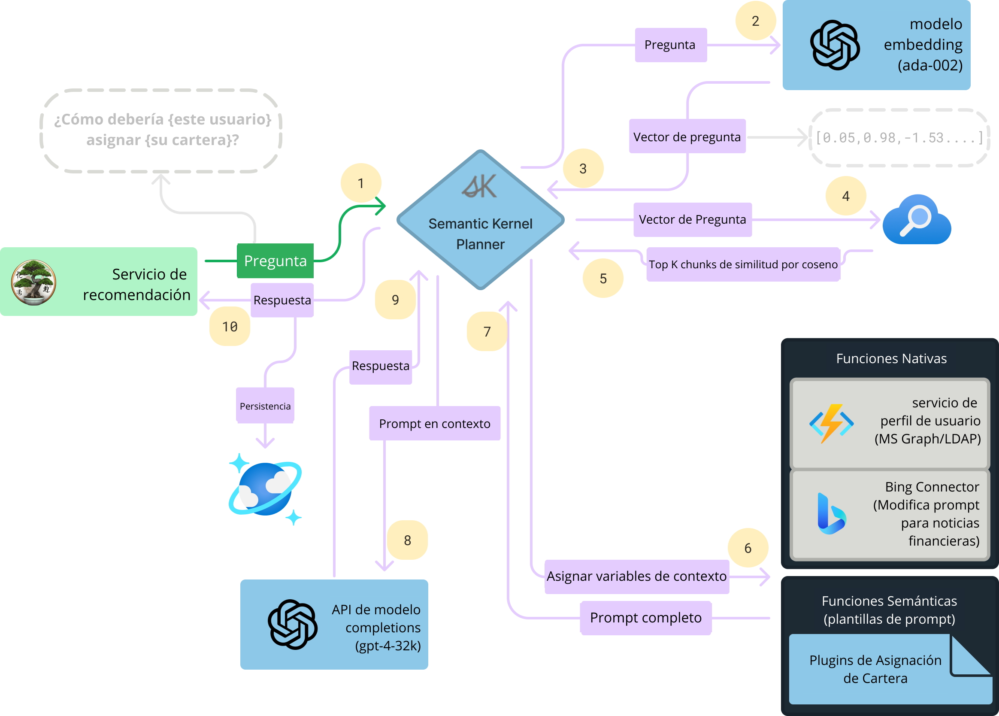
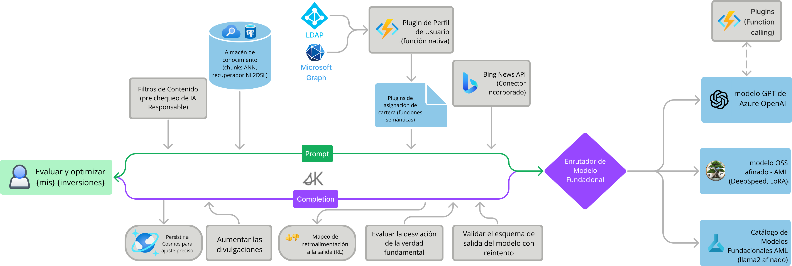
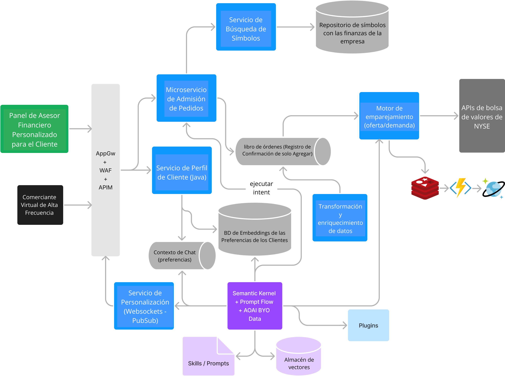
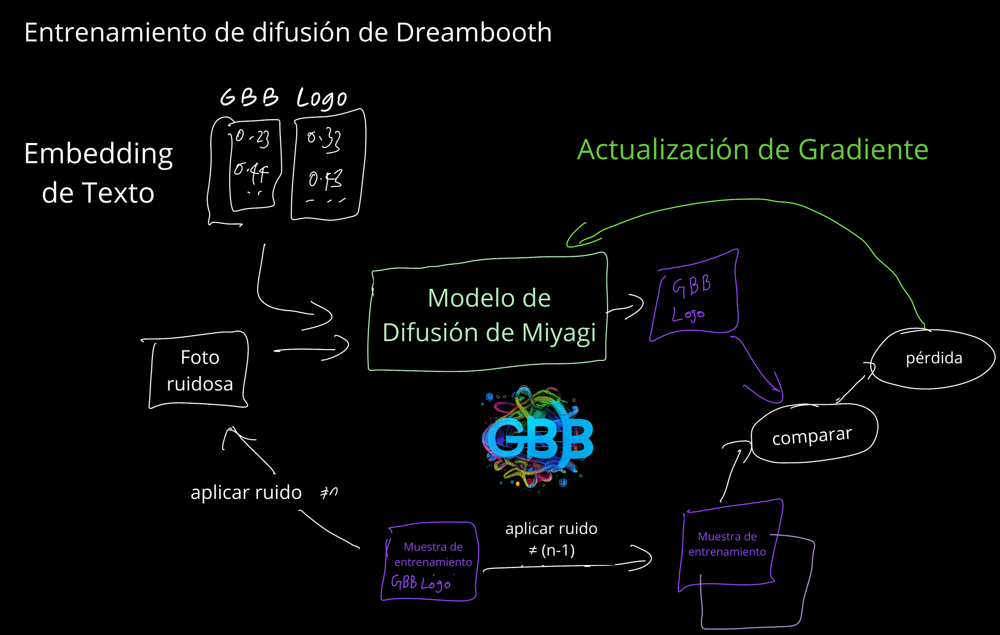
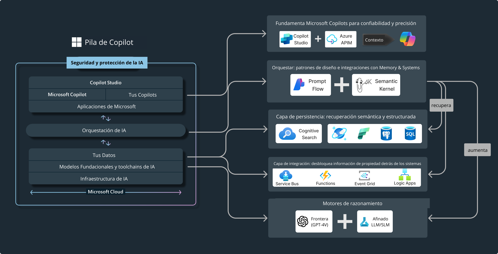

# Proyecto Miyagi - Muestra de la visión de la [Pila de Copilot](https://learn.microsoft.com/en-us/semantic-kernel/overview/#semantic-kernel-is-at-the-center-of-the-copilot-stack)

>  “Comience con la experiencia del cliente y trabaje hacia atrás hacia la tecnología” - Steve Jobs
>
>  "El cambio es la única constante" - Proverbio antiguo

Proyecto Miyagi muestra la Pila de Microsoft Copilot en un [taller visionario](https://github.com/Azure-Samples/intelligent-app-workshop) destinado a diseñar, desarrollar e implementar aplicaciones inteligentes de nivel empresarial. Al explorar [casos de uso](https://iappwksp.com/wksp/05-use-cases/) de ML tanto a nivel generativo como tradicional, Miyagi ofrece un enfoque experimental para desarrollar experiencias de productos dotadas con IA que mejoran la productividad y permiten la hiperpersonalización. Además, el taller presenta a los ingenieros de software tradicionales los patrones de diseño emergentes en prompt engineering, tales como Cadena de Pensamiento y Recuperación Aumentada, así como técnicas como la vectorización para la memoria a largo plazo, el ajuste preciso (fine-tuning) de modelos OSS, orquestación tipo agente, y plugins o herramientas para aumentar y fundamentar los LLMs.

> **Nota**  
> *Trabajo en Progreso*. Mientras tanto, regístrese en [intelligentapp.dev](https://intelligentapp.dev) para obtener actualizaciones y consulte nuestro repositorio relacionado que muestra capacidades de IA Generativa para microservicios de nube nativa impulsados ​​por eventos: [Azure/reddog-solutions](https://github.com/Azure/reddog-solutions#readme). 
>
> :tv: Para una vista previa, vea la [grabación en Cosmos DB Live TV](https://www.youtube.com/watch?v=V8dlEvXdGEM&t=144s)
>

El proyecto incluye ejemplos de uso de [Semantic Kernel](https://learn.microsoft.com/en-us/semantic-kernel/overview/#semantic-kernel-is-at-the-center-of-the-copilot-stack), [Promptflow](https://promptflow.azurewebsites.net/overview-what-is-prompt-flow.html), [LlamaIndex](https://github.com/jerryjliu/llama_index), [LangChain](https://github.com/hwchase17/langchain#readme), almacenes de vectores ([Azure AI Search](https://github.com/Azure/cognitive-search-vector-pr), [CosmosDB Postgres pgvector](https://learn.microsoft.com/en-us/azure/cosmos-db/postgresql/howto-use-pgvector)), y utilidades de imágenes generativas tales como [DreamFusion](https://huggingface.co/thegovind/reddogpillmodel512) y [ControlNet](https://github.com/lllyasviel/ControlNet). Además, presenta modelos fundacionales ajustados de AzureML como Llama2 y Phi-2. Utilice este proyecto para obtener información a medida que moderniza y transforma sus aplicaciones con IA y ajuste de forma precisa con sus datos privados para crear sus propios Copilotos. 

Esta base de código políglota se basa en una multitud de microservicios, implementando varios [casos de uso](https://iappwksp.com/wksp/05-use-cases/) que utilizan nuestra pila de Copilot. Incluye texto e imágenes generativas para asesoramiento financiero personalizado, resúmenes y orquestación tipo agente. Construido sobre una columna vertebral de arquitectura basada en eventos (EDA) de nube nativa, el diseño y la base de código garantizan atributos de calidad de nivel empresarial, tales como disponibilidad, escalabilidad y mantenibilidad.

Embárquese en un viaje para transformar sus aplicaciones en sistemas inteligentes de vanguardia con el taller autoguiado y descubra el arte de lo posible.

### Implementaciones Parciales

Debido al rápido ritmo de avances en los modelos fundacionales, estamos implementando gradualmente casos de uso para Miyagi en la carpeta de experimentos. Hasta el momento hemos implementado lo siguiente:

1. [MVP con Personalize (Síntesis a través de Semantic Kernel) y Chat en Azure Container Apps](https://agentmiyagi.com).
    1. [Desglose detallado e implementaciones](./services/README.md)
    1. [Inicio Rápido con RaG](./sandbox/usecases/rag/dotnet/Getting-started.ipynb)
1. [Extensión de VSCode para el Agente de GitHub Copilot](./sandbox/usecases/code-modernization/vscode-gh-copilot-extension/README.md)
1. [Plugin Miyagi ChatGPT](./services/chatgpt-plugin/python)
1. [Memoria de Grafo de Conocimiento usando la caché de entidad de Langchain](./sandbox/experiments/langchain/Memory_Usecases.ipynb)
1. [Almacén de vectores Qdrant para embeddings a través de Langchain](./sandbox/experiments/langchain/qdrant_miyagi_example)
1. [Intent del API de MS Graph invocado a través de las skills de Semantic Kernel](./sandbox/experiments/semantic-kernel/ms-graph-chain)
1. [Interacción de chat en Miyagi usando Prompt Engineering](./sandbox/experiments/langchain/chat) mediante PromptTemplate de LangChain
1. [Flujo básico de Azure OpenAI GPT-3.5](./sandbox/experiments/az-openai)
1. [Uso de GPT-3.5-turbo y Whisper-1 para transcribir audio y demonstrar un ejemplo de few-shot](./sandbox/experiments/gpt-3.5-turbo)
1. [DeepSpeed Chat](https://github.com/microsoft/DeepSpeedExamples/tree/master/applications/DeepSpeed-Chat) MiyagiGPT (Trae tus Propios Pesos con RLHF - Aprendizaje por Refuerzo a partir de la Retroalimentación Humana) - próximamente

### Frontend
La interacción con los modelos fundacionales es más que un chat. Este ejemplo muestra algunos casos de uso.

#### Extensión de VSCode para el Agente de GitHub Copilot

### Arquitectura

#### Arquitectura lógica de alto nivel

#### Orquestación de Semantic Kernel para el caso de uso de Miyagi

#### Flujo del aprendizaje en contexto

#### Panorama General

#### Prompt Flow

#### Modelos Fundacionales OSS preentrenados

#### Ideación inicial para el flujo EDA + SK

### Arquitectura del caso de uso de imagen generativa con Dreambooth 
Esto será similar al [caso de uso de generación de imágenes](https://huggingface.co/thegovind/reddogpillmodel512) de productos de [reddog](https://reddog-solutions.com). 

## Pila Tecnológica

### Pila de Copilot

### Servicios y capacidades

- [Azure OpenAI](https://learn.microsoft.com/en-us/azure/cognitive-services/openai/concepts/models)
- [Semantic Kernel](https://github.com/microsoft/semantic-kernel)
- [LangChain](https://python.langchain.com/docs/get_started/introduction)
- [LlamaIndex](https://docs.llamaindex.ai/en/stable/)
- [Agente de GitHub Copilot](https://gh.io/copilot-partner-program)
- [AI Studio](https://azure.microsoft.com/en-us/products/ai-studio)
- [AI Search](https://azure.microsoft.com/en-us/products/ai-services/ai-search)
- [AI Speech](https://azure.microsoft.com/en-us/products/ai-services/ai-speech)
- [AzureML PromptFlow](https://learn.microsoft.com/en-us/azure/machine-learning/prompt-flow/overview-what-is-prompt-flow?view=azureml-api-2)
- [TypeChat](https://microsoft.github.io/TypeChat)
- [Kernel-memory](https://github.com/microsoft/kernel-memory)
- [AutoGen](https://github.com/microsoft/autogen)
- [TaskWeaver](https://github.com/microsoft/TaskWeaver)
- [Azure Functions](https://azure.microsoft.com/en-ca/products/functions/)
- [APIM](https://learn.microsoft.com/en-us/azure/api-management/)
- [Service Bus](https://learn.microsoft.com/en-us/azure/service-bus-messaging/service-bus-messaging-overview)
- [Event Grid](https://learn.microsoft.com/en-us/azure/event-grid/overview)
- [Logic Apps](https://learn.microsoft.com/en-us/azure/logic-apps/logic-apps-overview)
- [AKS](https://azure.microsoft.com/en-us/products/kubernetes-service) / [ACA](https://azure.microsoft.com/en-us/products/container-apps)
- [Cosmos DB](https://azure.microsoft.com/en-us/products/cosmos-db/)
- [Github Actions](https://docs.github.com/en/actions)
- [Azure Monitor](https://learn.microsoft.com/en-us/azure/azure-monitor/)
- [Azure DB para PostgreSQL](https://azure.microsoft.com/en-us/products/postgresql)
- [Azure Redis Cache](https://azure.microsoft.com/en-us/products/cache)
- [Azure Storage](https://learn.microsoft.com/en-us/azure/storage/common/storage-introduction)

### Contribución

Este proyecto agradece contribuciones y sugerencias. La mayoría de las contribuciones requieren que usted acepte un
Acuerdo de Licencia de Colaborador (CLA) que declara que usted tiene derecho a otorgarnos, y de hecho lo hace,
los derechos de uso de su contribución. Para obtener más detalles, visite https://cla.opensource.microsoft.com.

Cuando envía una solicitud de incorporación de cambios, un bot CLA determinará automáticamente si necesita proporcionar
un CLA y decorará el PR apropiadamente (por ejemplo, verificación de estado, comentario). Simplemente siga las instrucciones
proporcionadas por el bot. Solo necesitará hacer esto una vez en todos los repositorios que utilicen nuestro CLA.

Este proyecto ha adoptado el [Código de Conducta de Código Abierto de Microsoft](https://opensource.microsoft.com/codeofconduct/).
Para obtener más información, consulte las [Preguntas Más Frecuentes del Código de Conducta](https://opensource.microsoft.com/codeofconduct/faq/) o póngase en contacto con [opencode@microsoft.com](mailto:opencode@microsoft.com) si tiene alguna pregunta o comentario adicional.

### Descargo de responsabilidad

Este software se proporciona únicamente con fines de demostración. No se debe confiar en él para ningún propósito. Los creadores de este software no hacen representaciones ni garantías de ningún tipo, expresas o implícitas, sobre la integridad, exactitud, confiabilidad, idoneidad o disponibilidad con respecto al software o la información, productos, servicios o gráficos relacionados contenidos en el software para cualquier propósito. Por lo tanto, cualquier confianza que usted deposite en dicha información es estrictamente bajo su propio riesgo.

### Licencia

Este software se proporciona únicamente con fines de demostración. No se debe confiar en él para ningún propósito. El software se proporciona "tal cual" y sin garantía alguna, expresa o implícita. El software no está destinado a ser utilizado con ningún fin comercial. El software se proporciona únicamente con fines de demostración y no debe utilizarse para ningún otro fin. El software se proporciona sin garantía de ningún tipo, ya sea expresa o implícita, incluidas, entre otras, las garantías implícitas de comerciabilidad, idoneidad para un propósito particular o no infracción. El software se proporciona "tal cual" y sin garantía de ningún tipo. El usuario asume todo riesgo y responsabilidad por el uso del software.
