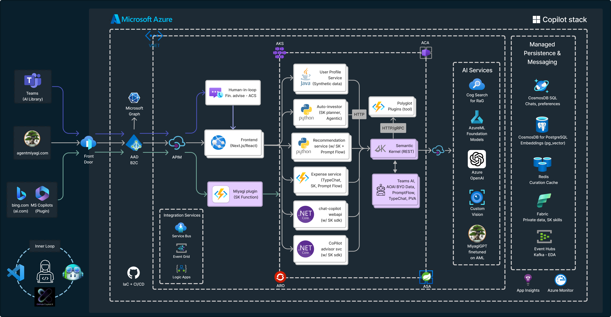
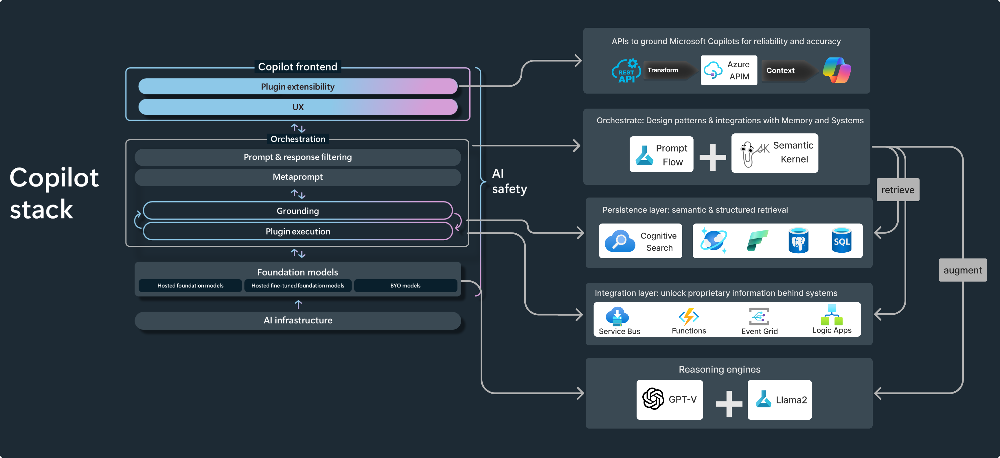

# Build Intelligent Apps with Microsoft's Copilot stack & Azure OpenAI

## Workshop Overview  

In this workshop, you will gain a strong understanding of Generative AI basics, Azure Open AI, Retrieval Augmented Generation (RAG) patterns, Semantic Kernel, and how to utilize these concepts to create your own Copilot for your business needs. You will also explore use cases that showcase Copilot product experiences. Using Microsoft's Copilot stack and practical use cases this workshop will guide you in envisioning and creating intelligent systems that integrate foundation models resulting in improved productivity and hyper-personalized product experiences.   

### What to expect?   

Learn Concepts:  

The first segment of the workshop involves a presentation that will provide a solid foundation in Generative AI concepts and guide you through the process of creating your own co-pilot using the Microsoft Copilot stack.  

## Hands-on Lab:  

In the hands-on segment (which will be the bulk of this workshop), participants will get deep exposure to Copilot Stack’s capabilities, especially with Semantic Kernel, Prompt Engineering, and Azure Cognitive Search. During this hands-on lab portion, you'll clone a sample Investment Advisor application and deploy it to Azure. This application harnesses the power of Azure Open AI, RAG, Semantic Kernel, and other Azure services. You will explore the following key features and gain insights into the underlying mechanisms:  

Investment Advisor Copilot: This Copilot, powered by Generative AI, provides investment recommendations based on user preferences. It utilizes Azure Open AI, Semantic Kernel, Azure Cognitive Search (with vector indexing for embeddings), Azure Cosmos DB, Container Apps, and Azure API Management.  

Chat Copilot: Get real-time assistance with investments using this feature. It leverages Azure Open AI, Semantic Kernel, Azure Cognitive Search (with vector indexing for embeddings), Azure Cosmos DB, Container Apps, and Azure API Management.

### Project Miyagi - Envisioning sample for [Copilot stack](https://learn.microsoft.com/en-us/semantic-kernel/overview/#semantic-kernel-is-at-the-center-of-the-copilot-stack)

Project Miyagi showcases Microsoft's Copilot Stack in an [envisioning workshop](https://github.com/Azure-Samples/intelligent-app-workshop) aimed at designing, developing, and deploying enterprise-grade intelligent apps. By exploring both generative and traditional ML [use cases](https://iappwksp.com/wksp/05-use-cases/), Miyagi offers an experiential approach to developing AI-infused product experiences that enhance productivity and enable hyper-personalization. Additionally, the workshop introduces traditional software engineers to emerging design patterns in prompt engineering, such as chain-of-thought and retrieval-augmentation, as well as to techniques like vectorization for long-term memory, fine-tuning of OSS models, and plugins or tools for augmenting and grounding LLMs.

The project includes examples of usage for [Semantic Kernel](https://learn.microsoft.com/en-us/semantic-kernel/overview/#semantic-kernel-is-at-the-center-of-the-copilot-stack), [Promptflow](https://promptflow.azurewebsites.net/overview-what-is-prompt-flow.html), [LlamaIndex](https://github.com/jerryjliu/llama_index), [LangChain](https://github.com/hwchase17/langchain#readme), vector stores ([Azure Cognitive Search](https://github.com/Azure/cognitive-search-vector-pr), [CosmosDB Postgres pgvector](https://learn.microsoft.com/en-us/azure/cosmos-db/postgresql/howto-use-pgvector), and generative image utilities such as [DreamFusion](https://huggingface.co/thegovind/reddogpillmodel512) and [ControlNet](https://github.com/lllyasviel/ControlNet). Additionally, it features fine-tuned foundation Models from AzureML such as Llama2. Utilize this project to gain insights as you modernize and transform your applications with AI and fine-tune your private data to build your own Copilots.

This polyglot codebase relies on a multitude of microservices, implementing several [use cases](https://iappwksp.com/wksp/05-use-cases/) using our Copilot stack. It includes generative text and images for personalized financial coaching, summarization, and agent-like orchestration. Built on a cloud-native event-diven architecture (EDA) backbone, the design and codebase ensures enterprise-grade quality attributes such as availability, scalability, and maintainability.

Embark on a journey to transform your applications into cutting-edge, intelligent systems with the self-guided workshop and discover the art of the possible.

### Frontend
Interaction with foundation models is more than chat. This sample shows a few use cases 

### Architecture

#### High-level logical architecture

#### Semantic Kernel Orchestration for Miyagi usecase

#### 30k foot view

### Copilot Stack

### Services and capabilities

- [Azure OpenAI](https://learn.microsoft.com/en-us/azure/cognitive-services/openai/concepts/models)
  - gpt-4
  - gpt-35-turbo
  - text-embedding-ada-002
- [Semantic Kernel](https://github.com/microsoft/semantic-kernel)
- [Use your own data with Azure OpenAI](https://learn.microsoft.com/en-us/azure/ai-services/openai/use-your-data-quickstart?tabs=command-line&pivots=rest-api#example-curl-commands)
- [AzureML PromptFlow](https://learn.microsoft.com/en-us/azure/machine-learning/prompt-flow/overview-what-is-prompt-flow?view=azureml-api-2)
- [TypeChat](https://microsoft.github.io/TypeChat)
- [Azure Functions](https://azure.microsoft.com/en-ca/products/functions/)
- [APIM](https://learn.microsoft.com/en-us/azure/api-management/)
- [Service Bus](https://learn.microsoft.com/en-us/azure/service-bus-messaging/service-bus-messaging-overview)
- [Event Grid](https://learn.microsoft.com/en-us/azure/event-grid/overview)
- [Logic Apps](https://learn.microsoft.com/en-us/azure/logic-apps/logic-apps-overview)
- [Cosmos DB](https://azure.microsoft.com/en-us/products/cosmos-db/)
- [Azure Monitor](https://learn.microsoft.com/en-us/azure/azure-monitor/)
- [Azure Storage](https://learn.microsoft.com/en-us/azure/storage/common/storage-introduction)
- [LangChain](https://github.com/hwchase17/langchain#readme)
- [Foundation Models from CogServices](https://azure.microsoft.com/en-us/blog/announcing-a-renaissance-in-computer-vision-ai-with-microsofts-florence-foundation-model/)
- [Qdrant](https://qdrant.tech/solutions/)
- [Microsoft DeepSpeed Chat](https://github.com/microsoft/DeepSpeedExamples/tree/master/applications/DeepSpeed-Chat)
- [Azure Web PubSub](https://azure.microsoft.com/en-us/products/web-pubsub)
- [Azure Communication Services (ACS)](https://learn.microsoft.com/en-us/azure/communication-services/overview#common-scenarios)

## Summary

### Introduction to Build Intelligent Apps with Microsoft's Copilot stack & Azure OpenAI

### Getting Started with CloudLabs Environment

### Lab 2.1 - Containerizing Recommendation service to Azure Container Apps

In this lab, you'll explore the process of containerizing a recommendation service and deploying it to Azure Container Apps.

### Lab 2.2 - Explore and Verify the Containerized Recommendation service in Azure Container App using Local Miyagi UI

In this Lab, you'll be exploring and verifying the automated Containerized Recommendation service in Azure Container App.
