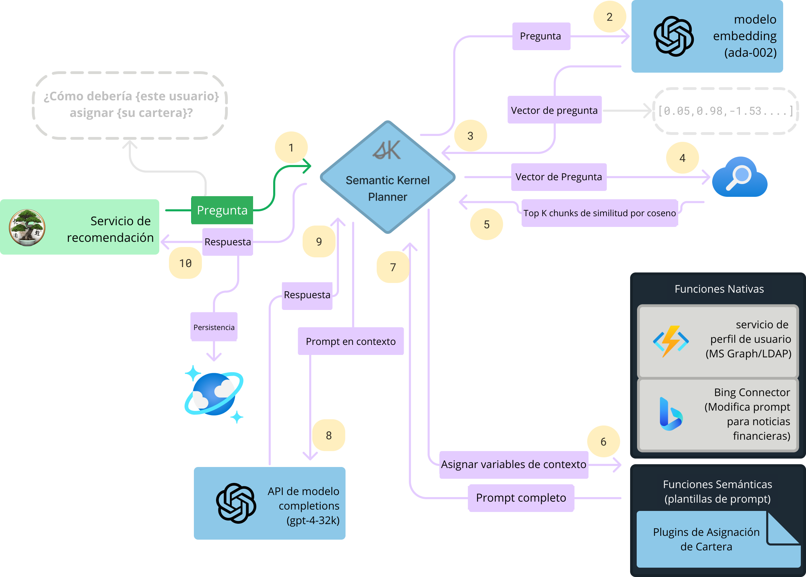
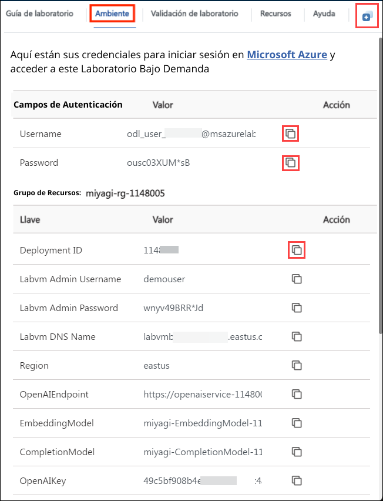
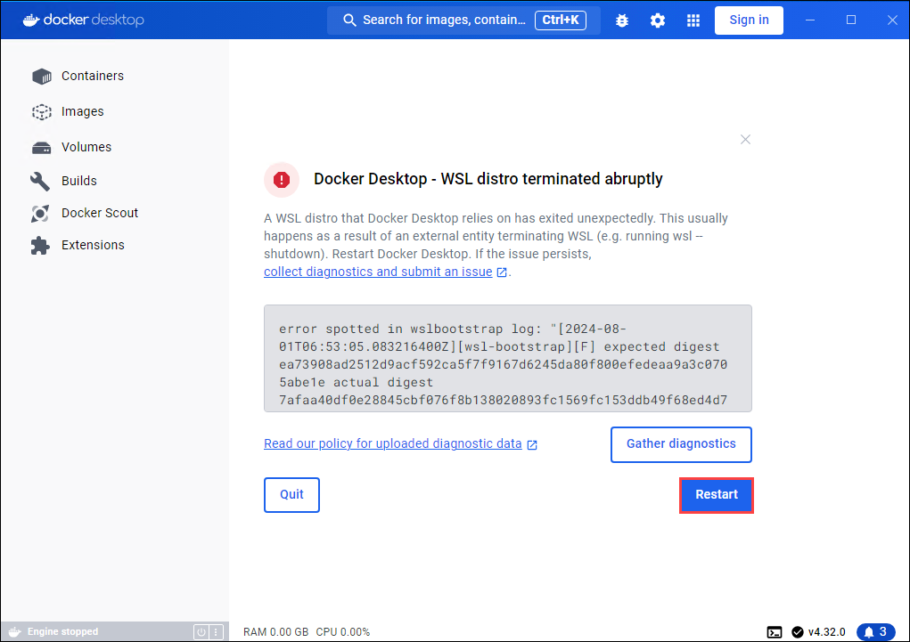
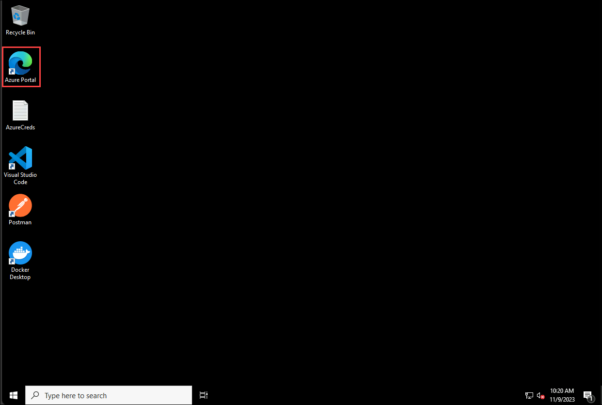
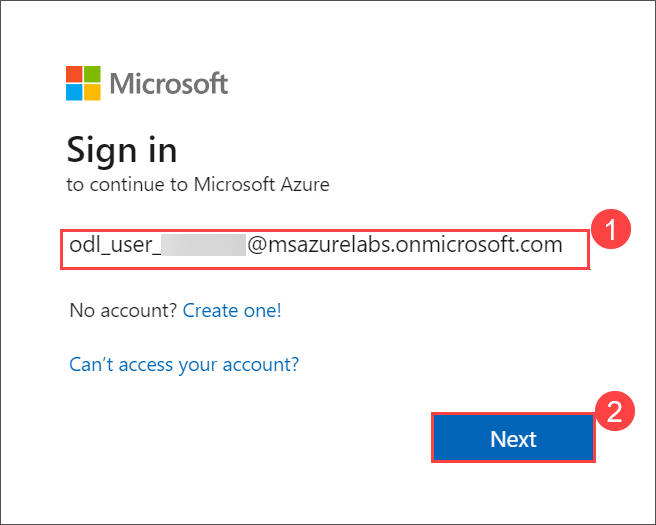
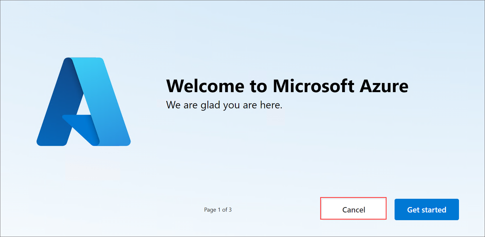

# Cree Aplicaciones Inteligentes con la Pila Copilot de Microsoft y Azure OpenAI

### Duración Total Estimada: 4 horas

## Descripción General

En este laboratorio, obtendrá una sólida comprensión de los conceptos básicos de la IA Generativa, Azure Open AI, los patrones de Recuperación de Generación Aumentada (RAG), Semantic Kernel y cómo utilizar estos conceptos para crear su propio Copilot para las necesidades de su negocio. También explorará casos de uso que muestran experiencias de productos Copilot. Utilizando la Pila Copilot de Microsoft y casos de uso prácticos, este laboratorio lo guiará en la visualización y creación de sistemas inteligentes que integran modelos fundacionales que dan como resultado una productividad mejorada y experiencias de producto hiperpersonalizadas.

## Objetivo

- **Verificar y Recuperar los valores de los Recursos de Azure**: Este ejercicio práctico tiene como objetivo verificar y recuperar los valores para asegurar la configuración y la conectividad adecuadas de los recursos de Azure.
- **Ejecutar la Aplicación Miyagi Localmente**: Este ejercicio práctico tiene como objetivo configurar la aplicación Miyagi, implementar el servicio de recomendación, desplegar el frontend localmente, optimizar la recuperación de datos con Azure AI Search y explorar la aplicación y el servicio para lograr una experiencia de usuario personalizada.
- **Contenedorización de la Interfaz de Usuario de Miyagi y el servicio de Recomendación en Azure Kubernetes Service (AKS)**: Este ejercicio práctico tiene como objetivo contenerizar y desplegar Miyagi UI y los servicios de recomendación en AKS, configurar Kubernetes, enviar imágenes de Docker a ACR y verificar la implementación a través de puntos de conexión del servicio.
- **Explorar y Verificar la interfaz de usuario de Miyagi y el servicio de Recomendación contenedorizados en AKS**: Este ejercicio práctico tiene como objetivo implementar y verificar Miyagi UI y los servicios de recomendación en AKS, probando APIs y accediendo a la Interfaz de Usuario a través de los puntos de conexión Ingress para asegurar su funcionalidad. Este ejercicio mejora la comprensión de la gestión y el enrutamiento del tráfico dentro de los entornos de Kubernetes.
- **Exponer Open AI a través de APIM**: Este ejercicio práctico tiene como objetivo verificar y crear APIs en el servicio APIM para actualizar la imagen de Docker para el servicio de recomendación, asegurando la optimización y el mantenimiento de las aplicaciones en contenedores.
- **Comenzando con su propio Copiloto**: Este ejercicio práctico tiene como objetivo integrar Modelos de Lenguaje Grande (LLM) con lenguajes como C#, Python y Java, permitiendo la creación de complementos que se pueden encadenar fácilmente.
  
## Requisitos previos

- Comprensión de los conceptos básicos de la IA generativa
- Familiaridad con Azure Open AI
- Experiencia con Semantic Kernel

## Arquitectura

La arquitectura de Miyagi utiliza IA para interacciones de usuario hiperpersonalizadas, transformando aplicaciones con habilidades avanzadas de Semantic Kernel y prompt engineering. Cuenta con microservicios escalables y una columna vertebral basada en eventos, que evoluciona con nuevos modelos de IA. El frontend ofrece experiencias personalizadas similares a Microsoft Copilot.

Integra Azure Functions, AKS y Apache Kafka para una comunicación fluida, con datos administrados por Cosmos DB y Azure Storage. Miyagi ejemplifica la IA avanzada y los servicios Azure para aplicaciones inteligentes preparadas para el futuro.

## Diagrama de Arquitectura

   

## Explicación de Componentes

- **Azure OpenAI**: Azure OpenAI integra los modelos de lenguaje de OpenAI en la nube de Microsoft Azure, permitiendo soluciones de IA escalables para el procesamiento del lenguaje natural y la automatización.
- **AI Search**: Es un servicio en la nube que permite capacidades de búsqueda potentes y flexibles, incluyendo la búsqueda de texto completo y las funciones impulsadas por IA.
- **Azure Functions**: Ejecuta código en respuesta a eventos sin administrar servidores. Escala automáticamente en función de la demanda.
- **AKS (Azure Kubernetes Service)**: Servicio administrado de Kubernetes para la orquestación y el escalado de contenedores.
- **Apache Kafka**: Maneja la transmisión de datos en tiempo real y el procesamiento de eventos.
- **Cosmos DB**: Base de datos multimodelo distribuida globalmente con baja latencia y alta disponibilidad.
- **Azure Storage**: Almacenamiento escalable para blobs, archivos, colas y tablas.
- **Bing Search**: Le permite agregar funciones de búsqueda de Bing a sus aplicaciones. Proporciona APIs para búsquedas web, de imágenes, videos y noticias.

## Comenzando con el Laboratorio

1. Una vez configurado el ambiente, su navegador cargará una máquina virtual (JumpVM), utilice esta máquina virtual durante todo el taller para realizar el laboratorio. Puede ver el número en la parte inferior de la guía de laboratorio para cambiar a diferentes ejercicios en la guía de laboratorio.

   
 
1. Para obtener los detalles del ambiente del laboratorio, puede seleccionar la pestaña **Ambiente**. Además, las credenciales también se enviarán por correo electrónico a su dirección de correo electrónico registrada. También puede abrir la Guía de Laboratorio en una ventana completa e independiente seleccionando **Ventana Dividida** en la esquina inferior derecha. Además, puede iniciar, detener y reiniciar máquinas virtuales desde la pestaña **Recursos**.

    
   
   > Verá el valor SUFFIX en la pestaña **Ambiente**; úselo dondequiera que vea SUFFIX o DeploymentID en los pasos del laboratorio.
 
## Iniciar Sesión en el Portal de Azure

1. Minimice **Docker Desktop** haciendo clic en el botón **Minimizar**.

   

   - Si se encuentra con el problema "A WSL distro Docker Desktop relies on has exited unexpectedly.", esto generalmente sucede como resultado de que una entidad externa finalizó WSL, haga clic en el botón **Reiniciar**

      

1. En JumpVM, haga clic en el acceso directo al Portal de Azure del navegador Microsoft Edge, el cual se ha creado en el escritorio.

   

1. En la pestaña **Iniciar sesión en Microsoft Azure**, verá la pantalla de inicio de sesión. Ingrese el siguiente correo electrónico o nombre de usuario y haga clic en **Siguiente**. 

   * **Correo electrónico/Nombre de usuario**: **<inject key="AzureAdUserEmail"></inject>**

     
     
1. Ahora ingrese la siguiente contraseña y haga clic en **Iniciar sesión**.
   
   * **Contraseña**: **<inject key="AzureAdUserPassword"></inject>**

     
   
1. Si ve la ventana emergente **¿Permanecer conectado?**, seleccione **No**.

   

1. Si aparece una ventana emergente **Bienvenido a Microsoft Azure**, seleccione **Cancelar** para omitir el recorrido.

    
   
1. Ahora verá el Panel del Portal de Azure, haga clic en **Grupos de recursos** en el panel Navegar para ver los grupos de recursos.

   

1. En **Grupos de recursos**, haga clic en el grupo de recursos **miyagi-rg-<inject key="DeploymentID" enableCopy="false"/>**.

   

1. En el grupo de recursos **miyagi-rg-<inject key="DeploymentID" enableCopy="false"/>**, verifique los recursos presentes.

   

> [!IMPORTANTE] 
> **Para una experiencia más fluida durante la práctica de laboratorio, es importante revisar detenidamente tanto las instrucciones como las notas que las acompañan. Esto le ayudará a realizar las tareas con facilidad y confianza.**

Este laboratorio práctico lo guiará para crear sistemas inteligentes con la pila Copilot de Microsoft, aprovechando los patrones de IA Generativa y RAG para una mayor productividad y experiencias personalizadas.

## Contacto de Soporte
 
El equipo de soporte de CloudLabs está disponible las 24 horas del día, los 7 días de la semana, los 365 días del año, por correo electrónico y chat en vivo para garantizar una asistencia sin inconvenientes en cualquier momento. Ofrecemos canales de soporte dedicados, diseñados específicamente tanto para estudiantes como para instructores, garantizando que todas sus necesidades sean atendidas de forma rápida y eficiente.

Contactos de Soporte para Estudiantes:

- Soporte por Correo Electrónico: cloudlabs-support@spektrasystems.com
- Soporte por Chat En Vivo: https://cloudlabs.ai/labs-support

Ahora, haga clic en **Siguiente** en la esquina inferior derecha para pasar a la página siguiente.

## ¡¡Feliz Aprendizaje!!
