## Getting Started with the Lab

1. After the environment has been set up, your browser will load a virtual machine (JumpVM), use this virtual machine throughout the workshop to perform the lab. You can see the number on the bottom of the lab guide to switch to different exercises in the lab guide.

   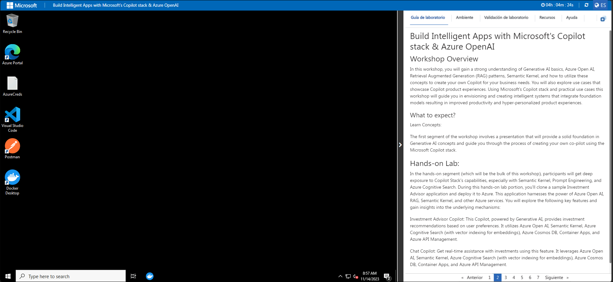
 
1. To get the lab environment details, you can select the **Environment** tab. Additionally, the credentials will also be emailed to your registered email address. You can also open the Lab Guide in a separate and full window by selecting the **Split Window** from the lower right corner. Also, you can start, stop, and restart virtual machines from the **Resources** tab.

    
   
   > You will see the SUFFIX value on the **Environment** tab; use it wherever you see SUFFIX or DeploymentID in lab steps.
 
## Login to the Azure Portal

1. In the JumpVM, click on the Azure portal shortcut of the Microsoft Edge browser, which is created on the desktop.

   

1. On the **Sign in to Microsoft Azure** tab, you will see the login screen. Enter the following email or username, and click on **Next**. 

   * **Email/Username**: **<inject key="AzureAdUserEmail"></inject>**

     
     
1. Now enter the following password and click on **Sign in**.
   
   * **Password**: **<inject key="AzureAdUserPassword"></inject>**

     
   
1. If you see the pop-up **Stay Signed in?**, select **No**.

   

1. If you see the pop-up **You have free Azure Advisor recommendations!**, close the window to continue the lab.

1. If a **Welcome to Microsoft Azure** popup window appears, select **Maybe Later** to skip the tour.

    
   
1. Now that you will see the Azure Portal Dashboard, click on **Resource groups** from the Navigate panel to see the resource groups.

   

1. In the **Resource groups**, click on **miyagi-rg-<inject key="DeploymentID" enableCopy="false"/>** resource group.

   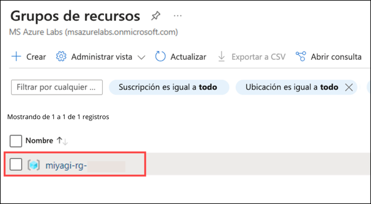

1. In the **miyagi-rg-<inject key="DeploymentID" enableCopy="false"/>** resource groups, verify the resources present in it.

   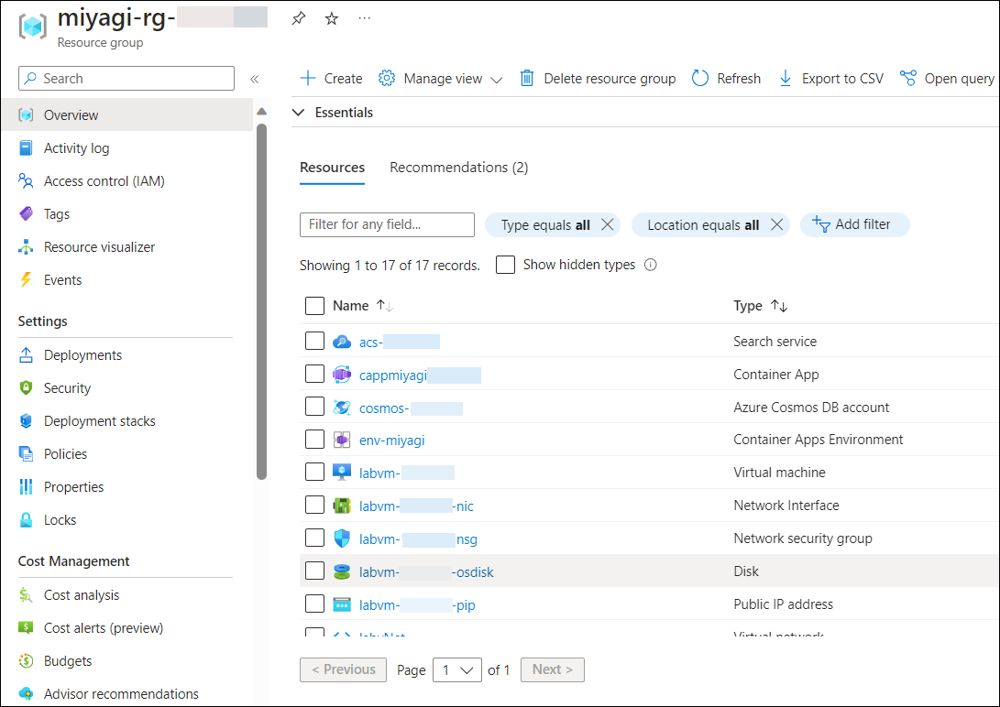

## Verify and Retrieve the values of Azure Resources 

In this task, verification, and retrieval of specific values, including End Point, Connection String, and Key for the designated resources.

   - Azure OpenAI : **OpenAIService-<inject key="DeploymentID" enableCopy="false"/>** 
   - Azure Cosmos DB account : **cosmos-<inject key="DeploymentID" enableCopy="false"/>**
   - Search Service : **acs-<inject key="DeploymentID" enableCopy="false"/>**

1. To verify the deployment model names for "**deploymentOrModelId**" and "**embeddingDeploymentOrModelId**" follow the below steps:
   
      - In Azure Portal, click on **Resource groups** from the Navigate panel.

      - From the Resource groups page, click on **miyagi-rg-<inject key="DeploymentID" enableCopy="false"/>**.

         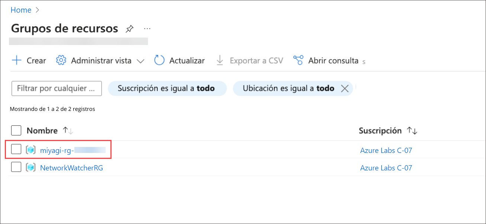

      - In the **miyagi-rg-<inject key="DeploymentID" enableCopy="false"/>**, from the Overview (1) tab select the **OpenAIService-<inject key="DeploymentID" enableCopy="false"/> (2)**.

        

      - In the **OpenAI Overview** **(1)** page, right-click on **Go to Azure OpenAI Studio** (2) button and click on **Open link a new tab**.

         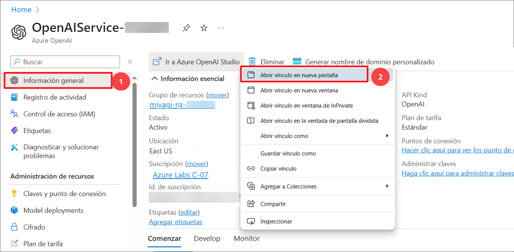 
   
      - In the **Azure AI Studio**, select **Deployments**, under the Management section.

      - In the **Deployments** blade of Azure AI Studio, click on **gpt-35-turbo** model name **(1)** and verify the **deployment name** of gpt-35-turbo model **(2)**.

          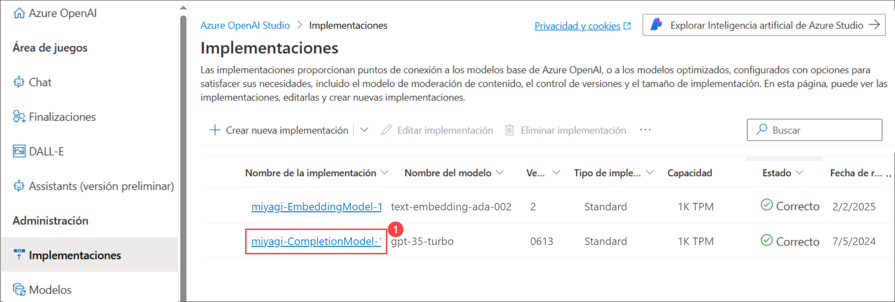
        
          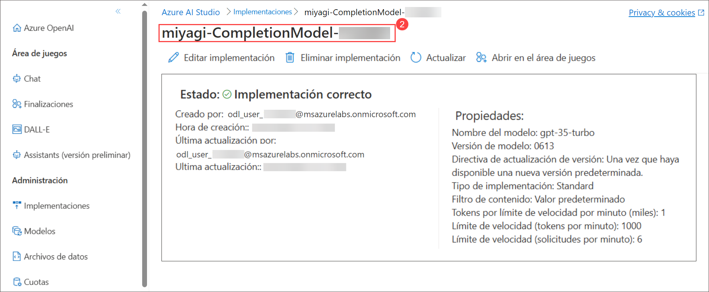
      
      -  Navigate back to the **Deployment** page

      - In the Deployments blade of Azure AI Studio, click on **text-embedding-ada-002 model name (1)** and verify the **deployment name** of **text-embedding-ada-002 model(2)**.
        
         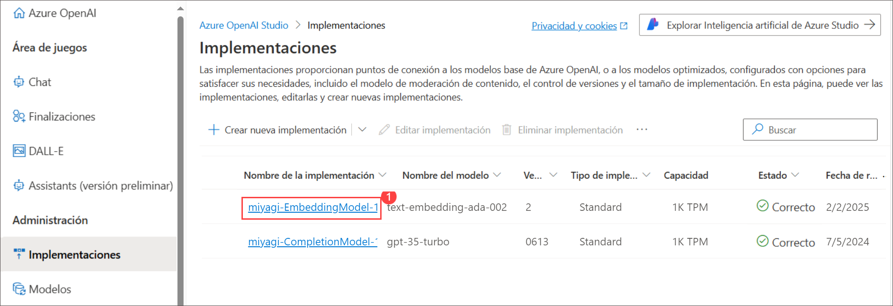

         

1. To verify the values for **endpoint** and **apiKey** follow the below steps:

   -  Navigate back to the tab displaying **Azure portal**. 

   -  In the **OpenAIService-<inject key="DeploymentID" enableCopy="false"/>** blade under **Resource Management** section, select **Keys and Endpoint**, verify the **KEY1** and **Endpoint**.
     
      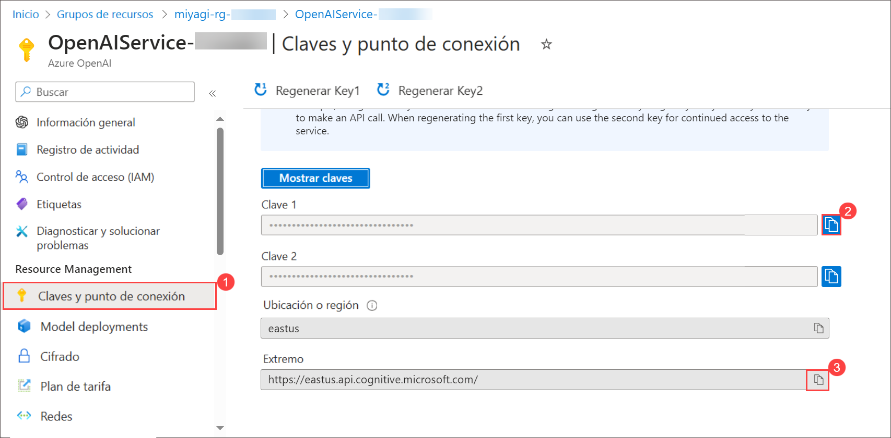

1. To verify the values for  "azureCognitiveSearchEndpoint", "azureCognitiveSearchApiKey", follow below steps:
   
   - Navigate back to **miyagi-rg-<inject key="DeploymentID" enableCopy="false"/>** resource group.

   - On the **miyagi-rg-<inject key="DeploymentID" enableCopy="false"/>** page, select **acs-<inject key="DeploymentID" enableCopy="false"/>** from resources list.

      
 
   - On **acs-<inject key="DeploymentID" enableCopy="false"/>** blade, verify the **URL**.
   
      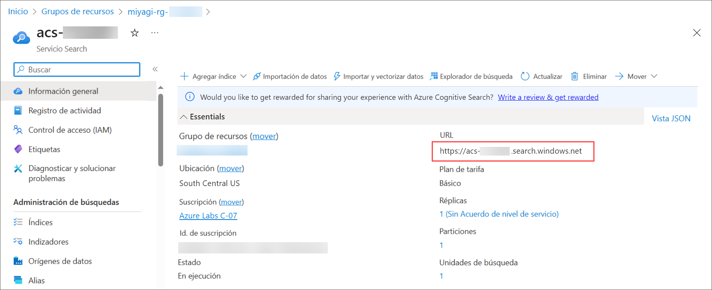

   - On **acs-<inject key="DeploymentID" enableCopy="false"/>** blade, under **Settings** section, verify the **Primary admin Key** value.
   
      

1. To verify the values for "**cosmosDbUri**" and "**cosmosDbName**," please follow the steps below:

   - Navigative back to resource group **miyagi-rg-<inject key="DeploymentID" enableCopy="false"/>** resource group page, select **cosmos-<inject key="DeploymentID" enableCopy="false"/>** from resources list.

     

   - On **cosmos-<inject key="DeploymentID" enableCopy="false"/>** verify the **URL**.
     
     

   - On **cosmos-<inject key="DeploymentID" enableCopy="false"/>** under **Settings**, select **Keys** and verify the value of the **Cosmos DB Primary Connection String**.

     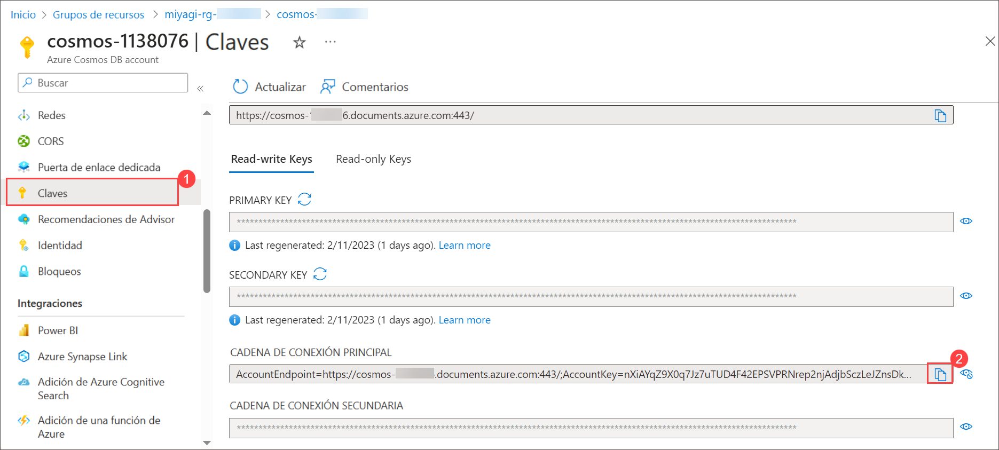

1. To obtain the values for  "**blobServiceUri**", please follow the steps below:

   - Navigative back to resource group **miyagi-rg-<inject key="DeploymentID" enableCopy="false"/>** resource group page, select **miyagiblobstorge<inject key="DeploymentID" enableCopy="false"/>** from resources list.

     

   - In the **miyagiblobstorge<inject key="DeploymentID" enableCopy="false"/>** storage account from the left menu select **Endpoints** **(1)** under Settings verify the **Blob service** **(1)** under Blob service.

     

1. Now, click on **Next** from the lower right corner to move to the next page.
