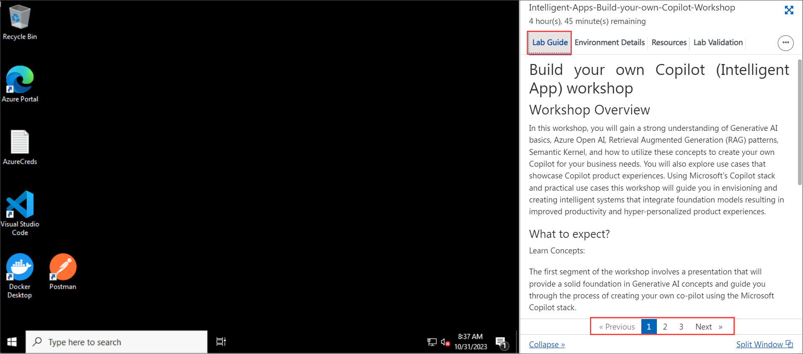

## Getting Started with the Lab

1. After the environment has been set up, your browser will load a virtual machine (JumpVM), use this virtual machine throughout the workshop to perform the lab. You can see the number on the bottom of the lab guide to switch to different exercises in the lab guide.
   
 
1. To get the lab environment details, you can select the **Environment Details** tab. Additionally, the credentials will also be emailed to your registered email address. Additionally, under the **Resources** tab, you may start, stop, and restart virtual machines.

    
   
   > You will see the SUFFIX value on the **Environment Details** tab; use it wherever you see SUFFIX or DeploymentID in lab steps.
 
## Login to the Azure Portal

1. In the JumpVM, click on the Azure portal shortcut of the Microsoft Edge browser, which is created on the desktop.
   

1. On the **Sign in to Microsoft Azure** tab, you will see the login screen. Enter the following email or username, and click on **Next**. 

   * **Email/Username**: <inject key="AzureAdUserEmail"></inject>

     
     
1. Now enter the following password and click on **Sign in**.
   
   * **Password**: <inject key="AzureAdUserPassword"></inject>

     
   
1. If you see the pop-up **Stay Signed in?**, select **No**.

   

1. If you see the pop-up **You have free Azure Advisor recommendations!**, close the window to continue the lab.

1. If a **Welcome to Microsoft Azure** popup window appears, select **Maybe Later** to skip the tour.

    
   
1. Now that you will see the Azure Portal Dashboard, click on **Resource groups** from the Navigate panel to see the resource groups.

   

