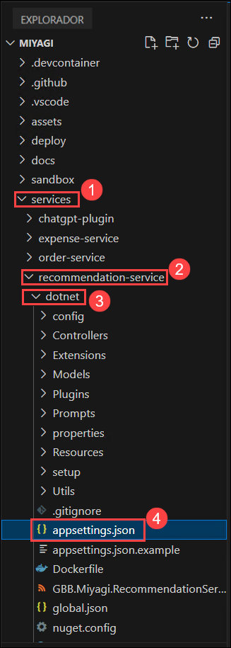
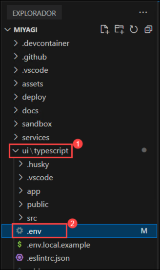
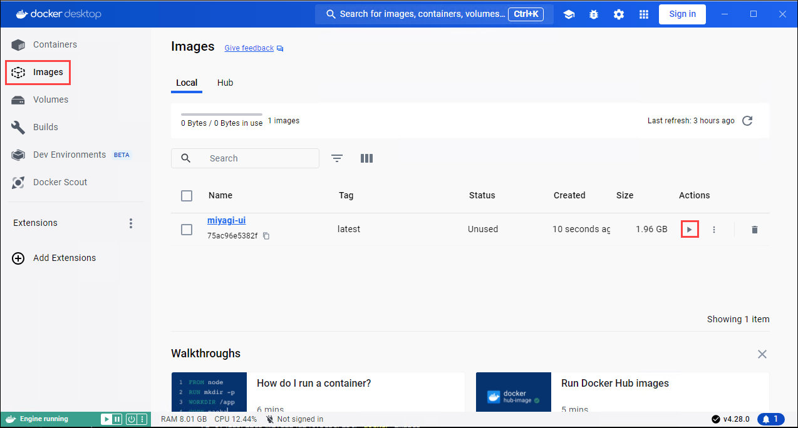
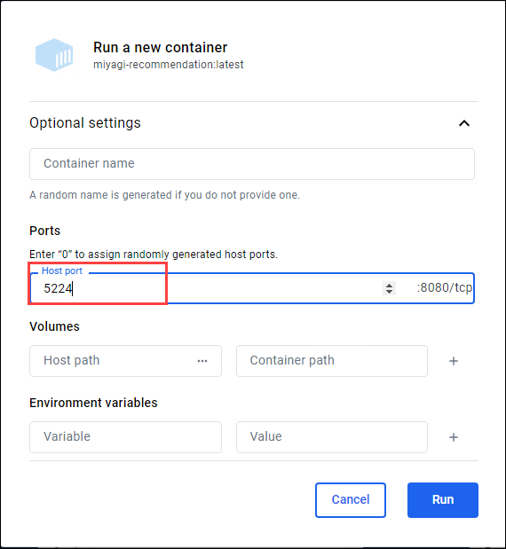

# Lab 3.1: Containerizing Miyagi UI and Recommendation service to Azure Kubernetes Service(AKS)

In this lab, you'll be building the docker images and publishing them to Azure Kubernetes Service(AKS).

### Task 1: Deploy AKS Services

1. Navigate back to the Visual Studio code window and navigate to **miyagi/deploy/infrastructure/kubernetes/manifests/50-miyagi**, right-click on **50-miyagi** in cascading menu, and select **Open in integrate Terminal**.

    

2. Run the following command to log in to the Azure portal.

   > **Note**: replace [ClusterName] with **<inject key="aksname" enableCopy="true"/>** and [ResourceGroupName] with **<inject key="rgname" enableCopy="true"/>**

   ```
   az aks get-credentials -n [ClusterName] -g [ResourceGroupName]
   ```

3. Once the command finishes you should now have access to the cluster and can run the following commands to deploy the application services.

   ```
   kubectl apply -f ./miyagi-recommendation-service.yaml
   ```
   ```
   kubectl apply -f ./miyagi-ui-service.yaml
   ```

4. Once the services have been deployed run the below command and keep track of the service's **external ip's**. It could take a few minutes for the **external ip's** to appear so wait a few minutes before running the command.

   ```
   kubectl get svc
   ```

   

5. Next navigate to **miyagi/services/recommendation-service/dotnet** and open app settings.

   
   
6. Copy the **miyagi-ui** IP address from the console and paste it in the **CorsAllowedOrigins** section formatted as an **http** endpoint.  

   

7. Next navigate to **miyagi/ui/typescript** and open the **.env** file. 

   

8. Copy the **miyagi-recommendation-service** IP address from the console and paste it in the **NEXT_PUBLIC_RECCOMMENDATION_SERVICE_URL** value.

   

### Task 2: Build a Docker Image for the Miyagi UI

1. Open the **Docker** Application from the Lab VM desktop by double-clicking on it.

   
   
2. In the **Docker Subscription Service Agreement** window, click **Accept**.

   

3. In the **Welcome to Docker Desktop** window, click on **Continue without signing in**.

   

4. In the **Tell us about the work you do** window, click on **Skip**.
   
5. Navigate back to **Visual studio code** window and navigate to **miyagi/ui/typescript** right - click on dotnet in cascading menu, select **Open in integrate Terminal**.

   ```
   docker build . -t miyagi-ui      
   ```

   > **Note**: Please wait as this command may require some time to complete.

6. Run the following command to get the newly created image.

   ```
   docker images
   ```
7. Navigate back to **Docker desktop**, from the left pane select **Images**.

   

8. In the **Images** blade, notice **miyagi-ui(1)** image is created, select **run(2)** icon .

   

9. In the **Run a new container** window select the dropdown arrow.

   .png)

10. In the **Run a new containe**, under **Ports** for **Host Port** enter **3000** and click on **Run**.

    

11. Click on **3000:3000** URL link

    
   
12. You should be able to see the application running locally
   
     

### Task 3: Build Docker Images for the Recommendation service

1. Navigate back to **Visual studio code** window and navigate to **miyagi/services/recommendation-service/dotnet** right - click on dotnet in cascading menu, select **Open in integrate Terminal**.

   

1. Run the following command to build a **Docker image**

   ```
   docker build . -t miyagi-recommendation      
   ```

   

   > **Note**: Please wait as this command may require some time to complete.

1. Run the following command to get the newly created image.

   ```
   docker images
   ```
   
   

1. Navigate back to **Docker desktop**, from the left pane select **Images**.

   

1. In the **Images** blade, notice **miyagi-recommendation(1)** image is created, select **run(2)** icon .

   

1. In the **Run a new container** window select the dropdown arrow.

   .png)

1. In the **Run a new containe**, under **Ports** for **Host Port** enter **5224** and click on **Run**.

    

1. Click on **5224:80** URL link

   
   
1. You should be able to see the application running locally
   
   

### Task 4: Push the Docker Image of Recommendation service to the Container registry

In this task, you'll Push miyagi-recommendation images to acr. 

1. Navigate back to the **Visual studio code** window and navigate to **miyagi/services/recommendation-service/dotnet** right - click on dotnet in cascading menu, select **Open in integrate Terminal**

1. Run the following command to log in to the **Azure portal**.

    ```
    az login
    ```

1. This will redirect to **Microsoft login page**, select your Azure account **<inject key="AzureAdUserEmail"></inject>**, and navigate back to the **Visual studio code**.

   

1. Run the following command to log in to an **Azure Container Registry (ACR)** using the Azure CLI.

   > **Note**: Please replace **[ACRname]** **<inject key="AcrUsername" enableCopy="true"/>**.
   
   ```
   az acr login -n [ACRname] 
   ```
    
1. Run the following command to add the tag.

   > **Note**: Please replace **[ACRname]** with **<inject key="AcrLoginServer" enableCopy="true"/>**.

   ```
   docker tag miyagi-recommendation:latest [ACRname]/miyagi-recommendation:latest
   ```

1. Run the following command to push the image to the container registry.

   > **Note**: Please replace **[ACRname]** with **<inject key="AcrLoginServer" enableCopy="true"/>**.

   ```
   docker push [ACRname]/miyagi-recommendation:latest
   ```

   

1. Navigate back to **Visual studio code** window and navigate to **miyagi/ui/typescript** right - click on dotnet in cascading menu, select **Open in integrate Terminal**.

1. Run the following command to add the tag.

   > **Note**: Please replace **[ACRname]** with **<inject key="AcrLoginServer" enableCopy="true"/>**.

   ```
   docker tag miyagi-ui:latest [ACRname]/miyagi-ui:latest
   ```

1. Run the following command to push the image to the container registry.

   > **Note**: Please replace **[ACRname]** with **<inject key="AcrLoginServer" enableCopy="true"/>**.

   ```
   docker push [ACRname]/miyagi-ui:latest
   ```

### Task 5: Deploy AKS Pods

1. Navigate back to the Visual Studio code window and navigate to **miyagi/deploy/infrastructure/kubernetes/manifests/50-miyagi** click on **50-miyagi** in the cascading menu, and select **Open in integrate Terminal**.

    

2. Open the **miyagi-recommendation.yaml** file and replace the &lt;ACR-NAME&gt; with **<inject key="acrUsername" enableCopy="true"/>** Azure container registry name created earlier.

   

4. Open the **miyagi-ui.yaml** file and replace the &lt;ACR-NAME&gt; with **<inject key="acrUsername" enableCopy="true"/>** Azure container registry name created earlier.

   

5. Run the following commands to deploy the application pods.

   ```
    kubectl apply -f ./miyagi-recommendation.yaml
   ```
   ```
    kubectl apply -f ./miyagi-ui.yaml
   ```

6. The applications should now be deployed. To verify run the below command and you should see both pods in a running state.
   ```
    kubectl get pods
   ```
   
   

# Lab 3.2: Explore and Verify the Containerized Miyagi UI and Recommendation service in AKS

### Task 1: Explore Recommendation service in AKS using Ingress Endpoint

1. To test the API run the below command to get the service IP addresses

   ```
   kubectl get svc
   ```
   
   


2. Copy the IP address of the **miyagi-recommendation-service** and enter it into the browser. You should now see the swagger endpoint.
   
   
   
### Task 2: Explore Miyagi App in AKS using Ingress Endpoint

1. To test the UI run the below command to get the service IP addresses
   ```
   kubectl get svc
   ```
   
   


2. Copy the IP address of the **miyagi-ui** and enter it into the browser. You should now see the Miyagi frontend.

   
