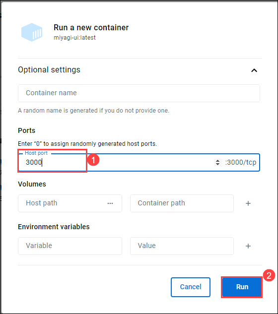
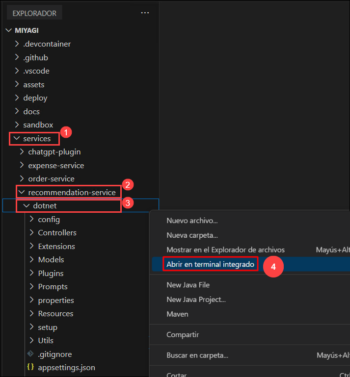
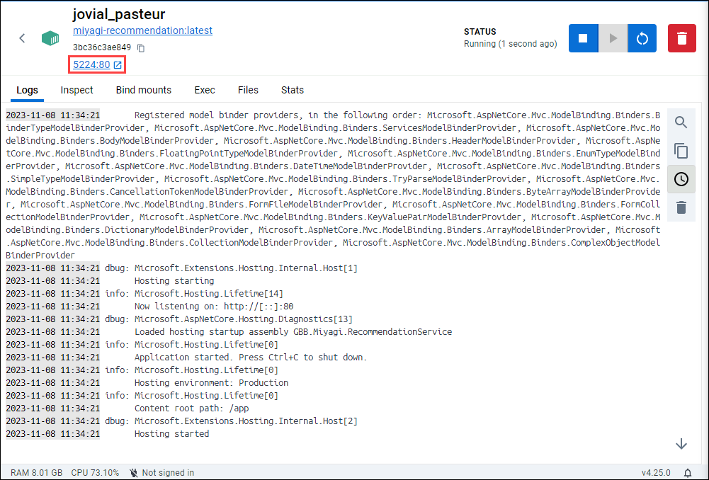
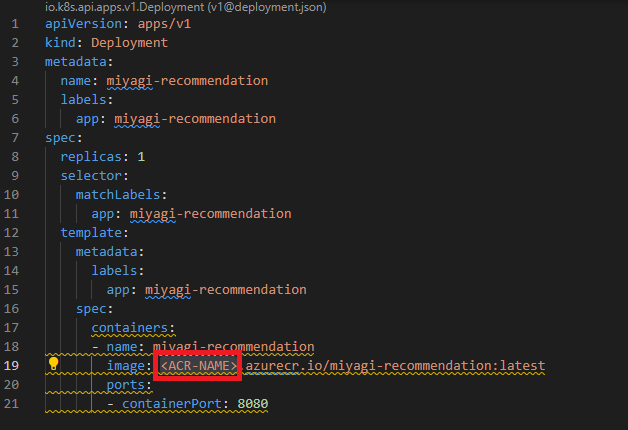
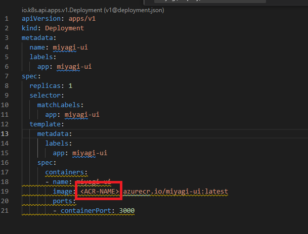
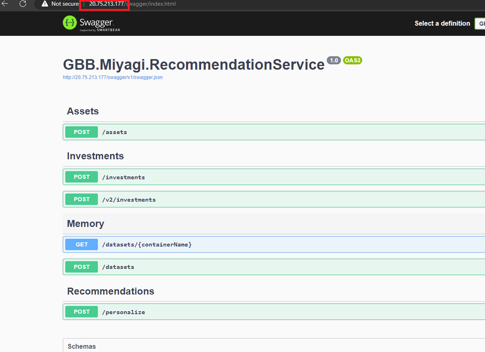
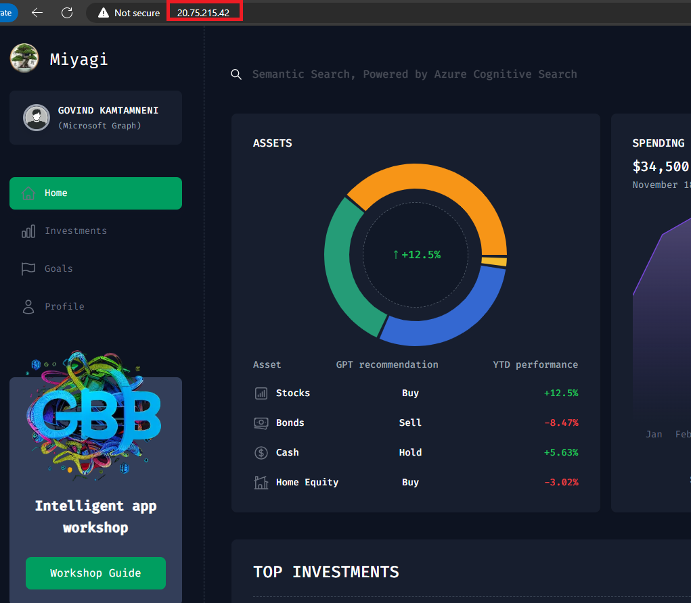

# Laboratorio 3.1 - Contenedorización de la interfaz de usuario de Miyagi y el servicio de Recomendación en Azure Kubernetes Service (AKS)

En esta práctica de laboratorio, creará las imágenes de Docker y las publicará en Azure Kubernetes Service (AKS).

### Tarea 1: Implementar servicios de AKS

1. Vuelva a la ventana de Visual Studio Code y navegue a **miyagi/deploy/infrastructure/kubernetes/manifests/50-miyagi**, haga clic derecho en **50-miyagi** y en el menú contextual seleccione **Abrir en Terminal Integrada**.

    

2. Ejecute el siguiente comando para iniciar sesión en el Portal de Azure.

   > **Nota**: reemplace [ClusterName] con **<inject key="aksname" enableCopy="true"/>** y [ResourceGroupName] con **<inject key="rgname" enableCopy="true"/>**

   ```
   az aks get-credentials -n [ClusterName] -g [ResourceGroupName]
   ```

3. Una vez que el comando finalice, ahora debería tener acceso al clúster para poder ejecutar los siguientes comandos a fin de implementar los servicios de la aplicación.

   ```
   kubectl apply -f ./miyagi-recommendation-service.yaml
   ```
   ```
   kubectl apply -f ./miyagi-ui-service.yaml
   ```

4. Una vez que se hayan implementado los servicios, ejecute el siguiente comando y realice un seguimiento de las **direcciones IP externas** del servicio. Las **direcciones IP externas** pueden tardar unos minutos en aparecer, así que espere unos minutos antes de ejecutar el comando.

   ```
   kubectl get svc
   ```

   

5. A continuación, navegue a **miyagi/services/recommendation-service/dotnet** y abra el archivo **appsettings.json**.

   
   
6. Copie la Dirección IP Externa **miyagi-ui** de la consola y péguela en la sección **CorsAllowedOrigins** formateada como un punto de conexión **http** y guarde el archivo con **Ctrl + S**.  

   

7. Ahora navegue a **miyagi/ui/typescript** y abra el archivo **.env**. 

   

8. Copie la Dirección IP Externa **miyagi-recommendation-service** de la consola y péguela en el valor **NEXT_PUBLIC_RECCOMMENDATION_SERVICE_URL** y guarde el archivo con **Ctrl + S**.

   

### Tarea 2: Crear una imagen de Docker para la interfaz de usuario de Miyagi

1. Abra la Aplicación **Docker** desde el Escritorio de Lab VM haciendo doble clic en el acceso directo.

   
   
2. En la ventana **Acuerdo de Servicio de Suscripción de Docker**, haga clic en **Accept**.

   

3. En la ventana **Welcome to Docker Desktop**, haga clic en **Continue without signing in**.

   

    >**Nota**: En la ventana Cuéntenos sobre el trabajo que realiza, haga clic en Omitir.

    >**Nota**: Asegúrese de que el motor Docker esté en funcionamiento antes de continuar con el siguiente paso.

4. En la ventana **Tell us about the work you do**, haga clic en **Skip**.
   
5. Vuelva a la ventana de **Visual Studio Code** y navegue a **miyagi/ui/typescript** haga clic derecho y en el menú contextual seleccione **Abrir en la Terminal Integrada**.

   ```
   docker build . -t miyagi-ui      
   ```

   > **Nota**: Por favor espere, ya que este comando puede tardar algún tiempo en completarse.

6. Ejecute el siguiente comando para obtener la imagen recién creada.

   ```
   docker images
   ```
7. Vuelva a **Docker Desktop**, en el panel izquierdo seleccione **Images**.

   

8. En la hoja **Images**, observe que se ha creado la imagen **miyagi-ui (1)**, seleccione el icono **run (2)**.

   

9. En la ventana **Run a new container** seleccione la flecha desplegable.

   .png)

10. En **Run a new container**, en **Ports** para **Host Port** ingrese **3000** y haga clic en **Run**.

    

11. Haga clic en el enlace URL **3000:3000**.

    
   
12. Debería poder ver la aplicación ejecutándose localmente.
   
     

### Tarea 3: Crear Imágenes de Docker para el servicio de Recomendación 

1. Vuelva a la ventana de **Visual Studio Code** y navegue a **miyagi/services/recommendation-service/dotnet**, haga clic derecho en dotnet, en el menú contextual seleccione **Abrir en Terminal integrada**.

   

1. Ejecute el siguiente comando para crear una **imagen de Docker**

   ```
   docker build . -t miyagi-recommendation      
   ```

   

   > **Nota**: Por favor espere, ya que este comando puede tardar algún tiempo en completarse.

1. Ejecute el siguiente comando para obtener la imagen recién creada.

   ```
   docker images
   ```
   
   

1. Vuelva a **Docker Desktop**, en el panel izquierdo seleccione **Images**.

   

1. En la hoja **Images**, observe que se crea la imagen **miyagi-recommendation (1)**, seleccione el icono **Run (2)**.

   

1. En la ventana **Run a new container**, seleccione la flecha desplegable.

   .png)

1. En **Run a new container**, en **Ports** para **Host Port** ingrese **5224** y haga clic en **Run**.

    

1. Haga clic en el enlace URL **5224:80**

   
   
1. Debería poder ver la aplicación ejecutándose localmente.
   
   

### Tarea 4: Enviar la Imagen Docker del servicio de Recomendación a Azure Container registry

En esta tarea, enviará las imágenes miyagi-recommendation a acr. 

1. Vuelva a la ventana **Visual Studio Code** y navegue a **miyagi/services/recommendation-service/dotnet** haga clic derecho en dotnet y el menú contextual seleccione **Abrir en la Terminal Integrada**.

1. Ejecute el siguiente comando para iniciar sesión en el **Portal de Azure**.

    ```
    az login
    ```

1. Esto lo redirigirá a la **Página de Inicio de sesión de Microsoft Azure**, seleccione su cuenta de Azure **<inject key="AzureAdUserEmail"></inject>**, y regrese a **Visual Studio Code**.

   

1. Ejecute el siguiente comando para iniciar sesión en **Azure Container Registry (ACR)** usando la CLI de Azure.

   > **Nota**: Por favor reemplace **[ACRname]** con **<inject key="AcrUsername" enableCopy="true"/>**.
   
   ```
   az acr login -n [ACRname] 
   ```
    
1. Ejecute el siguiente comando para agregar la etiqueta.

   > **Nota**: Por favor reemplace **[ACRname]** con **<inject key="AcrLoginServer" enableCopy="true"/>**.

   ```
   docker tag miyagi-recommendation:latest [ACRname]/miyagi-recommendation:latest
   ```

1. Ejecute el siguiente comando para enviar la imagen al registro de contenedor.

   > **Nota**: Por favor reemplace **[ACRname]** con **<inject key="AcrLoginServer" enableCopy="true"/>**.

   ```
   docker push [ACRname]/miyagi-recommendation:latest
   ```

   

1. Vuelva a la ventana **Visual Studio Code** y navegue a **miyagi/ui/typescript** haga clic derecho, en el menú contextual seleccione **Abrir en la Terminal Integrada**.

1. Ejecute el siguiente comando para agregar la etiqueta.

   > **Nota**: Por favor reemplace **[ACRname]** con **<inject key="AcrLoginServer" enableCopy="true"/>**.

   ```
   docker tag miyagi-ui:latest [ACRname]/miyagi-ui:latest
   ```

1. Ejecute el siguiente comando para enviar la imagen al registro del contenedor.

   > **Nota**: Por favor reemplace **[ACRname]** con **<inject key="AcrLoginServer" enableCopy="true"/>**.

   ```
   docker push [ACRname]/miyagi-ui:latest
   ```

### Tarea 5: Implementar Pods de AKS

1. Vuelva a la ventana Visual Studio Code y navegue a **miyagi/deploy/infrastructure/kubernetes/manifests/50-miyagi** haga clic derecho en **50-miyagi** y en el menú contextual seleccione **Abrir en Ventana Integral**.

    

2. Abra el archivo **miyagi-recommendation.yaml** y reemplace &lt;ACR-NAME&gt; con **<inject key="acrUsername" enableCopy="true"/>**, el nombre del Azure Container Registry creado anteriormente y guarde el archivo con **Ctrl + S**.

   

4. Abra el archivo **miyagi-ui.yaml** y reemplace &lt;ACR-NAME&gt; con **<inject key="acrUsername" enableCopy="true"/>**, el nombre del Azure Container Registry creado anteriormente y guarde el archivo con **Ctrl + S**.

   

5. Ejecute los siguientes comandos para implementar los pods de aplicaciones.

   ```
    kubectl apply -f ./miyagi-recommendation.yaml
   ```
   ```
    kubectl apply -f ./miyagi-ui.yaml
   ```

6. Las aplicaciones ahora deberían estar implementadas. Para verificar, ejecute el siguiente comando y debería ver ambos pods en estado de ejecución.

   >**Nota**: El resultado puede tardar unos minutos en aparecer, así que espere unos minutos antes de ejecutar el comando. 
   
   ```
    kubectl get pods
   ```
   
   


    <validation step="e8c4db10-7879-482c-a538-de23b5f3eba3" />
 
>**¡Felicitaciones** por completar la tarea! Ahora es el momento de validarla. Aquí están los pasos:
> - Pulse el botón Validar para la tarea correspondiente. Si recibe un mensaje de éxito, ha validado correctamente el laboratorio.
> - De lo contrario, lea atentamente el mensaje de error y vuelva a intentar el paso, siguiendo las instrucciones de la guía de laboratorio. 
> - Si necesita ayuda, contáctenos en labs-support@spektrasystems.com.

    <validation step="1405474b-fe74-412b-a221-8c7fe07c7762" />

# Laboratorio 3.2: Explorar y Verificar la interfaz de usuario de Miyagi y el servicio de Recomendación contenedorizados en AKS

### Tarea 1: Explorar el servicio de Recomendación en AKS mediante Ingress Endpoint

1. Para probar la API, ejecute el siguiente comando para obtener las direcciones IP del servicio:

   >**Nota** : El resultado puede tardar unos minutos en aparecer, así que espere unos minutos antes de ejecutar el comando.

   ```
   kubectl get svc
   ```
   
   


2. Copie la Dirección IP Externa de **miyagi-recommendation-service** e ingrésela en el navegador. Debería ver el punto de conexión swagger.
   
   
   
### Tarea 2: Explorar la aplicación Miyagi en AKS usando Ingress Endpoint

1. Para probar la interfaz de usuario, ejecute el siguiente comando para obtener las direcciones IP del servicio:
   ```
   kubectl get svc
   ```
   
   

2. Copie la dirección IP Externa de **miyagi-ui** e ingrésela en el navegador. Ahora debería ver el frontend de Miyagi.

   

### Resumen

En esta práctica de laboratorio, implementó Azure Kubernetes Service (AKS) tanto para la interfaz de usuario de Miyagi como para el servicio de Recomendación de Miyagi. Comenzó con la construcción de imágenes de Docker para estos servicios, que contienen todos los componentes necesarios como el código y los archivos de configuración. Después de la creación de la imagen, el siguiente paso consistió en enviar la imagen Docker del servicio de Recomendación a Azure Container Registry, una plataforma de almacenamiento e implementación para clústeres de Kubernetes. Finalmente, se implementaron pods de AKS, que representan contenedores en ejecución dentro del clúster de Kubernetes, lo que hizo que la interfaz de usuario y el servicio de Recomendación de Miyagi estuvieran operativos.
