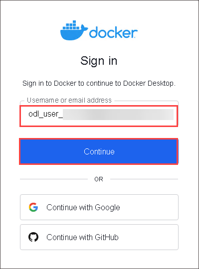
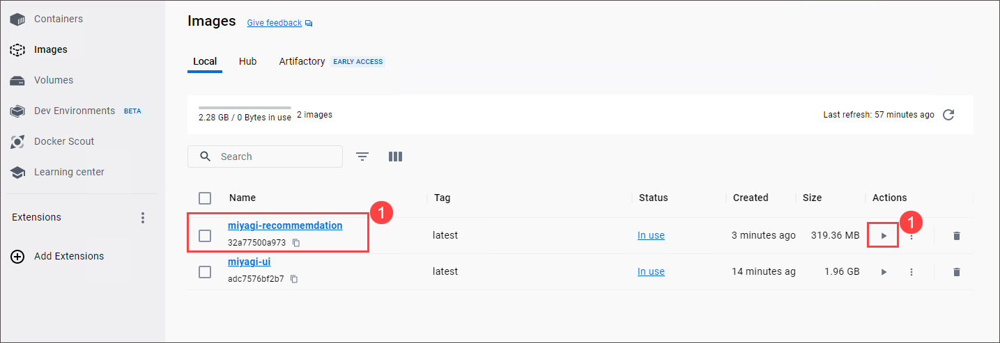
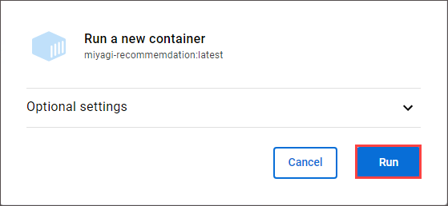
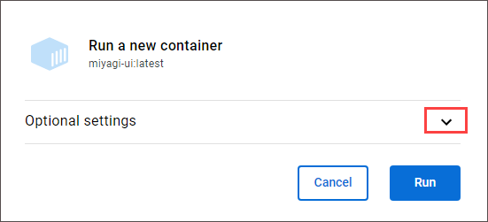
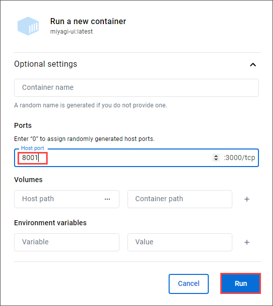

# Lab 2: Deploy Apps to Azure Container Apps

In this lab, you'll be building the docker images and publishing it to Azure Container Apps.

### Task 1: Build Docker Images for the Recommendation service

1. Open Docker Application from the Lab VM desktop by double-clicking on it.
   
   
1. On **Docker Subscription Service Agreement** window, click **Accept**.
   

1. On **Welcome to Docker Desktop** window, click on **sign up**.

   

1. On **Create your account** window, specify the following details and click on sign up.

   | **Settings**         | **Values**           | 
   | -------------------- | -------------------- | 
   | Email                | <inject key="AzureAdUserEmail"></inject>  | 
   | Username             | Odluser<inject key="DeploymentID" enableCopy="false"/>   |
   | Password             | <inject key="AzureAdUserPassword"></inject>         |
   | Send me occasional product updates and announcements. | Select the checkbox |
   |||

   

1. On Sign in window, enter your email <inject key="AzureAdUserEmail"></inject> and click on **Continue**.

   

1. On Enter your Password window, provide <inject key="AzureAdUserPassword"></inject> and click on **Continue**

    .png)

1. If **This site is trying to open docker desktop.** pop up's click on **Open**.

1. Navigate to **miyagi/services/recommendation-service/dotnet** right - click on dotnet in cascading menu, select **Open in intergate Terminal**

1. Run following command to build a Docker image

   ```
   docker build . -t miyagi-recommemdation      
   ```
1. Run foolowing command to show the newly created image
   ```
   docker images
   ```
1. Run following command
   ```
   docker run -t miyagi-recommemdation -p 8002:80
   ```
1. Navigate back to **Docker desktop**, from left pane select **Images**.
   

1. On **Images** blade, notice **miyagi-recommemdation(1)** image is created, select **run(2)** icon .
   

1. On **Run a new containe** window select the dropdown arrow.

   

1. On **Run a new containe**, under **Ports** for **Host Port** enter **8001** and click on **Run**.

    

1. Click on **8001:3000** url link
   
   
1. You should be able to see the application running locally
   
   

### Task 2: Build Docker Images for the Miyagi-ui

1. Navigate to miyagi/ui/ right - click on ui/typescript in cascading menu, select **Open in intergate Terminal**.

1. Run following command to build a Docker image

    ```
    docker build . -t miyagi-ui      
    ```
1. Run foolowing command to show the newly created image
   ```
   docker images
   ```
1. Run following command
   ```
   docker run -t miyagi-ui -p 8001:3000
   ```
1. Navigate back to **Docker desktop**, from left pane select **Images**.
   

1. On **Images** blade, notice **miyagi-ui(1)** image is created, select **run(2)** icon .
   

1. On **Run a new containe** window select the dropdown arrow.

   

1. On **Run a new containe**, under **Ports** for **Host Port** enter **8001** and click on **Run**.

    

1. Click on **8001:3000** url link
   
   
1. You should be able to see the application running locally
   
   

### Task 3: Push two Images to the Azure container registery(acr)

In this task, you'll Push miyagi-ui and miyagi-recommendation images to acr. 

1. Navigate to miyagi/ui/ right - click on ui/typescript in cascading menu, select **Open in intergate Terminal**.

1. Run following command to login.

    **Note**: Please replace <ACRname> and [uname] with **miyagiacr<inject key="DeploymentID" enableCopy="false"/>** for [password] navigate to resource group > and select **miyagiacr<inject key="DeploymentID" enableCopy="false"/>** from list of recources and under settings select **Access Keys**, select check box for **Admin user** and copy the password.

   ```
    docker login <ACRname>.azurecr.io -u [uname] -p [password]
   ```

1. Run following command to add tag

   **Note**: Please replace **miyagiacr[did]** with **miyagiacr<inject key="DeploymentID" enableCopy="false"/>**

   ```
    docker tag miyagi-ui:latest miyagiacr{did].azurecr.io/miyagi-ui:latest
   ```
1. Run the following command to push image to container registery

   **Note**: Please replace **miyagiacr[did]** with **miyagiacr<inject key="DeploymentID" enableCopy="false"/>**

   ```
    docker push miyagiacr[did].azurecr.io/miyagi-ui:latest

   ```

1. Navigate to **miyagi/services/recommendation-service/dotnet** right - click on dotnet in cascading menu, select **Open in intergate Terminal**

1. Run following command to login.

   **Note**: Please replace <ACRname> and [uname] with **miyagiacr<inject key="DeploymentID" enableCopy="false"/>** for [password] navigate to resource group > and select **miyagiacr<inject key="DeploymentID" enableCopy="false"/>** from list of recources and under settings select **Access Keys**, select check box for **Admin user** and copy the password.

    ```
    docker login <ACRname>.azurecr.io -u [uname] -p [password]
    ```

1. Run following command to add tag.

   **Note**: Please replace **miyagiacr[did]** with **miyagiacr<inject key="DeploymentID" enableCopy="false"/>**

   ```
    docker tag miyagi-recommendation:latest miyagiacr{did].azurecr.io/miyagi-recommendation:latest
   ```
1. Run the following command to push image to container registery

   **Note**: Please replace **miyagiacr[did]** with **miyagiacr<inject key="DeploymentID" enableCopy="false"/>**

   ```
    docker push miyagiacr[did].azurecr.io/miyagi-recommendation:latest

   ```

