# Laboratorio 4 - Exponer Open AI a través de APIM

En esta práctica de laboratorio, verificará y creará APIs en el servicio implementado API Management a fin de actualizar la imagen de Docker para el servicio de Recomendación. La revisión del servicio de Recomendación de los servicios de Azure Kubernetes encapsula el enfoque meticuloso para mantener y optimizar las aplicaciones en contenedores dentro del alcance del proyecto.

## Objetivos del laboratorio
Podrás completar las siguientes tareas:

- Tarea 1: Verificar el servicio implementado API Management y crear una API.
- Tarea 2: Crear Políticas y Roles de API Management
- Tarea 3: Actualizar la Imagen de Docker para el servicio de Recomendación
- Tarea 4: Revisión del servicio de Recomendación de AKS 
- Tarea 5: Configurar Event Hub Logging y Validar la Entrada

### Tarea 1: Verificar el servicio implementado API Management y crear una API

1. Navegue al Portal de Azure, abra el Grupo de recursos llamado **miyagi-rg-<inject key="DeploymentID" enableCopy="false"/>**  y seleccione el servicio API Management **miyagi-apim-<inject key="DeploymentID" enableCopy="false"/>** de la lista de recursos.

   

1. En el servicio API Management **miyagi-apim-<inject key="DeploymentID" enableCopy="false"/>**, haga clic en **API** **(1)** en la sección APIs del menú izquierdo y seleccione **HTTP** **(2)** en Definir una nueva API para crear una API HTTP.

   

1. Introduzca los siguientes valores en el panel Crear una API HTTP:
   
   | **Parameter**        | **Values**           | 
   | -------------------- | -------------------- | 
   | API Type **(1)**     | **Basic**            | 
   | Display name **(2)** | **miyagi-api**       |
   | Name **(3)**         | **miyagi-api**       |
   | Web service URL **(4)** | Enter the Endpoint of Azure OpenAI Endpoint  **<inject key="OpenAIEndpoint" enableCopy="true"/>**  |
   | API URL suffix **(5)** | **openai** |
   | Click on  **(6)** | **Create** |

   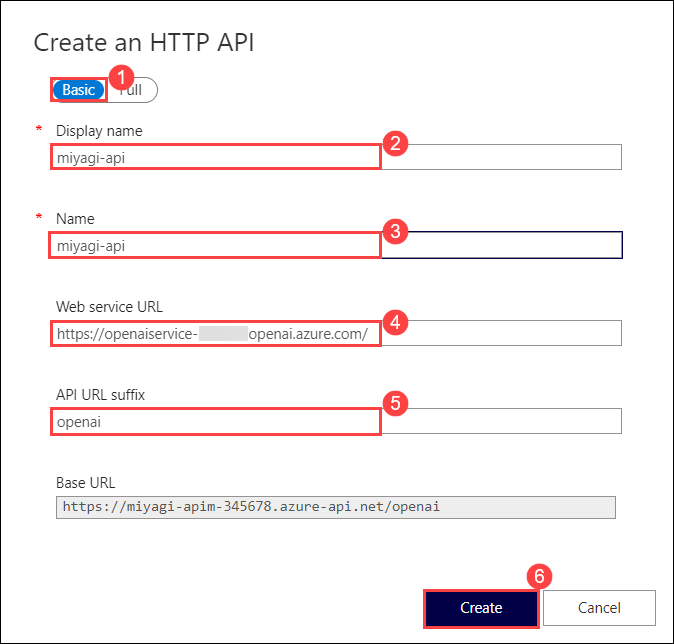

1. Una vez creada la API, haga clic en **Información general** **(1)** en el menú de la izquierda, copie la **URL de la Puerta de Enlace** **(2)** del servicio API Management. Péguela en el Bloc de notas para usarlo más adelante.

   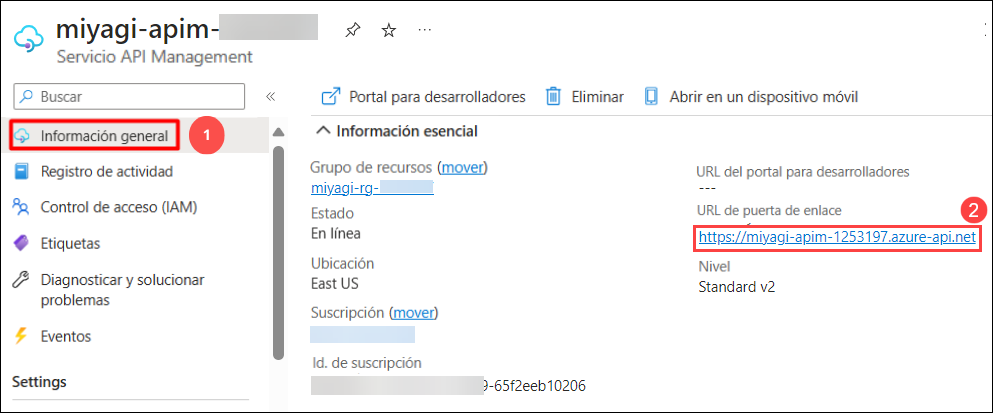


   >**¡Felicitaciones** por completar la tarea! Ahora es el momento de validarla. Aquí están los pasos:
   > - Pulse el botón Validar para la tarea correspondiente.
   > - Si recibe un mensaje de éxito, puede proceder a la siguiente tarea. De lo contrario, lea atentamente el mensaje de error y vuelva a intentar el paso, siguiendo las instrucciones de la guía de laboratorio.
   > - Si necesita ayuda, contáctenos en cloudlabs-support@spektrasystems.com. Estamos disponibles las 24 horas del día, los 7 días de la semana para ayudarle.

    <validation step="5385328b-c6b7-4d03-9fcc-c2d33d96d9cd" />

### Tarea 2: Crear Políticas y Roles de API Management

1. En el servicio API Management **miyagi-apim-<inject key="DeploymentID" enableCopy="false"/>**, haga clic en **API** **(1)**, luego clic en los **three dots** **(2)** al lado de miyagi-api, seleccione **Import** **(3)**, y haga clic en **OpenAPI** **(4)**.

   

2. En la ventana emergente de **Import from OpenAPI specification** pegue el siguiente enlace en el **textbox** **(1)** de la especificación OpenAPI, y entonces haga clic en **Import** **(2)**. 

   ```
   https://raw.githubusercontent.com/Azure/azure-rest-api-specs/main/specification/cognitiveservices/data-plane/AzureOpenAI/inference/stable/2023-05-15/inference.json
   ```

   

3. Ahora debería ver una serie de APIs en Azure OpenAI Service API.
   
    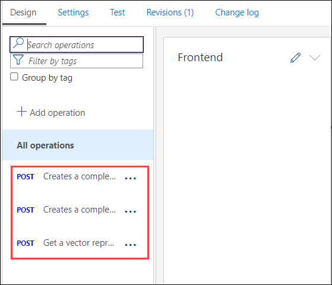

4. En la API **Azure OpenAI Service API** navegue a la pestaña **Settings** **(1)** y actualice el **Header Name** con el valor **api-key** **(2)** y haga clic en **Save** **(3)**.

   

5. En el servicio API Management **miyagi-apim-<inject key="DeploymentID" enableCopy="false"/>**, haga clic en **Productos** **(1)** en APIs del menú izquierdo y haga clic en **+ Agregar** **(2)**.

   

6. En **Agregar producto** coloque el nombre para mostrar como **OpenAi** **(1)** y la descripción como **OpenAI** **(2)**. En el menú APIs haga clic en el **signo más** **(3)** seleccione **Azure OpenAI Service API** **(4)** presione Enter y haga clic en **Crear** **(5)**.

   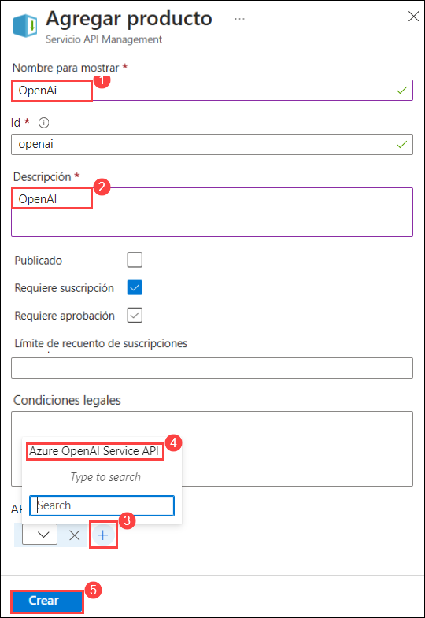

7. En el servicio API Management **miyagi-apim-<inject key="DeploymentID" enableCopy="false"/>**, haga clic en **Suscripciones** **(1)** en APIs del menú izquierdo y haga clic en **+ Agregar suscripción** **(2)**.

   

8. En **Agregar suscripción**, ingrese el Nombre como **aoai-test** **(1)**, establezca el Nombre para mostrar como **AOAI Test** **(2)**, y haga clic en **Crear** **(3)**.

   

9. Una vez creada la suscripción, haga clic en los **tres puntos** **(1)** al lado de la clave recién creada y haga clic en **Mostrar u ocultar claves** **(2)**. Copie la clave **principal de suscripción** **(3)** y guárdela para más adelante.

   

10. Navegue a **Azure OpenAI** en el Portal de Azure, seleccione el recurso Azure OpenAI **OpenAIService-<inject key="DeploymentID" enableCopy="false"/>**.

11. En **OpenAIService-<inject key="DeploymentID" enableCopy="false"/>**, seleccione **Control de acceso (IAM)** **(1)**, haga clic en **+ Agregar** **(2)**, y seleccione **Agregar asignación de roles** **(3)**.

    
   
12. En la pestaña **Adición de la asignación de roles** en la barra de búsqueda escriba y seleccione **Cognitive Services User** y haga clic en **Siguiente**.

    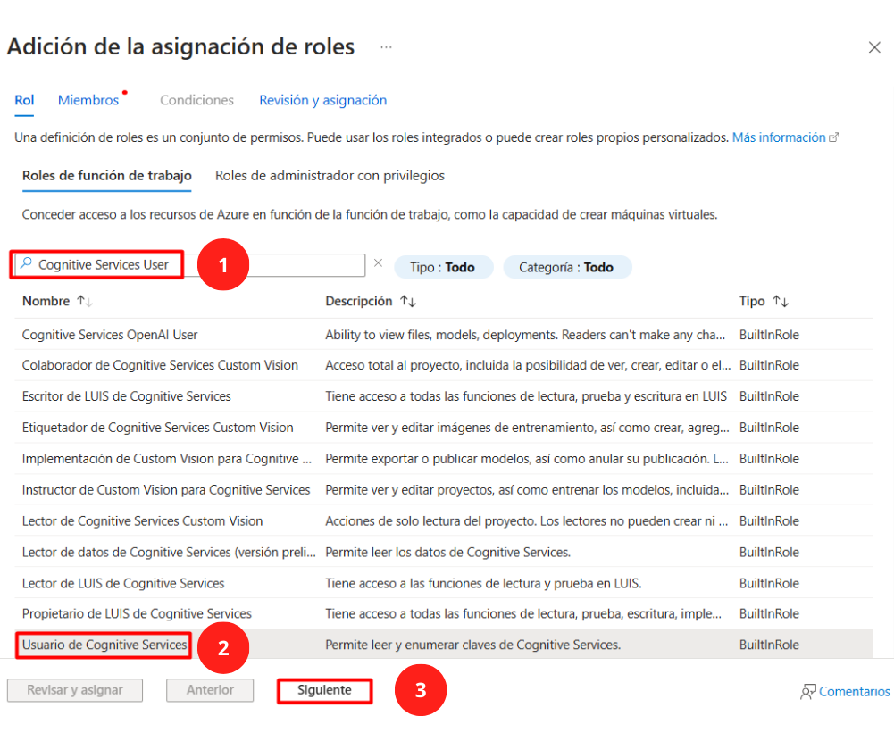

13. En la pestaña **Miembros**, seleccione **Identidad administrada** **(1)**, haga clic en **+ Seleccionar miembros** **(2)**, en la ventana emergente Selección de identidades administradas en el menú desplegable Identidad administrada seleccione **API Management service** **(3)**, elija **miyagi-apim-<inject key="DeploymentID" enableCopy="false"/>** **(4)**, haga clic en **Seleccionar** **(5)** y haga clic en **Siguiente** **(6)**.

    

14. En la pestaña **Revisar y asignar** haga clic en **Revisar y asignar**.

      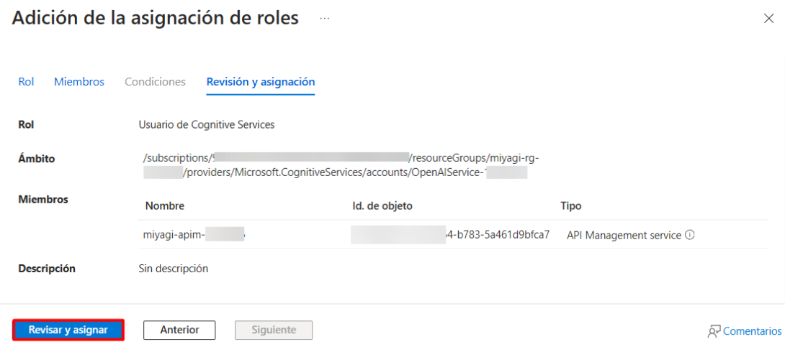

15. Vuelva al **servicio API Management** en el Portal de Azure, seleccione el servicio API Management **miyagi-apim-<inject key="DeploymentID" enableCopy="false"/>**.

16. En el servicio **API Management**, seleccione **API** **(1)**, elija la API **Azure OpenAI Service API** **(2)** creada en el paso anterior, seleccione **Todas las Operaciones** **(3)** y haga clic en **Editor de código de política** **(4)** en **Procesamiento entrante**.

      

17. En el editor de código, copie la siguiente política para sobrescribir solo las etiquetas **entrantes** **(1)**, reemplace **&lt;&lt;Azure_OpenAI_Endpoint&gt;&gt;** con **<inject key="OpenAIEndpoint" enableCopy="true"/>** **(2)** del administrador de API que copió el Paso 4 de la Tarea 1 y haga clic en **Guardar** **(3)**.

      ```
      <inbound>
         <base />
         <set-header name="api-key" exists-action="delete" />
         <authentication-managed-identity resource="https://cognitiveservices.azure.com" output-token-variable-name="msi-access-token" ignore-error="false" />
         <set-header name="Authorization" exists-action="override">
            <value>@("Bearer " + (string)context.Variables["msi-access-token"])</value>
         </set-header>
         <set-backend-service base-url="https://<<Azure_OpenAI_Endpoint>>/openai" />
      </inbound>
      ```

    

    >**Nota**: Asegúrese de pegar los valores de **OpenAIEndpoint** y eliminar cualquier duplicación de **https://**.

18. En API Management, haga clic en **Probar** **(1)**, seleccione Creates a **completion for the chat message** **(2)**, ingrese el nombre de la implementación gpt-35-turbo **<inject key="CompletionModel" enableCopy="true"/>** **(3)** en el campo deployment-id, ingrese **2023-05-15** **(4)** en el campo api-version, y haga clic en **Enviar** **(5)**. 

     

19. Desplácese hacia abajo en la respuesta y debería ver una respuesta `200` y un mensaje devuelto por su servicio OpenAI.

    

### Tarea 3: Actualizar la Imagen de Docker para el servicio de Recomendación

1. Navegue a Visual Studio Code, expanda el directorio **miyagi/services/recommendation-service/dotnet** y seleccione **appsettings.json**.

   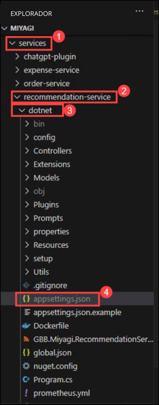

1. En el archivo `appsettings.json`, debe reemplazar el valor **endpoint** que tiene el **punto de conexión del recurso OpenAI** con la **URL de la Puerta de Enlace del API** que copió en el Paso 4 de la Tarea 1, el valor **apiKey** con la **clave de suscripción** que se copió in el Paso 9 de la Tarea 2 y guarde el archivo.

   

1. Desde el Explorador, navegue a la ruta `Miyagi/services/recommendation-service/dotnet/` **(1)**. Haga clic derecho en la carpeta `dotnet` y seleccione **Abrir en Terminal Integrada** **(2)** en la pestaña de opciones para abrir la terminal con la ruta requerida.

   

1. Ahora, necesita reconstruir la imagen docker para el servicio de recomendación ejecutando el siguiente comando docker. Asegúrese de utilizar el mismo nombre de la imagen docker que se creó anteriormente para el servicio de recomendación.

   ```
   docker build . -t miyagi-recommendation
   ```

   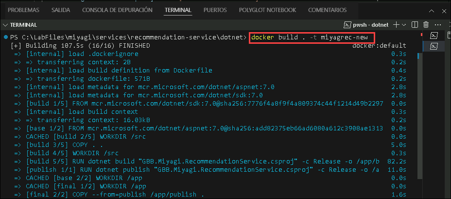
   
1. Ejecute el siguiente comando para iniciar sesión en ACR.

   > **Nota**: Por favor reemplace **[ACRname]** con **<inject key="AcrLoginServer" enableCopy="true"/>**, **[uname]** con **<inject key="AcrUsername" enableCopy="true"/>**, y **[password]** con **<inject key="AcrPassword" enableCopy="true"/>**.

    ```
    docker login [ACRname] -u [uname] -p [password]
    ```

1. Ejecute el siguiente comando para agregar la etiqueta.

   > **Nota**: Por favor reemplace **[ACRname]** con **<inject key="AcrLoginServer" enableCopy="true"/>**.

   ```
   docker tag miyagi-recommendation:latest [ACRname]/miyagi-recommendation:latest
   ```

1. Una vez que haya iniciado sesión en ACR, ejecute el siguiente comando para enviar la imagen docker actualizada del servicio de recomendación al registro del contenedor.

   **Nota**: Asegúrese de reemplazar **[ACRname]** con **<inject key="AcrLoginServer" enableCopy="true"/>**.

   ```
   docker push [ACRname]/miyagi-recommendation:latest
   ```

   

### Tarea 4: Revisión del servicio de Recomendación de AKS 

1. Navegue al Portal de Azure, abra el Grupo de Recursos denominado **miyagi-rg-<inject key="DeploymentID" enableCopy="false"/>**  y seleccione el servicio de Kubernetes **env-miyagi-<inject key="DeploymentID" enableCopy="false"/>** de la lista de recursos.

   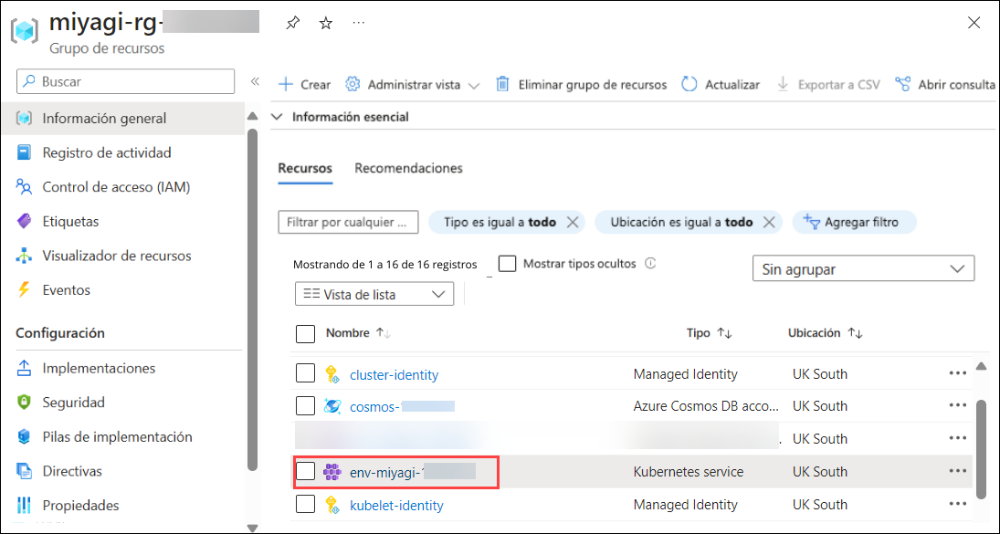

1. En la pestaña Información general del panel del servicio de Kubernetes **env-miyagi-<inject key="DeploymentID" enableCopy="false"/>**, haga clic en el botón **Detener**.

   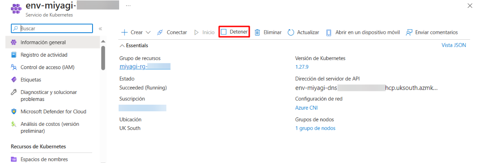

   > **Nota**: Espere hasta que el servicio de Kubernetes se detenga por completo. 

1. En la pestaña Información general del panel del servicio de Kubernetes **env-miyagi-<inject key="DeploymentID" enableCopy="false"/>**, haga clic en el botón **Iniciar**.

   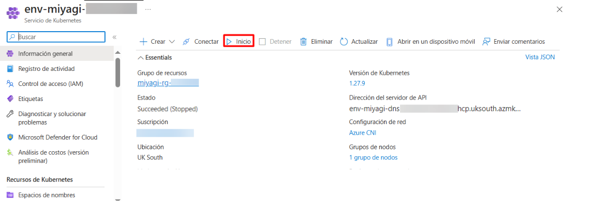

1. Una vez que se inicie el servicio de Kubernetes, seleccione **Servicios e ingresses** en recursos de Kubernetes y haga clic en **Extension IP** de miyagi-recommendation-service.

   

1. Esto navegará a una nueva pestaña con la página web de **miyagi-recommendation-service**.

   

### Tarea 5: Configurar Event Hub Logging y Validar la Entrada

1. En el Portal de Azure, busque y seleccione **Event Hubs**, seleccione **miyagi-event-<inject key="DeploymentID" enableCopy="false"/>**.

2. En la pestaña Espacios de nombres de Event hub **miyagi-event-<inject key="DeploymentID" enableCopy="false"/>**, en el menú de la izquierda seleccione **Control de acceso (IAM)** **(1)** , haga clic en **+ Agregar** **(2)**, y seleccione **Agregar asignación de roles** **(3)**.

   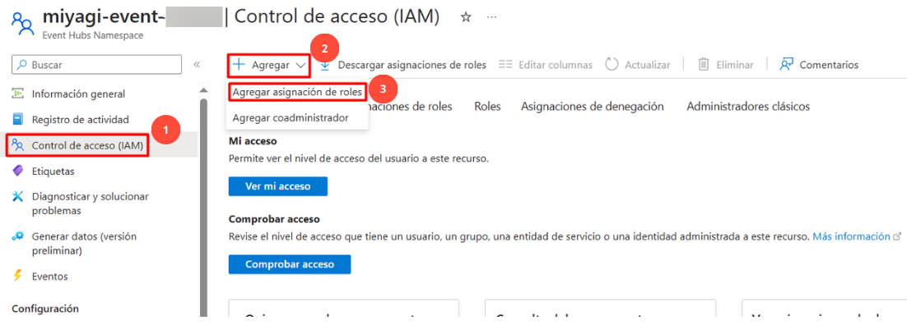

3. En la pestaña **Rol** de la pestaña Adición de la asignación de roles en la barra de búsqueda escriba y seleccione **Azure Event Hubs Data Sender** y haga clic en **Siguiente**.

   

4. En la pestaña **Miembros**, seleccione **Identidad administrada** **(1)**, haga clic en **+ Seleccionar miembros** **(2)**, en la ventana emergente Selección de identidades administradas en el menú desplegable Identidad administrada elija **API Management service** **(3)**, seleccione **miyagi-apim-<inject key="DeploymentID" enableCopy="false"/>** **(4)**, haga clic en **Seleccionar** **(5)** y haga clic en **Siguiente** **(6)**.

   

5. En la pestaña **Revisar y asignar** haga clic en **Revisar y asignar**.

   

6. En la pestaña Espacio de nombres de Event hub **miyagi-event-<inject key="DeploymentID" enableCopy="false"/>**, en el menú de la izquierda seleccione **Event Hubs** **(1)** en Entidades y haga clic en **miyagi-event-<inject key="DeploymentID" enableCopy="false"/>**

   

7. En la **Instancia de Event Hubs** de **miyagi-event-<inject key="DeploymentID" enableCopy="false"/>**, en el menú de la izquierda seleccione **Políticas de acceso compartido** **(1)** en Configuración, haga clic en **apimLoggerAccessPolicy** **(2)** y copie la **Cadena de conexión primaria** **(3)** y péguela en un bloc de notas.

   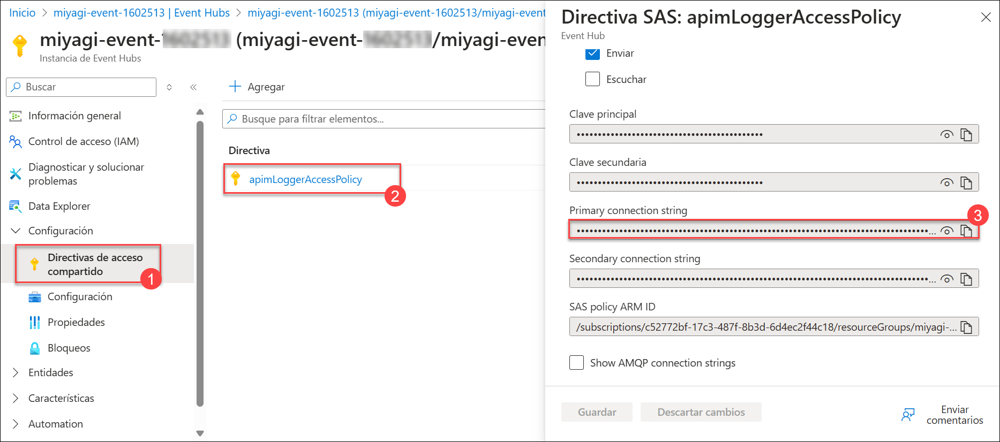

8. Abra el **bloc de notas** de JumpVM y copie y pegue el siguiente código, actualizando **&lt;&lt;API_MANAGEMENT_NAME&gt;&gt;** con el nombre **miyagi-apim-<inject key="DeploymentID" enableCopy="false"/>** y &lt;&lt;EVENT_HUB_CONNECTION_STRING&gt;&gt; con el valor copiado en el paso anterior.

   ```
   resource existingApiManagement 'Microsoft.ApiManagement/service@2023-03-01-preview' existing = {
      name: '<<API_MANAGEMENT_NAME>>'
    }
    
    resource ehLoggerWithConnectionString 'Microsoft.ApiManagement/service/loggers@2023-05-01-preview' = {
      name: 'AOAILogger'
      parent: existingApiManagement
      properties: {
        loggerType: 'azureEventHub'
        description: 'Event hub logger with connection string'
        credentials: {
          connectionString: '<<EVENT_HUB_CONNECTION_STRING>>'
          name: 'ApimEventHub'
        }
      }
    }
   ```

   

9. En la barra de menú del bloc de notas seleccione **Archivo** y haga clic en **Guardar como**.

10. En **Guardar como** navegue a la ruta `C:\LabFiles\miyagi` **(1)**, ingrese el nombre de archivo **aoai-logger.bicep** **(2)**, guarde el tipo como **Todos los archivos** **(3)** y haga clic en **Guardar** **(4)**.

    

11. En JumpVM abra la terminal de PowerShell y ejecute el siguiente comando para iniciar sesión en el **Portal de Azure**.

    ```
    az login
    ```

12. Esto lo redireccionará a la **página de inicio de sesión de Microsoft**, seleccione su cuenta de Azure **<inject key="AzureAdUserEmail"></inject>**, y regrese de vuelta a **PowerShell**.

    

13. Ejecute el siguiente comando para cambiar el directorio a la carpeta raiz `miyagi` en la terminal y ejecutar el archivo bicep.

    > **Nota**: Reemplace &lt;&lt;RESOURCE_GROUP_NAME&gt;&gt; con **<inject key="rgname" enableCopy="true"/>**.
   
    ```
    cd C:\LabFiles\miyagi
    az deployment group create --resource-group <<RESOURCE_GROUP_NAME>> --template-file .\aoai-logger.bicep
    ```
    
14. Navegue al Portal de Azure, abra el Grupo de recursos denominado **miyagi-rg-<inject key="DeploymentID" enableCopy="false"/>**  y seleccione el servicio API Management **miyagi-apim-<inject key="DeploymentID" enableCopy="false"/>** de la lista de recursos.

    

15. En servicio API Management **miyagi-apim-<inject key="DeploymentID" enableCopy="false"/>** en el menú de la izquierda haga clic en **APIs** **(1)** y seleccione **Azure OpenAI Service API** **(2)** que fue creado en un paso anterior, seleccionando **Todas las Operaciones** **(3)** y en **procesamiento saliente** haga clic en el **Editor de código de política(4)**.

    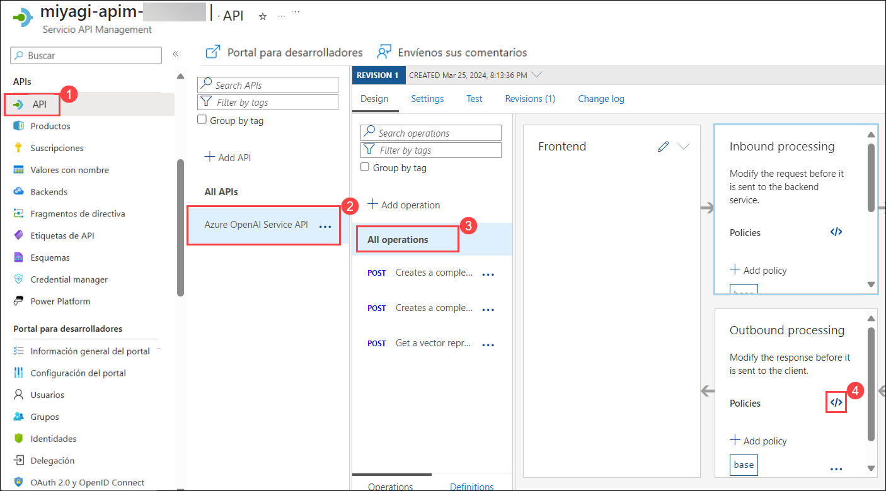

16. En el editor de código copie la siguiente política para sobrescribir las etiquetas **salientes** únicamente y haga clic en **Guardar**.

      ```
      <outbound>
         <base />
         <choose>
            <when condition="@(!context.Variables.GetValueOrDefault<bool>("isStream"))">
                  <log-to-eventhub logger-id="AOAILogger" partition-id="0">@{
                  var responseBody = context.Response.Body?.As<JObject>(true);
                  return new JObject(
                     new JProperty("prompt_tokens", responseBody["usage"]["prompt_tokens"].ToString()),
                     new JProperty("total_tokens", responseBody["usage"]["total_tokens"].ToString())
                  ).ToString();
            }</log-to-eventhub>
            </when>
         </choose>
      </outbound>
      ```

      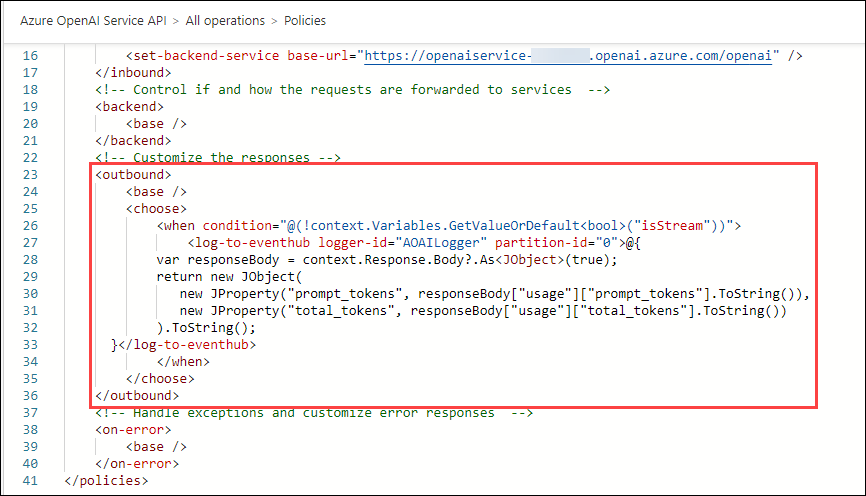

17. Vuelva a Event Hubs, seleccione el recurso Event Hub **miyagi-event-<inject key="DeploymentID" enableCopy="false"/>**.

    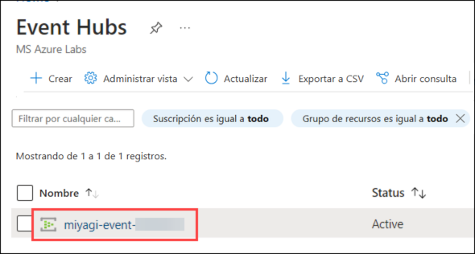

18. En el Espacio de nombres Event Hub **miyagi-event-<inject key="DeploymentID" enableCopy="false"/>**, en el menú de la izquierda seleccione **Event Hubs** **(1)** en Entidades y haga clic en **miyagi-event-<inject key="DeploymentID" enableCopy="false"/>**

    

19. En la Instancia de Event Hubs **miyagi-event-<inject key="DeploymentID" enableCopy="false"/>**, en el menú de la izquierda seleccione **Procesar datos** **(1)**, desplácese hacia abajo hasta localizar **Procese sus datos de Event Hub usando Stream Analytics Query Language** y haga clic en **Iniciar** **(2)**.

    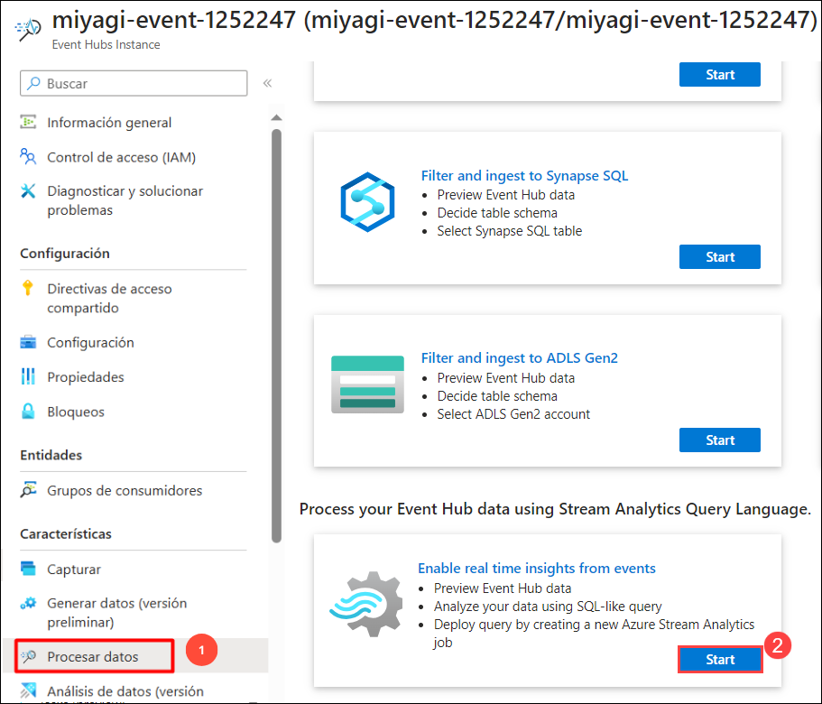

20. Ahora abra la interfaz de usuario de Miyagi en una pestaña separada del navegador, haga clic en **Personalize** y cambie sus preferencias de stock. Luego, haga clic en **Personalize** y repita los mismos pasos varias veces para generar registros adicionales. En Query de Event hub, debería ver información de registro de los tokens utilizados.

    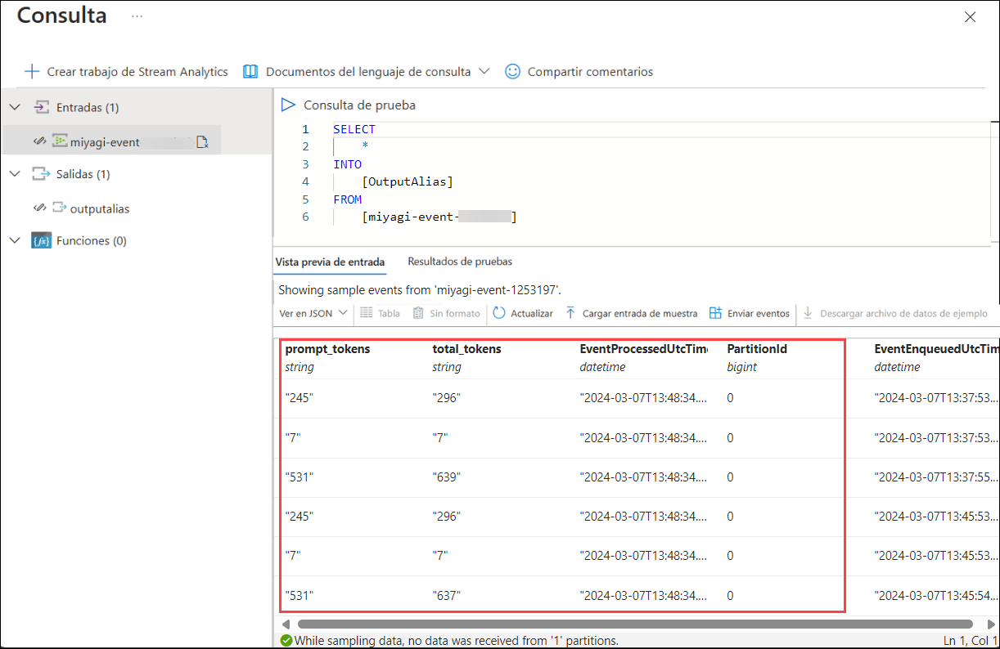

### Resumen

En esta práctica de laboratorio, configuró un servicio API Management para administrar las APIs de manera eficiente. Inicialmente, se implementó el servicio y se creó una API dentro de él. Posteriormente se establecieron reglas y roles para controlar el acceso a la API. El registro de Event Hub se configuró para monitorear el uso de API de manera efectiva. Por último, se realizó una validación de entradas para garantizar que la API manejara varias entradas correctamente. En general, este proceso garantizó la gestión efectiva, la seguridad y el monitoreo del rendimiento de las API, contribuyendo a un ecosistema de API seguro y bien organizado.
