# Lab 4 - Expose Open AI through APIM

In this lab, you'll be verifying and creating APIs in the deployed API Management service to update the Docker image for the Recommendation service. The revision of the Recommendation service from the Azure Kubernetes services encapsulates the meticulous approach to maintaining and optimizing containerized applications within the project's scope.

### Task 1: Verify the deployed API Management service and create an API

1. Navigate to Azure portal, open the Resource Group named **miyagi-rg-<inject key="DeploymentID" enableCopy="false"/>**  and select **miyagi-apim-<inject key="DeploymentID" enableCopy="false"/>** API Management service from the resources list.

   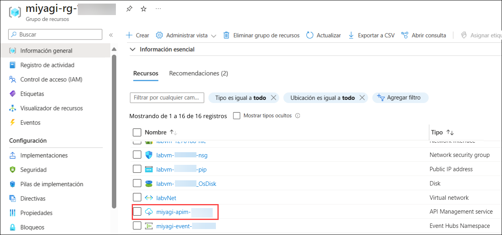

1. In the **miyagi-apim-<inject key="DeploymentID" enableCopy="false"/>** API Management service, click on **APIs** **(1)** under APIs from the left menu and select **HTTP** **(2)** under Define a new API to create an HTTP API.

   

1. Enter the following values in the Create an HTTP API pane:
   
   | **Parameter**        | **Values**           | 
   | -------------------- | -------------------- | 
   | API Type **(1)**     | **Basic**            | 
   | Display name **(2)** | **miyagi-api**       |
   | Name **(3)**         | **miyagi-api**       |
   | Web service URL **(4)** | Enter the Endpoint of Azure OpenAI Endpoint  **<inject key="OpenAIEndpoint" enableCopy="true"/>**  |
   | API URL suffix **(5)** | **openai** |
   | Click on  **(6)** | **Create** |

   

1. Once API is created, click on **Overview** **(1)** from the left-menu copy the **Gateway URL** **(2)** of API Management service. Paste it into Notepad for later use.

   

### Task 2: Create API Management Policy and Roles

1. In the **miyagi-apim-<inject key="DeploymentID" enableCopy="false"/>** API Management service, click on **APIs** **(1)**, click on the **three dots** **(2)** next to miyagi-api, select **Import** **(3)**, and click on **OpenAPI** **(4)**.

   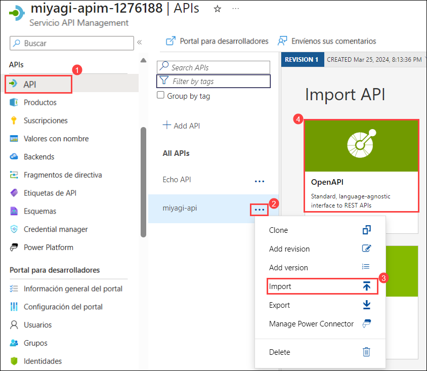

2. In the popup of **Import from OpenAPI specification** paste the below link in the OpenAPI specification **textbox** **(1)** , and then click **import** **(2)**. 

   ```
   https://raw.githubusercontent.com/Azure/azure-rest-api-specs/main/specification/cognitiveservices/data-plane/AzureOpenAI/inference/stable/2023-05-15/inference.json
   ```

   

3. You should now see a series of APIs under the Azure OpenAI Service API.
   
    

4. In the **Azure OpenAI Service API** API navigate to the **settings** **(1)** tab and update the subscription key **Header Name** to **api-key** **(2)** and click on **Save** **(3)**.

   

5. In the **miyagi-apim-<inject key="DeploymentID" enableCopy="false"/>** API Management service, click on **Products** **(1)** under APIs from the left menu and click on **+ Add** **(2)**.

   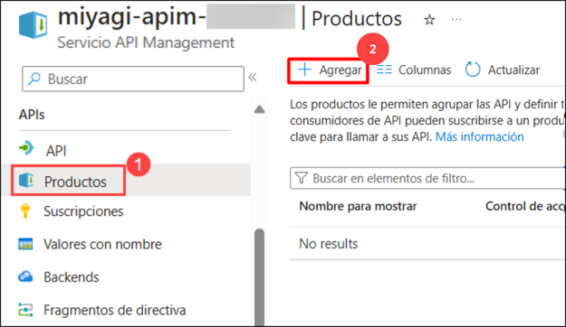

6. In the **Add product** display name as **OpenAi** **(1)**, description as **OpenAI** **(2)**. Under the APIs menu click the **plus sign** **(3)** select the **Azure OpenAI Service API** **(4)** hit Enter and click on **Create** **(5)**.

   

7. In the **miyagi-apim-<inject key="DeploymentID" enableCopy="false"/>** API Management service, click on **subscriptions** **(1)** under APIs from the left menu and click on **+ Add subscription** **(2)**.

   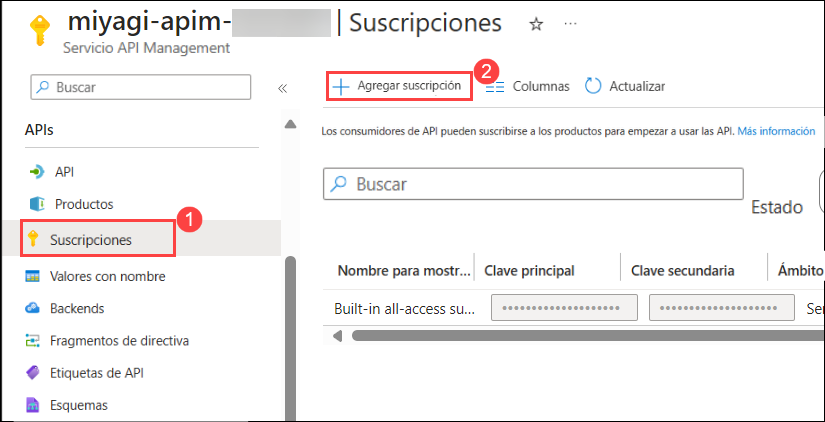

8. In the **Add subscription**, enter the Name as **aoai-test** **(1)**, enter Display name as **AOAI Test** **(2)**, and click on **Create** **(3)**.

   

9. Once the subscription is created click the **three dots** **(1)** next to the newly created key and then click **Show\hide keys** **(2)**. Copy the **primary subscription** **(3)** key and save it for later.

   

10. Navigate to **Azure OpenAI** in the Azure Portal, select the **OpenAIService-<inject key="DeploymentID" enableCopy="false"/>** Azure OpenAI resources.

11. In the **OpenAIService-<inject key="DeploymentID" enableCopy="false"/>**, select **Access control (IAM)** **(1)**, click on **+ Add** **(2)**, and select **Add role assignment** **(3)**.

    
   
12. In **Add role assignment** tab in the search bar search and select **Cognitive Services User** and click on **Next**.

    

13. In the **Members** tab, select **Managed identity** **(1)**, click on **+ Select Members** **(2)** in the select managed identity pop-up under Managed identity the drop-down select **API Management service** **(3)**, select the **miyagi-apim-<inject key="DeploymentID" enableCopy="false"/>** **(4)**, then click-on **Select** **(5)** and click on **Next** **(6)**.

    

14. In the **Review + assign** tab click on **Review + assign**.

      

15. Navigate back to **API Management service** in the Azure Portal, select the **miyagi-apim-<inject key="DeploymentID" enableCopy="false"/>** API Management service.

16. In the **API Management service**, select **APIs** **(1)**, select the **Azure OpenAI Service API** **(2)** API created in the earlier step, select **All Operations** **(3)** and click on **Policy code editor** **(4)**.

      

17. In the code editor copy the below policy to overwrite the **inbound** **(1)** tags only, replace **&lt;&lt;Azure_OpenAI_Endpoint&gt;&gt;** with **<inject key="OpenAIEndpoint" enableCopy="true"/>** **(2)** of API manager which you copen in Task 1 Step 4 and click on **Save** **(3)**.

      ```
      <inbound>
         <base />
         <set-header name="api-key" exists-action="delete" />
         <authentication-managed-identity resource="https://cognitiveservices.azure.com" output-token-variable-name="msi-access-token" ignore-error="false" />
         <set-header name="Authorization" exists-action="override">
            <value>@("Bearer " + (string)context.Variables["msi-access-token"])</value>
         </set-header>
         <set-backend-service base-url="https://<<Azure_OpenAI_Endpoint>>/openai" />
      </inbound>
      ```

    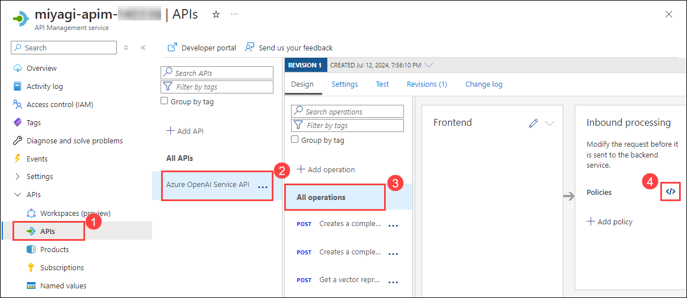

18. In API Management, click on **Test** **(1)**, select Creates a **completion for the chat message** **(2)**, enter the gpt-35-turbo deployment name **<inject key="CompletionModel" enableCopy="true"/>** **(3)** in the deployment-id field, enter **2023-05-15** **(4)** in the API version field, and click **Send** **(5)**. 

     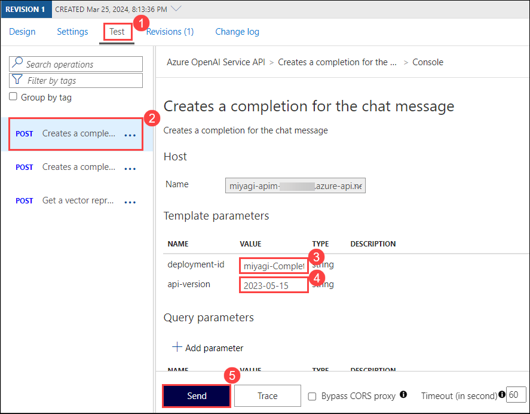

19. Scroll down the response and you should see a `200` response and a message back from your OpenAI service.

    

### Task 3: Update the Docker Image for the Recommendation service

1. Navigate to Visual Studio Code, expand **miyagi/services/recommendation-service/dotnet** directory and select the **appsettings.json**.

   

1. In the `appsettings.json` file, you have to replace the **endpoint** value from **OpenAI resource endpoint** with **API Gateway URL** which you have copied in Task-1 Step-4, **apiKey** value with the **subscription key** that was copied in Task-2 Step-9 and Save the file.

   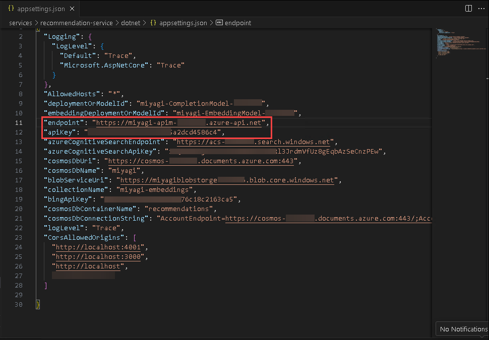

1. From the Explorer, navigate to `Miyagi/services/recommendation-service/dotnet/` **(1)** path. Right-click on `dotnet` folder and select **Open in Integrated Terminal** **(2)** from the options tab to open the terminal with the required path.

   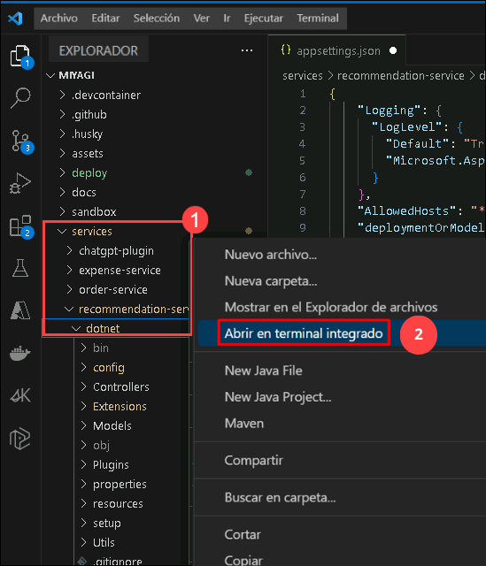

1. Now, you need to re-build the docker image for recommendation service by running the below docker command. Make to update the docker image name which was created earlier for recommendation service with the same name.

   ```
   docker build . -t miyagi-recommendation
   ```

   
   
1. Run the following command to ACR login.

   > **Note**: Please replace **[ACRname]** with **<inject key="AcrLoginServer" enableCopy="true"/>**, **[uname]** with **<inject key="AcrUsername" enableCopy="true"/>**, and **[password]** with **<inject key="AcrPassword" enableCopy="true"/>**.

    ```
    docker login [ACRname] -u [uname] -p [password]
    ```

1. Run the following command to add the tag.

   > **Note**: Please replace **[ACRname]** with **<inject key="AcrLoginServer" enableCopy="true"/>**.

   ```
   docker tag miyagi-recommendation:latest [ACRname]/miyagi-recommendation:latest
   ```

1. Once you are logged into ACR. Run the below command to push the updated docker image of the recommendation service to the container registry.

   **Note**: Make sure to replace **[ACRname]** with **<inject key="AcrLoginServer" enableCopy="true"/>**.

   ```
   docker push [ACRname]/miyagi-recommendation:latest
   ```

   

### Task 4: Revision of Recommendation service from AKS 

1. Navigate to the Azure portal, open the Resource Group named **miyagi-rg-<inject key="DeploymentID" enableCopy="false"/>**  and select **env-miyagi-<inject key="DeploymentID" enableCopy="false"/>** Kubernetes service from the resources list.

   

1. In the Overview tab **env-miyagi-<inject key="DeploymentID" enableCopy="false"/>** Kubernetes service pane, click on **Stop** button.

   

   > **Note**: Wait till Kubernetes service is completely stopped. 

1. In the Overview tab **env-miyagi-<inject key="DeploymentID" enableCopy="false"/>** Kubernetes service pane, click on **Start** button.

   

1. Once the Kubernetes service starts, select **Services and ingresses** under Kubernetes resources and click on **Extension IP** of the miyagi-recommendation-service.

   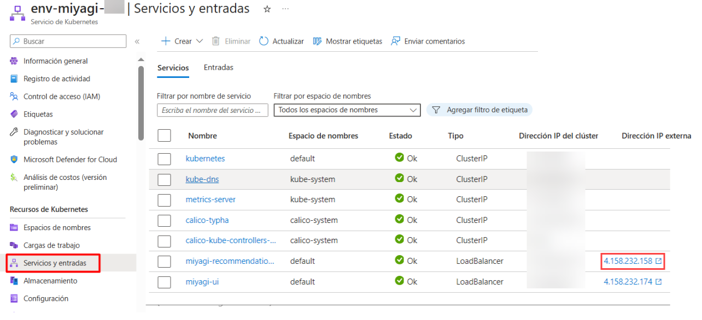

1. This will navigate a new tab with **miyagi-recommendation-service** web page.

   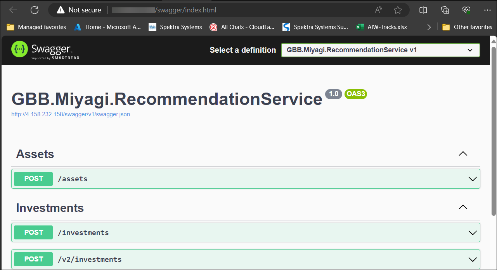

### Task 5: Setup Event Hub Logging and Validate Input

1. In the Azure portal Search and select **Event Hubs**, select the **miyagi-event-<inject key="DeploymentID" enableCopy="false"/>**.

2. In the **miyagi-event-<inject key="DeploymentID" enableCopy="false"/>** Event hub Namespace tab, from the left menu select **Access control (IAM)** **(1)** , click on **+ Add** **(2)**, and select **Add role assignment** **(3)**.

   

3. In the **Role** tab of the Add role assignment tab in the search bar search and select **Azure Event Hubs Data Sender** and click on **Next**.

   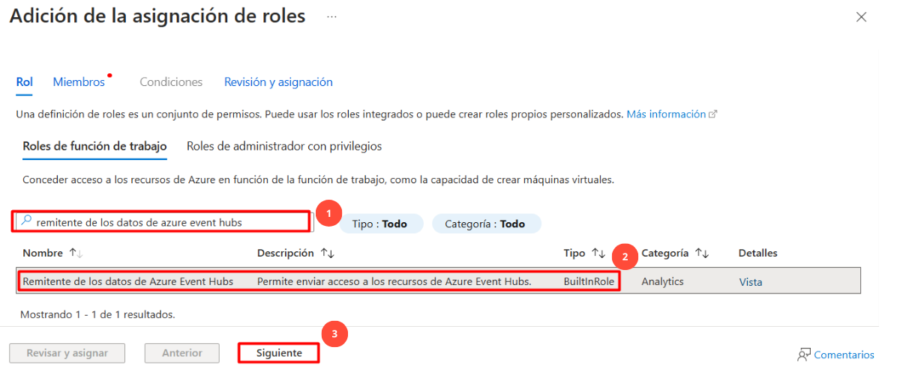

4. In the **Members** tab, select **Managed identity** **(1)**, click on **+ Select Members** **(2)** in the select managed identity pop-up under Managed identity the drop-down select **API Management service** **(3)**, select the **miyagi-apim-<inject key="DeploymentID" enableCopy="false"/>** **(4)**, then click-on **Select** **(5)** and click on **Next** **(6)**.

   

5. In the **Review + assign** tab click on **Review + assign**.

   

6. In the **miyagi-event-<inject key="CompletionModel" enableCopy="false"/>** Event hub Namespace, from the left-menu select **Event Hubs** **(1)** under Entity and click on **miyagi-event-<inject key="CompletionModel" enableCopy="false"/>**

   

7. In the **Event Hubs Instance** of **miyagi-event-<inject key="CompletionModel" enableCopy="false"/>**, from the left menu select **Shared access policies** **(1)** under Settings, click on **apimLoggerAccessPolicy** **(2)** and copy the **Connection string–primary key** **(3)** paste it in a notepad.

   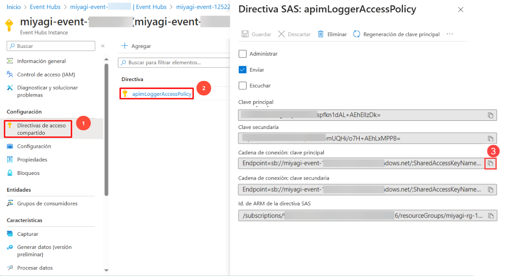

8. Open the **notepad** from the jumpvm and copy and paste the below code, update the **&lt;&lt;API_MANAGEMENT_NAME&gt;&gt;** with **miyagi-apim-<inject key="DeploymentID" enableCopy="false"/>** name and the &lt;&lt;EVENT_HUB_CONNECTION_STRING&gt;&gt; copied from the step above.

   ```
   resource existingApiManagement 'Microsoft.ApiManagement/service@2023-03-01-preview' existing = {
      name: '<<API_MANAGEMENT_NAME>>'
    }
    
    resource ehLoggerWithConnectionString 'Microsoft.ApiManagement/service/loggers@2023-05-01-preview' = {
      name: 'AOAILogger'
      parent: existingApiManagement
      properties: {
        loggerType: 'azureEventHub'
        description: 'Event hub logger with connection string'
        credentials: {
          connectionString: '<<EVENT_HUB_CONNECTION_STRING>>'
          name: 'ApimEventHub'
        }
      }
    }
   ```

   

9. In the menu bar notepad select **Files** and click on **Save As**.

10. In the **Save As** navigate to the `C:\LabFiles\miyagi` **(1)** path, enter the file name **aoai-logger.bicep** **(2)**, save as type to **All Files** **(3)** and click on **Save** **(4)**.

    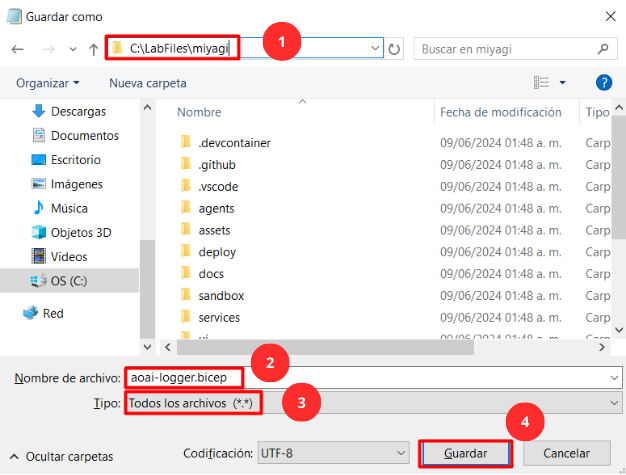

11. From the jumpvm open the PowerShell terminal and run the following command to log in to the **Azure portal**.

    ```
    az login
    ```

12. This will redirect to **Microsoft login page**, select your Azure account **<inject key="AzureAdUserEmail"></inject>**, and navigate back to the **PowerShell**.

    

13. Run the following command to change the directory to `miyagi` root folder in the terminal and run the bicep file.

    > **Note**: Replace &lt;&lt;RESOURCE_GROUP_NAME&gt;&gt; with **<inject key="rgname" enableCopy="true"/>**.
   
    ```
    cd C:\LabFiles\miyagi
    az deployment group create --resource-group <<RESOURCE_GROUP_NAME>> --template-file .\aoai-logger.bicep
    ```
    
14. Navigate to Azure portal, open the Resource Group named **miyagi-rg-<inject key="DeploymentID" enableCopy="false"/>**  and select **miyagi-apim-<inject key="DeploymentID" enableCopy="false"/>** API Management service from the resources list.

    

15. In the **miyagi-apim-<inject key="DeploymentID" enableCopy="false"/>** API Management service for the left menu, click on **APIs** **(1)** and  Select the **Azure OpenAI Service API** **(2)** created in the earlier step, select **All Operations** **(3)**.

    

16. In the code editor copy the below policy to overwrite the **outbound** tags only and click on **Save**.

      ```
      <outbound>
         <base />
         <choose>
            <when condition="@(!context.Variables.GetValueOrDefault<bool>("isStream"))">
                  <log-to-eventhub logger-id="AOAILogger" partition-id="0">@{
                  var responseBody = context.Response.Body?.As<JObject>(true);
                  return new JObject(
                     new JProperty("prompt_tokens", responseBody["usage"]["prompt_tokens"].ToString()),
                     new JProperty("total_tokens", responseBody["usage"]["total_tokens"].ToString())
                  ).ToString();
            }</log-to-eventhub>
            </when>
         </choose>
      </outbound>
      ```

17. Navigate back to Event Hub, select **miyagi-event-<inject key="DeploymentID" enableCopy="false"/>** Event Hubs.

    

18. In the **miyagi-event-<inject key="DeploymentID" enableCopy="false"/>** Event hub Namespace, from the left-menu select **Event Hubs** **(1)** under Entity and click on **miyagi-event-<inject key="CompletionModel" enableCopy="false"/>**

    

19. In the **miyagi-event-<inject key="DeploymentID" enableCopy="false"/>** Event hubs Instance, from the left menu select **Process data** **(1)**, scroll down till you find **Process your Event Hub data using Stream Analytics Query Language** and click **Start** **(2)**.

    

20. Next open the Miyagi UI in a separate browser tab and change your stock preferences. In the Event Hub query, you should see log information for the tokens used.

    
