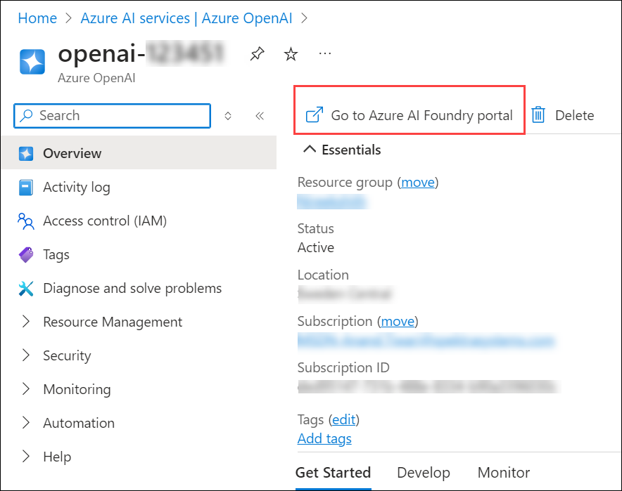
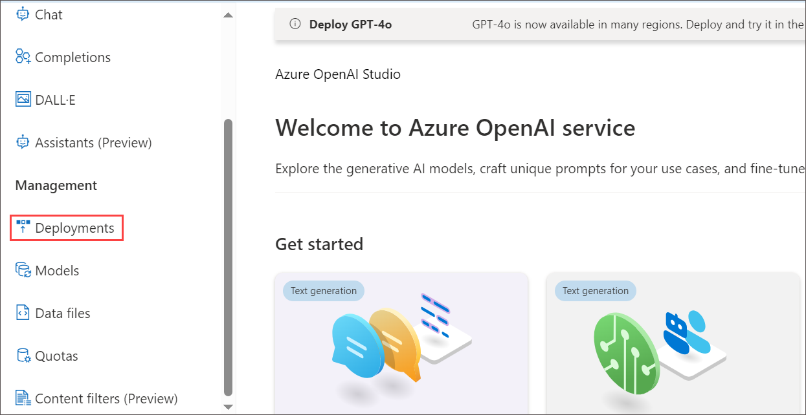
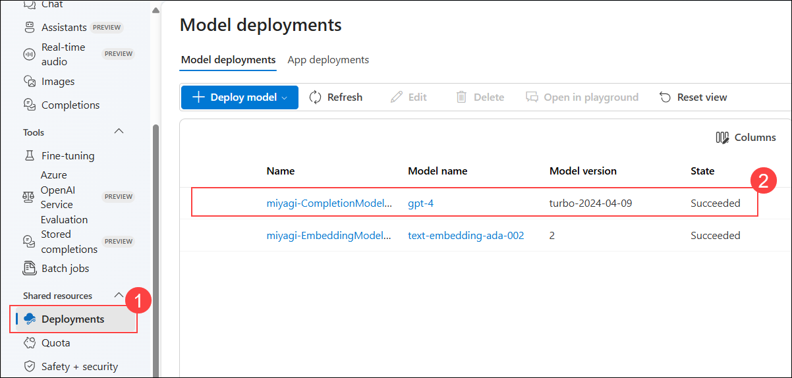
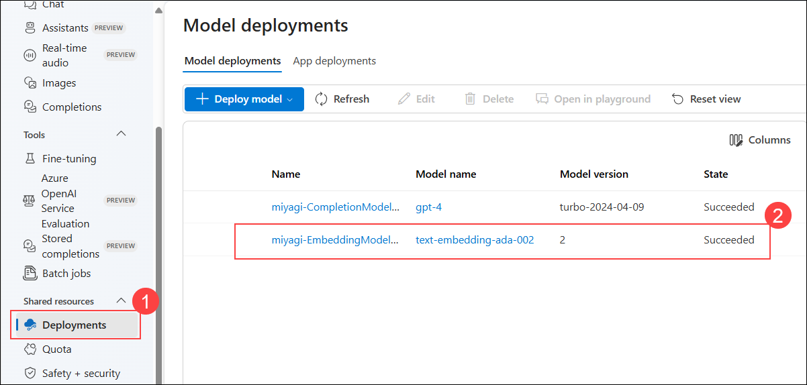
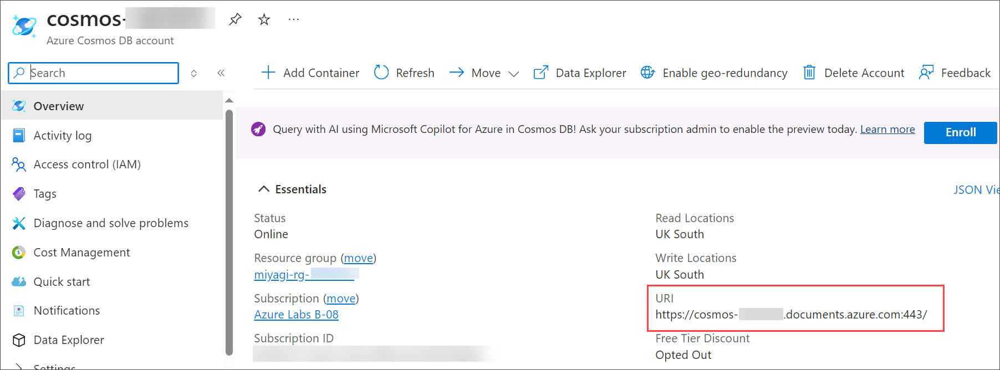

# Laboratório 1: Verificar e recuperar os valores dos recursos do Azure (opcional)

Neste laboratório, irá verificar e recuperar valores específicos, como Endpoint, Connection String e Key, para vários recursos do Azure. Isto é crucial para garantir a configuração e conectividade adequadas destes recursos.

 - Azure OpenAI: **OpenAIService-<inject key="DeploymentID" enableCopy="false"/>**
 - Conta DB do Azure Cosmos: **cosmos-<inject key="DeploymentID" enableCopy="false"/>**
 - Serviço de pesquisa: **acs-<inject key="DeploymentID" enableCopy="false"/>**

1. Para verificar os nomes dos modelos de implementação para "**deploymentOrModelId**" e "**embeddingDeploymentOrModelId**" siga os passos abaixo:

    - Na página inicial do Portal Azure, clique em **Grupos de recursos** no painel **Navegar**.

      

    - Na página Grupos de recursos, clique em **miyagi-rg-<inject key="DeploymentID" enableCopy="false"/>**.

      

    - Em **miyagi-rg-<inject key="DeploymentID" enableCopy="false"/>**, no separador Overview selecione **OpenAIService-<inject key="DeploymentID" enableCopy="false"/>** .

      

    - Na página **OpenAI Overview**, clique com o botão direito do rato em **Ir para Azure OpenAI Studio** e clique em **Abrir ligação num novo separador**.

      

    - No **Azure AI Studio**, no painel de navegação esquerdo na secção **Gestão**, selecione **Implantações**.

      

    - Na folha **Implantações (1)** do Azure AI Studio, clique no nome do modelo **gpt-4** e verifique o **nome da implantação** do modelo gpt-4 **(2)**.

      

      .png)

    - Navegue de volta para a página **Implantação (1)**.

    - Na folha Azure AI Studio Deployments, clique em **nome do modelo text-embedding-ada-002** e verifique o **nome da implementação** do modelo **text-embedding-ada-002 (2)**.

      

      .png)

1. Para verificar os valores de **endpoint** e **apiKey** siga os passos abaixo:

    - Navegue de volta para o separador que exibe **portal Azure**.

    - Na folha **OpenAIService-<inject key="DeploymentID" enableCopy="false"/>** na secção **Gestão de Recursos**, selecione **Chaves e Endpoint (1)**, verifique a **KEY 1 (2)** e **Ponto final (3)**.

      

1. Para verificar os valores de "azureCognitiveSearchEndpoint", "azureCognitiveSearchApiKey", siga os passos abaixo:

    - Navegue de volta para o grupo de recursos **miyagi-rg-<inject key="DeploymentID" enableCopy="false"/>**.

    - On the **miyagi-rg-<inject key="DeploymentID" enableCopy="false"/>** page, select **acs-<inject key="DeploymentID" enableCopy="false"/>** from resources lista.

      

    - Na folha **acs-<inject key="DeploymentID" enableCopy="false"/>**, verifique o **URL**.

      

    - No painel **acs-<inject key="DeploymentID" enableCopy="false"/>**, na secção **Definições**, selecione **Chave (1)** e verifique a **Chave de administração primária (2)** valor.

      

1. Para verificar os valores de "**cosmosDbUri**" e "**cosmosDbName**", siga os passos abaixo:

    - Navegue de volta para o grupo de recursos **miyagi-rg-<inject key="DeploymentID" enableCopy="false"/>** página do grupo de recursos, selecione **cosmos-<inject key="DeploymentID" enableCopy= "false"/>** da lista de recursos.

      

    - Em **cosmos-<inject key="DeploymentID" enableCopy="false"/>** verifique o **URL**.

      

    - Em **cosmos-<inject key="DeploymentID" enableCopy="false"/>** em **Definições**, seleccione **Chaves** e verifique o valor da **Cadeia de ligação primária do Cosmos DB** .

      

1. Para obter os valores de **blobServiceUri**, siga os passos abaixo:

    - Navegue de volta para o grupo de recursos **miyagi-rg-<inject key="DeploymentID" enableCopy="false"/>** página do grupo de recursos, selecione **miyagiblobstorge<inject key="DeploymentID" enableCopy=" false"/>** da lista de recursos.

      

    - Na conta de armazenamento **miyagiblobstorge<inject key="DeploymentID" enableCopy="false"/>** no menu esquerdo, selecione **Endpoints** **(1)** na secção **Definições**, verifique o **Serviço Blob** **(2)** no serviço Blob.

      

## Resumo
Neste laboratório, irá verificar e recuperar valores de configuração como Endpoint, Connection String e Key para vários recursos do Azure, como OpenAI Service, Cosmos DB e Cognitive Search. Isto garante uma configuração e conectividade adequadas. Os passos envolvem aceder ao Portal Azure, navegar até grupos de recursos específicos e verificar os valores necessários.

### Tem sucesso concluiu este laboratório com sucesso. Agora clique em **Seguinte** no canto inferior direito para passar para a página seguinte.
