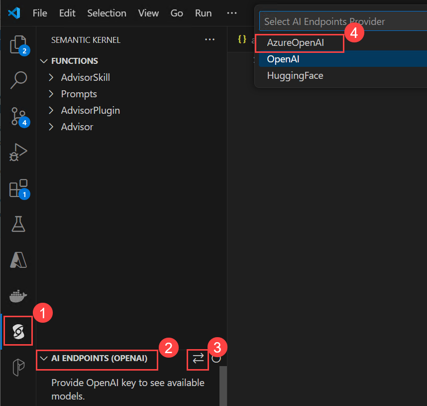
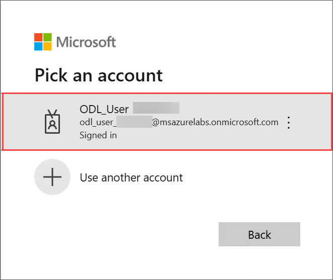
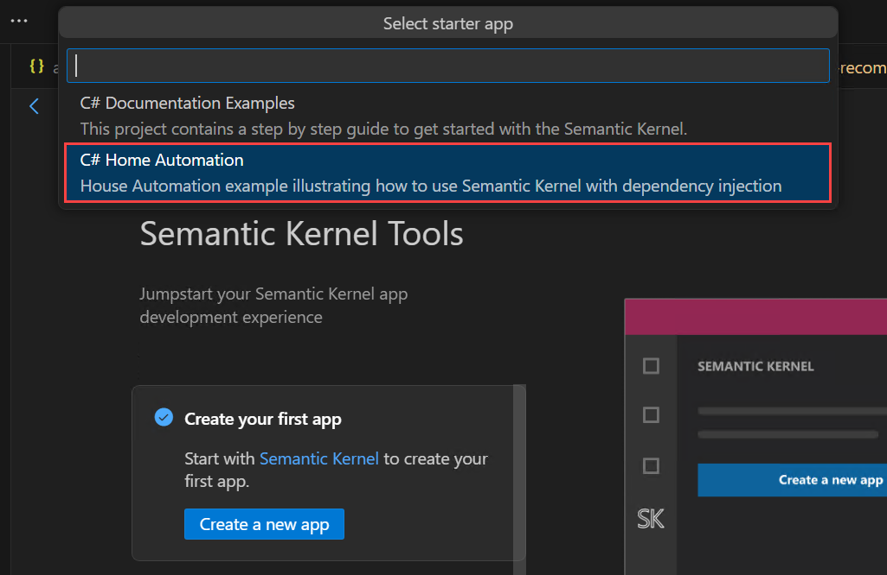
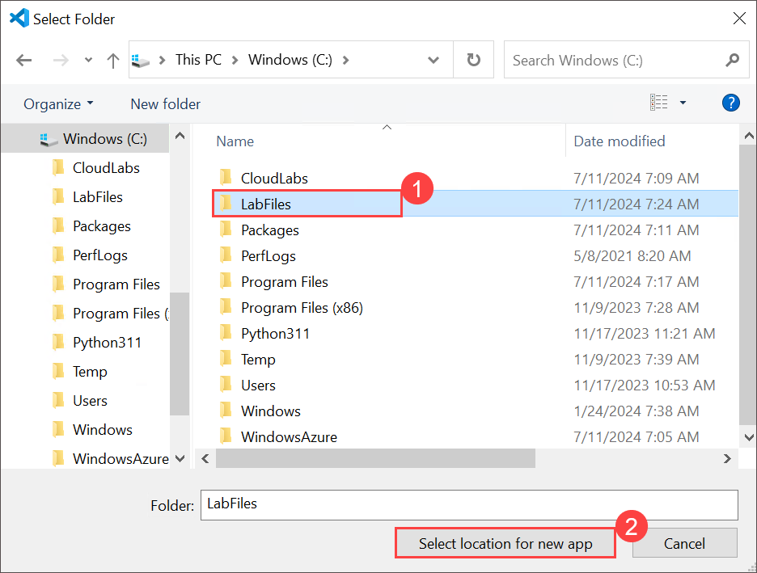
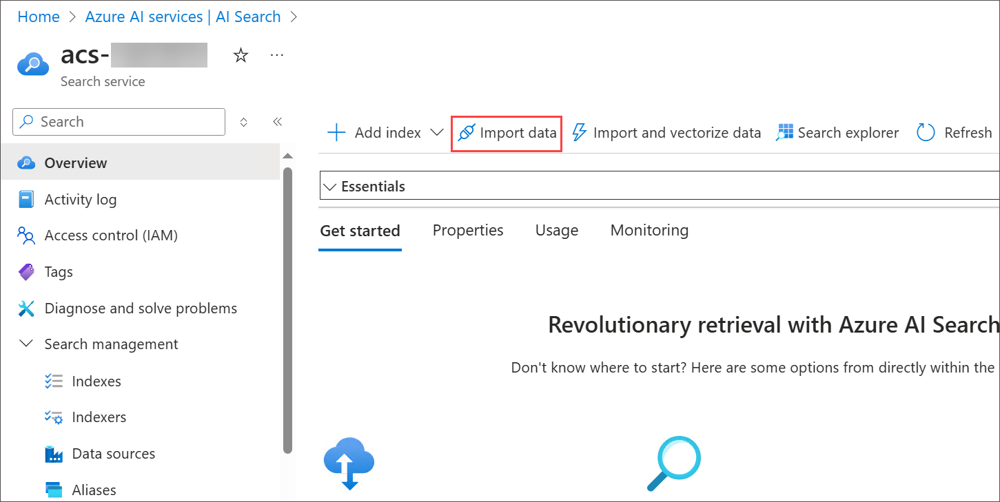
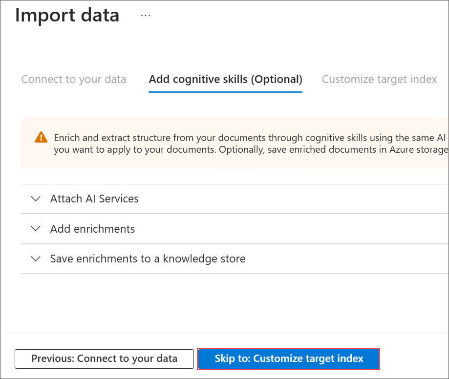

# Primeiros passos com o seu próprio copiloto

### Duração: 30 minutos

O Semantic Kernel é um SDK que integra Large Language Models (LLMs) como OpenAI, Azure OpenAI e Hugging Face com linguagens de programação convencionais como C#, Python e Java. O Kernel Semântico consegue isto permitindo definir plug-ins que podem ser encadeados em apenas algumas linhas de código.

O que torna o Kernel Semântico _especial_, no entanto, é a sua capacidade de orquestrar plug-ins _automaticamente_ com IA. Com Kernel Semântico
[planeadores](https://learn.microsoft.com/en-us/semantic-kernel/ai-orchestration/planner), pode pedir a um LLM para gerar um plano que atinja o objetivo único de um utilizador. Posteriormente, o Kernel Semântico executará o plano para o utilizador.

### Tarefa 1: Configurar e executar a amostra do kernel semântico
Nesta tarefa, irá configurar o plug-in do Kernel Semântico no Visual Studio Code, criar uma aplicação de domótica C# utilizando o Azure OpenAI e criará e executará a aplicação para interagir com ela.

1. Abra o **Visual Studio Code** na área de trabalho do Lab VM, clicando duas vezes sobre o mesmo.

   

2. No **Visual Studio Code** no painel esquerdo, selecione **Semantic Kernel** **(1)** plugin, expanda clicando em **AIENDPONTS(OPEN AI)** **(2)**, clique em **Alternar fornecedor de EndPoint** **(3)** e seleccione **AzureOpenAI** **(4)**.

   

3. Em **AI ENDPONTS(AZURE OPENAI)**, clique em **entrar no Azure** **(1)**, no pop-up **A extensão 'Semantic Kernel Tools' pretende fazer login utilizando o Microsoft** clique em **Permitir** **(2)**.

   

4. Isto irá redirecionar para **página de login da Microsoft**, selecione a sua conta do Azure **<inject key="AzureAdUserEmail"></inject>** e navegue de volta para **código do Visual Studio**.

   

5. Navegue de volta para **Visual Studio Code** No **painel Funções**, clique no **ícone Introdução** **(1)** e siga o assistente para **criar a sua aplicação** **(2)** com a função semântica.

   

6. Escolha **C# Domótica**

   

7. Procure o local **C:\LabFiles** e **selecione o local para a nova aplicação**

   

8. Clique em **Sim, confio nos autores**.

   

9. Navegue até ao ficheiro **appsettings. json** **(1)** e substitua o **script** **(2)** existente pelo seguinte:

   ```
   {
   "AzureOpenAI": {
     "ChatDeploymentName": "",
     "Endpoint": "",
     "ApiKey": ""
      }
   }
   ```

   

10. No ASP.NET Core, `appsettings. json` é um ficheiro de configuração utilizado para armazenar várias definições de aplicações, tais como terminais de serviço e outras definições específicas de aplicações e guardar o ficheiro **Ctrl+S**.

    | **Variables**       | **Values**                                             |
    | --------------------|--------------------------------------------------------|
    | ChatDeploymentName  | **<inject key="CompletionModel" enableCopy="true"/>**  |
    | Endpoint            | **<inject key="OpenAIEndpoint" enableCopy="true"/>**   |
    | ApiKey              | **<inject key="OpenAIKey" enableCopy="true"/>**        |

11. Certifique-se de que o seu ficheiro `appsettings. json` tem o aspecto apresentado na imagem abaixo.

    .png)

12. Navegue até o arquivo **Program.cs (1)** e substitua o código existente pelo seguinte. O arquivo `Program.cs` configura um aplicativo .NET usando injeção de dependência e Kernel Semântico. Configura serviços, incluindo Azure OpenAI para conclusão de chat, e adiciona vários plugins (`MyTimePlugin, MyAlarmPlugin, MyLightPlugin`). Os `AzureOpenAIOptions` são carregados de arquivos de configuração e variáveis ​​de ambiente. Um serviço hospedado `(Worker)` trata da lógica de execução principal. Um kernel de automação residencial é criado com uma coleção desses plug-ins e adicionado ao contêiner de injeção de dependência.

   ```
   using HomeAutomation.Options;
   using HomeAutomation.Plugins;
   using Microsoft.Extensions.DependencyInjection;
   using Microsoft.Extensions.Hosting;
   using Microsoft.Extensions.Options;
   using Microsoft.SemanticKernel;
   using Microsoft.SemanticKernel.ChatCompletion;
   using Microsoft.SemanticKernel.Connectors.OpenAI;

   namespace HomeAutomation;

   internal static class Program
   {
      internal static async Task Main(string[] args)
      {
         HostApplicationBuilder builder = Host.CreateApplicationBuilder(args);

         // Actual code to execute is found in Worker class
         builder.Services.AddHostedService<Worker>();

         // Get configuration
         builder.Services.AddOptions<AzureOpenAIOptions>()
                           .Bind(builder.Configuration.GetSection(nameof(AzureOpenAIOptions)))
                           .ValidateDataAnnotations()
                           .ValidateOnStart();

         // Chat completion service that kernels will use
         builder.Services.AddSingleton<IChatCompletionService>(sp =>
         {
               /*OpenAIOptions options = sp.GetRequiredService<IOptions<OpenAIOptions>>().Value;

               // A custom HttpClient can be provided to this constructor
               return new OpenAIChatCompletionService(options.ChatModelId, options.ApiKey);

               Alternatively, you can use plain, Azure OpenAI after loading AzureOpenAIOptions instead
                  of OpenAI options with builder.Services.AddOptions:*/

               AzureOpenAIOptions options = sp.GetRequiredService<IOptions<AzureOpenAIOptions>>().Value;

               return new AzureOpenAIChatCompletionService(options.ChatDeploymentName, options.Endpoint, options.ApiKey); 
         });

         // Add plugins that can be used by kernels
         // The plugins are added as singletons so that they can be used by multiple kernels
         builder.Services.AddSingleton<MyTimePlugin>();
         builder.Services.AddSingleton<MyAlarmPlugin>();
         builder.Services.AddKeyedSingleton<MyLightPlugin>("OfficeLight");
         builder.Services.AddKeyedSingleton<MyLightPlugin>("PorchLight", (sp, key) =>
         {
               return new MyLightPlugin(turnedOn: true);
         });

         /* To add an OpenAI or OpenAPI plugin, you need to be using Microsoft.SemanticKernel.Plugins.OpenApi.
            Then create a temporary kernel, use it to load the plugin and add it as keyed singleton.
         Kernel kernel = new();
         KernelPlugin openAIPlugin = await kernel.ImportPluginFromOpenAIAsync("<plugin name>", new Uri("<OpenAI-plugin>"));
         builder.Services.AddKeyedSingleton<KernelPlugin>("MyImportedOpenAIPlugin", openAIPlugin);

         KernelPlugin openApiPlugin = await kernel.ImportPluginFromOpenApiAsync("<plugin name>", new Uri("<OpenAPI-plugin>"));
         builder.Services.AddKeyedSingleton<KernelPlugin>("MyImportedOpenApiPlugin", openApiPlugin);*/

         // Add a home automation kernel to the dependency injection container
         builder.Services.AddKeyedTransient<Kernel>("HomeAutomationKernel", (sp, key) =>
         {
               // Create a collection of plugins that the kernel will use
               KernelPluginCollection pluginCollection = [];
               pluginCollection.AddFromObject(sp.GetRequiredService<MyTimePlugin>());
               pluginCollection.AddFromObject(sp.GetRequiredService<MyAlarmPlugin>());
               pluginCollection.AddFromObject(sp.GetRequiredKeyedService<MyLightPlugin>("OfficeLight"), "OfficeLight");
               pluginCollection.AddFromObject(sp.GetRequiredKeyedService<MyLightPlugin>("PorchLight"), "PorchLight");

               // When created by the dependency injection container, Semantic Kernel logging is included by default
               return new Kernel(sp, pluginCollection);
         });

         using IHost host = builder.Build();

         await host.RunAsync();
      }
   }
   ```

13. Navegue até o arquivo **Worker.cs** e atualize o número da linha 29 e **CTRL+S**.

    ```
    ToolCallBehavior = ToolCallBehavior.AutoInvokeKernelFunctions
    ```

14. Configure um endpoint Azure OpenAI abrindo um novo **Terminal**, clique em **(...) (1)** junto ao menu **View** e seleccione **Terminal(2)** > **Novo Terminal(3)**.

    

15. Execute os seguintes comandos para instalar os pacotes necessários.

    ```
    dotnet add package Microsoft.Extensions.Hosting --version 9.0.0-preview.3.24172.9
    dotnet add package Microsoft.Extensions.Options.DataAnnotations --version 9.0.0-preview.3.24172.9
    dotnet add package Microsoft.SemanticKernel --version 1.11.0
    ```


    >**Nota**: Estes comandos são utilizados num projeto .NET Core ou .NET 5+ para adicionar pacotes NuGet ao projeto. Eis o que cada comando faz:

    > **dotnet add package Microsoft.Extensions.Hosting --version 9.0.0-preview.3.24172.9**: Adiciona o pacote Microsoft.Extensions.Hosting ao projeto com uma versão específica (9.0.0-preview.3.24172. 9 ). Este pacote fornece abstrações de alojamento e arranque para aplicações .NET.

    > **dotnet add package Microsoft.Extensions.Options.DataAnnotations --version 9.0.0-preview.3.24172.9**: Adiciona o pacote Microsoft.Extensions.Options.DataAnnotations ao projeto com uma versão específica (visualização de 9.0.0 .3.24172.9). Este pacote estende a estrutura de opções no . NET para suportar anotações de dados para objetos de configuração.

    > **dotnet add package Microsoft.SemanticKernel --version 1.11.0**: Adiciona o pacote Microsoft.SemanticKernel ao projeto com uma versão específica (1.11.0). Este pacote provavelmente fornece funcionalidades relacionadas com a análise e processamento semântico dentro da aplicação.

16. Para construir e executar a aplicação Home Automation a partir do terminalnal utilize os seguintes comandos:

    ```PowerShell
    dotnet build
    dotnet run
    ```

    

    > **Nota**: Desconsidere o aviso.

    > **Nota** Os comandos dotnet build e dotnet run são fundamentais em ambientes .NET Core e .NET 5+ para criar e executar aplicações .NET localmente na sua máquina.

17. Depois de executar `dotnet run`, pode fazer algumas perguntas e rever a resposta. Por exemplo: `Que horas são?`

    

18. Exemplo 2: `Defina um alarme para as 6h.`

    

19. Se desejar incluir questões adicionais, navegue até ao ficheiro **worker.cs** e insira as suas novas questões na **linha número 32**.

    

20. Em alternativa, pode fazer qualquer pergunta no terminal.

### Tarefa 2: Configurar a Pesquisa Cognitiva do Azure

Nesta tarefa, irá configurar o Azure Cognitive Search importando dados do CosmosDB para um índice de pesquisa denominado "realestate-us-sample-index". Personaliza o índice e cria um indexador chamado "realestate-us-sample-indexer" para sincronizar os dados. Por fim, verifica a funcionalidade de pesquisa consultando dados de "Seattle".

1. Navegue de volta para o separador **Portal do Azure**, na caixa Pesquisar recursos, serviços e documentos (G+/) na parte superior do portal, introduza **AI Search** e selecione **AI Search** sob serviços.

   

1. Em **serviços Azure IA | No separador AI Search**, selecione **acs-<inject key="DeploymentID" enableCopy="false"/>**.

   

1. Na aba de visão geral do serviço de pesquisa, clique em **Importar dados**.

   

1. No menu suspenso, selecione **Fonte de dados** como **Amostra (1)**, selecione **Amostra de hotéis CosmosDB (2)** e clique em **Seguinte: Adicionar competências cognitivas (opcional) ( 3)**.

   

1. Em **competências cognitivas** deixe por defeito e clique em **Personalizar índice de destino**.

   

1. Em **Personalizar índice de destino**, introduza o nome do índice como **realestate-us-sample-index** e clique em **Seguinte:Criar um indexador**.

   

1. Em **criar um indexador**, altere o nome do indexador para **realestate-us-sample-indexer** e clique em **enviar**.

   

1. Navegue de volta para **Serviços de IA do Azure | No separador AI Search**, selecione **acs-<inject key="DeploymentID" enableCopy="false"/>**.

   

1. No painel de navegação esquerdo, em **Gestão de pesquisa**, selecione **Índices (1)** e clique em **realestate-us-sample-index (2)**.

   

1. Clique em **realestate-us-sample-index** na barra de pesquisa, escreva **Seattle (1)** e clique em **Pesquisar (2)** e veja o **Resultado (3)**.

   .png)

### Resumo

Neste laboratório, aprendeu a configurar e executar o exemplo do Kernel Semântico integrando o SDK no seu projeto, configurando fornecedores LLM, definindo plug-ins e executando o código. Além disso, adquiriu conhecimentos sobre a configuração do Azure Cognitive Search, incluindo a criação ou seleção de um índice, a configuração de campos, a configuração do Kernel Semântico para interagir com o Azure, a definição de plug-ins e o teste da integração para recursos de pesquisa melhorados.

### Concluiu este laboratório com sucesso. Agora clique em Seguinte no canto inferior direito para passar para a página seguinte.
