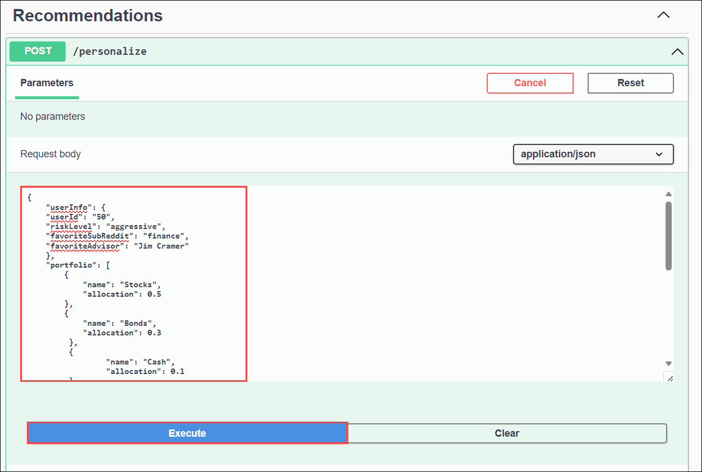
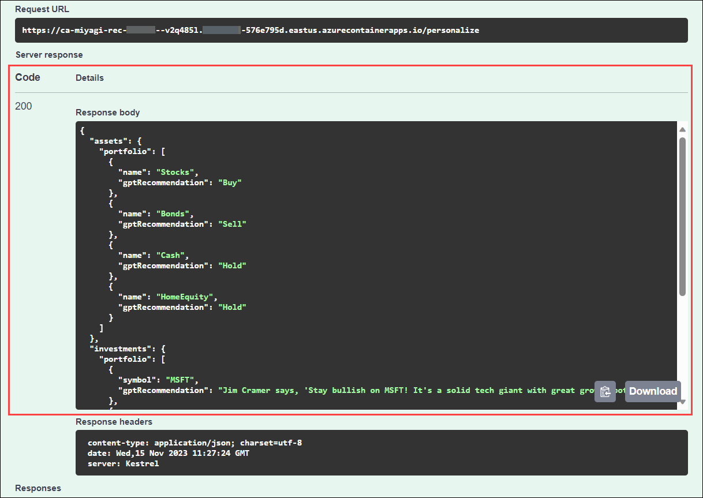

# Lab 1.2: Explore and Verify the Containerized Recommendation service in Azure Container App using Local Miyagi UI
### Lab Scenario

In this lab, you will explore and verify the containerized Recommendation Service deployed in Azure Container Apps using the local Miyagi UI. Begin by configuring the Miyagi UI to connect to the Azure endpoint of the Recommendation Service. Next, test various API calls through the UI to ensure accurate recommendations based on user inputs. Document any discrepancies or issues encountered during testing. Finally, validate the overall integration and functionality of the services.

## Lab objectives
In this lab, you will complete the following tasks:

- Task 1: Verify the Recommendation service running in the Container App by Personalizing
- Task 2: Update Container App Recommendation service URL for Miyagi UI
- Task 3: Access Recommendation Service running on Azure Container Apps from Local Miyagi-UI

### Duration: 60 minutes

### Task 1: Verify the Recommendation service running in the Container App by Personalizing

In this lab, you will verify the Recommendation service running in the Container App by personalizing recommendations based on user preferences and testing the service's responses.

1. In the Azure Portal page, in the Search resources, services, and docs (G+/) box at the top of the portal, enter **Container Apps (1)**, and then select **Container Apps (2)** under services.

   

1. In the **Container Apps** blade, select **ca-miyagi-rec-<inject key="DeploymentID" enableCopy="false"/>**.

   

1. In the **ca-miyagi-rec-<inject key="DeploymentID" enableCopy="false"/>** page, from the left navigation pane select **Ingress** **(1)** under setting session and click on **Endpoints** **(2)** URL link.

   

1. Navigate back to container app **ca-miyagi-rec-<inject key="DeploymentID" enableCopy="false"/>**, and click on **Log Stream** under **Monitoring** from the left menu.

    
   
      
   
     > **Note** : Please click on **Refresh** for the logs to show up .

1. Navigate back to **Miyagi Recommendations** page, scroll down to the **Recommendations**, click on **POST /personalize** expansion, and click on **Try it out**.

   

1. Replace the provided **JSON code** below and click on **Execute**.

   ```
   {
       "userInfo": {
       "userId": "50",
       "riskLevel": "aggressive",
       "favoriteSubReddit": "finance",
       "favoriteAdvisor": "Jim Cramer"
       },
       "portfolio": [
           {
               "name": "Stocks",
               "allocation": 0.5
           },
           {
               "name": "Bonds",
               "allocation": 0.3
            },
            {
                    "name": "Cash",
                    "allocation": 0.1
            },
            {
                    "name": "HomeEquity",
                    "allocation": 0.1
            }
          ],
          "stocks": [
            {
                    "symbol": "MSFT",
                    "allocation": 0.3
            },
            {
                    "symbol": "ACN",
                    "allocation": 0.1
            },
            {
                    "symbol": "JPM",
                    "allocation": 0.3
            },
            {
                    "symbol": "PEP",
                    "allocation": 0.3
            }
       ]
   }
   ```

      

1. In the **Miyagi Recommendations** page, Scroll down to the Responses session review that it has been executed successfully by checking the code status is **200**, and review the **Response body** section.

   

   > **Note**: Please ignore the 500 error and move on to the next task.

1. Navigate back to container app **ca-miyagi-rec-<inject key="DeploymentID" enableCopy="false"/>|Log stream**, review the **logs**.

### Task 2: Update Container App Recommendation service URL for Miyagi UI

In this lab, you will update the Container App Recommendation service URL for the Miyagi UI by modifying the configuration settings to ensure seamless integration between the front end and the service.

1. Once you completed the review of the logs, click on **Ingress** **(1)** under **Settings** and copy **Endpoints** **(2)** URL link.

   

1. Navigate back to **Visual Studio Code**, navigate to **miyagi>ui\typescript>.env.** and replace existing code for **NEXT_PUBLIC_RECCOMMENDATION_SERVICE_URL** with copied for **Endpoints** and save the file 

   
   
>**Congratulations** on completing the Task! Now, it's time to validate it. Here are the steps:
  > - Hit the Validate button for the corresponding task. If you receive a success message, you have successfully validated the lab. 
  > - If not, carefully read the error message and retry the step, following the instructions in the lab guide.
  > - If you need any assistance, please contact us at labs-support@spektrasystems.com.

<validation step="61a2f44e-b3e1-4dfc-b3aa-c623d519a6f8" />

### Task 3: Access Recommendation Service running on Azure Container Apps from Local Miyagi-UI 

In this lab, you will access the Recommendation Service running on Azure Container Apps from your local Miyagi UI by configuring API endpoints and ensuring proper network connectivity.

1. Open a new terminal: by navigating  **miyagi/ui** and right-click on **ui/typescript** , in cascading menu select **Open in Integrated Terminal**.

   

1. Run the following command to install the dependencies
   
    ```
    yarn dev
    ```

   **Note**: Let the command run, meanwhile you can proceed with the next step.

1. Open another tab in Edge, and  browse the following

   ```
   http://localhost:4001
   ```

    > **Note**: Refresh the page continuously until you get miyagi app running locally as depicted in the image below.
                       
   

1. In the to the **recommendation service** ui page, and click on **Personalize** button.

    

1. In the **personalize** page, select your **financial advisor** from the drop-down, and click on **Personalize**.

     

1. You should see the recommendations from the recommendation service in the Top Stocks widget.

   

1. Navigate back to the **ca-miyagi-rec-<inject key="DeploymentID" enableCopy="false"/>** Container App, from the left-side menu select **Log stream** under Monitoring, and you can go through the logs.

    

    > **Note**: Navigate back to VS code, from the Terminal select Node terminal, and press Ctrl + C to stop the recommendation service ui page.

## Review

In this lab, you have accomplished the following:

- Verified the Recommendation Service by personalizing user interactions successfully.
- Updated the Recommendation Service URL in Miyagi UI configuration.
- Accessed the Recommendation Service from local Miyagi UI effectively.

