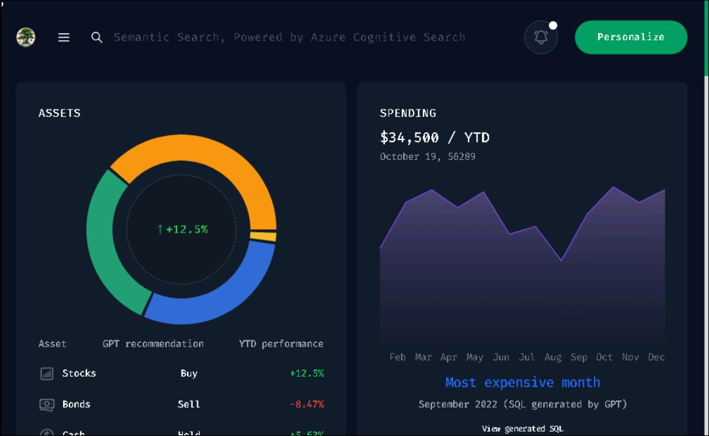
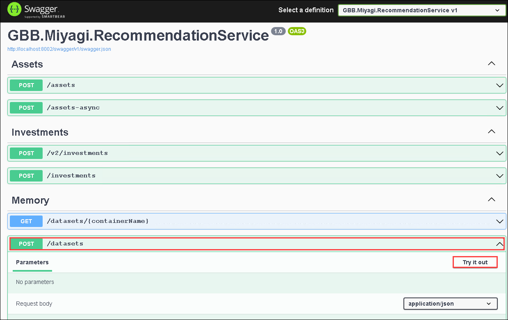
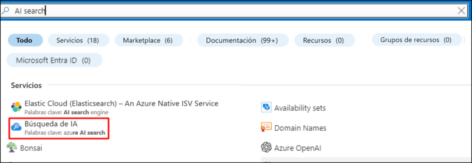
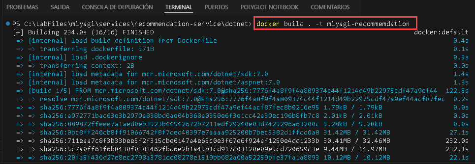
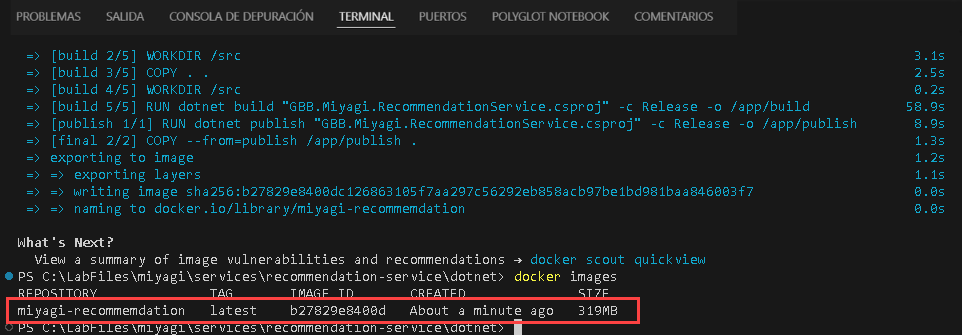
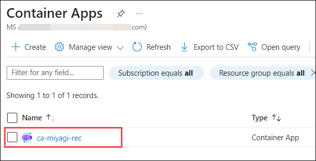
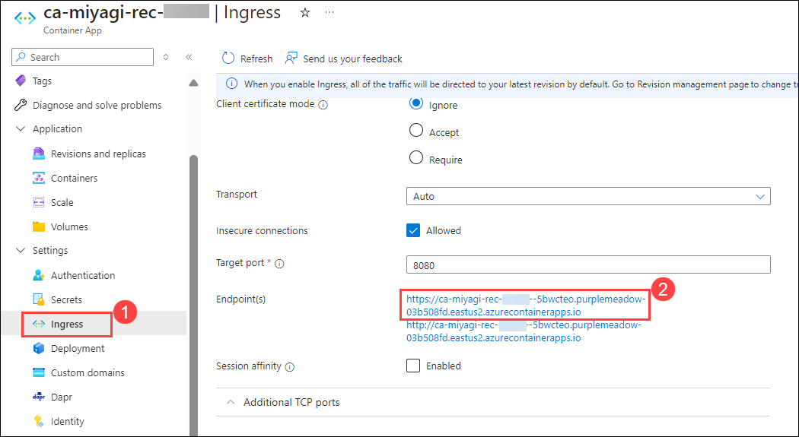
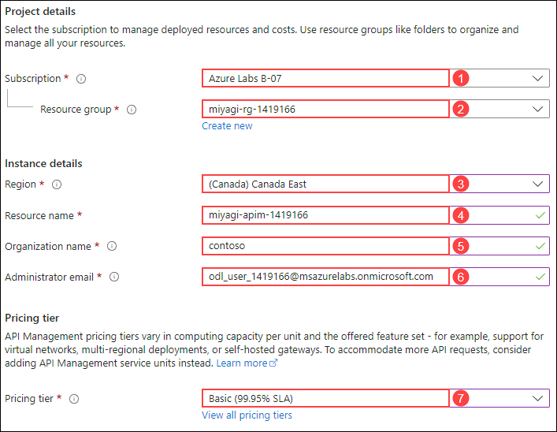

# Lab 1.1: Containerizing Recommendation service to Azure Container Apps

## Lab scenario 

In this Lab, you'll explore the process of containerizing a recommendation service and deploying it to Azure Container Apps. Containerization has become a key strategy in modern application development and deployment, providing a consistent and reproducible environment across various stages of the software development lifecycle. Azure Container Apps, part of Microsoft's Azure cloud platform, offers a managed container service that enables developers to deploy and scale containerized applications seamlessly. 

## Lab objectives 

In this lab, you will complete the following tasks:

- Task 1: Setup configuration for miyagi app
- Task 2: Run miyagi frontend locally
- Task 3: Persist embeddings in Azure AI Search
- Task 4: Build Docker Images for the Recommendation service
- Task 5: Push the Docker Image of the Recommendation service to the Container registry
- Task 6: Create a Container app for recommendation-service
- Task 7: Verify Recommendation Service using Swagger
- Task 8: Provision API Management Service 

### Duration: 60 minutes

### Task 1: Setup configuration for miyagi app

In this task, you will set up the configuration for the Miyagi app by installing dependencies, configuring environment variables, and preparing the database for local development.

1. Open **Visual Studio Code** from the Lab VM desktop by double-clicking on it.

   

   >**Note**: If **Join us in making promt-flow extension better!** window prompted please click on **No,thanks**.

   
   
1. In **Visual Studio Code** from menu bar select **File(1)>open folder(2)**.

   

1. Within **File Explorer**, navigate to **C:\LabFiles\miyagi** select **miyagi**(1) click on **Select folder(2)**

   .png)

1. In **Visual Studio Code**, click on **Yes, I trust the authors** when **Do you trust the authors of the files in this folder?** window prompted.

    
   
1. Expand **miyagi>ui** directory and verify that **.env.** file is present. 

1. Expand **miyagi/services/recommendation-service/dotnet** directory and verify that **appsettings.json** file is present.
  
1. In the **appsettings.json** file replace the following values for the variables below.

   | **Variables**                | **Values**                                                    |
   | ---------------------------- |---------------------------------------------------------------|
   | deploymentOrModelId          | **<inject key="CompletionModel" enableCopy="true"/>**         |
   | embeddingDeploymentOrModelId | **<inject key="EmbeddingModel" enableCopy="true"/>**          |
   | endpoint                     | **<inject key="OpenAIEndpoint" enableCopy="true"/>**          |
   | apiKey                       | **<inject key="OpenAIKey" enableCopy="true"/>**               |
   | azureCognitiveSearchEndpoint | **<inject key="SearchServiceuri" enableCopy="true"/>**        |
   | azureCognitiveSearchApiKey   | **<inject key="SearchAPIkey" enableCopy="true"/>**            |
   | cosmosDbUri                  | **<inject key="CosmosDBuri" enableCopy="true"/>**             |
   | blobServiceUri               | **<inject key="StorageAccounturi" enableCopy="true"/>**       |
   | bingApiKey                   | **<inject key="Bing_API_KEY" enableCopy="true"/>**           |
   | cosmosDbConnectionString     | **<inject key="CosmosDBconnectinString" enableCopy="true"/>** |
   
   > **Note**: FYI, the above values/Keys/Endpoints/ConnectionString of Azure Resources are directly injected to labguide. Leave default settings for "cosmosDbContainerName": "recommendations" and "logLevel": "Trace".

      
   
1. Once after updating the values kindly save the file by pressing **CTRL + S**.

1. Navigate to **miyagi/sandbox/usecases/rag/dotnet** and verify **.env** file is present.
  
1. In the **.env** file replace the following values for the variables below.

   | **Variables**                          | **Values**                                            |
   | ---------------------------------------| ------------------------------------------------------|
   | AZURE_OPENAI_ENDPOINT                  | **<inject key="OpenAIEndpoint" enableCopy="true"/>**  |
   | AZURE_OPENAI_CHAT_MODEL                | **<inject key="CompletionModel" enableCopy="true"/>** |
   | AZURE_OPENAI_EMBEDDING_MODEL           | **<inject key="EmbeddingModel" enableCopy="true"/>**  |
   | AZURE_OPENAI_API_KEY                   | **<inject key="OpenAIKey" enableCopy="true"/>**       |
   | AZURE_COGNITIVE_SEARCH_ENDPOINT        | **<inject key="SearchServiceuri" enableCopy="true"/>**|
   |AZURE_COGNITIVE_SEARCH_API_KEY          | **<inject key="SearchAPIkey" enableCopy="true"/>**    |
   
   

1. Once after updating the values kindly save the file by pressing **CTRL + S**.

1. Open a new terminal: by navigating **miyagi/services/recommendation-service/dotnet** and right-click on in cascading menu select **Open in Integrated Terminal**.

    

1. Run the following command to run the recommendation service locally
    ```
    dotnet build
    dotnet run
    ```

   **Note**: Let the command run, meanwhile you can proceed with the next step.

1. Open another tab in Edge, in the browser window paste the following link

   ```
   http://localhost:5224/swagger/index.html 
   ```

   **Note**: Refresh the page continuously until you get the swagger page for the recommendation service as depicted in the image below.

   


### Task 2: Run miyagi frontend locally

In this task, you will run the Miyagi frontend locally by starting the development server and verifying the user interface for functionality and interaction.

1. Open a new terminal: by navigating  **miyagi/ui** and right-click on **ui/typescript** , in cascading menu select **Open in Integrated Terminal**.

   

1. Run the following command to install the dependencies
   
    ```
    npm install --global yarn
    yarn install
    yarn dev
    ```

   **Note**: Let the command run, meanwhile you can proceed with the next step.

1. Open another tab in Edge, and  browse the following

   ```
   http://localhost:4001
   ```

   **Note**: Refresh the page continuously until you get miyagi app running locally as depicted in the image below.
                       
   
   
### Task 3: Persist embeddings in Azure AI Search

In this task, you will persist embeddings in Azure AI Search by configuring the service and using APIs to store and retrieve data efficiently.

1. Navigate back to the **swagger UI** page, scroll to **Memory** session, click on **POST /datasets** for expansion, and click on **Try it out**.

   

1. Replace the code with the below code, and click on **Execute**.

     ```
     {
        "metadata": {
              "userId": "50",
              "riskLevel": "aggressive",
              "favoriteSubReddit": "finance",
              "favoriteAdvisor": "Jim Cramer"
            },
          "dataSetName": "intelligent-investor"
      }
      ```

      
      
1. In the **swagger UI** page, Scroll down to the **Responses** session review that it has been executed successfully by checking the code status is **200**.

    

1. Navigate back to the **Azure portal** tab, search and select **AI Search**.

        

1. In **Azure AI services | AI Search** tab, select **acs-<inject key="DeploymentID" enableCopy="false"/>**.

1. In **acs-<inject key="DeploymentID" enableCopy="false"/>** Search service tab, click on **Indexes** **(1)** under Search management, and review the **miyagi-embeddings** **(2)** has been created.   

    

    > **Note**: Please click on the refresh button till you view the **Document Count**.

1. once you viewed the indexes in AI Search, Navigae back to VS Code and  press **Ctrl + C** to stop the **swagger UI** page for node terminal.

1. From the **Terminal** select **dotnet** terminal, press **Ctrl + C** to stop the **recommendation service** ui page.

### Task 4: Build Docker Images for the Recommendation service

In this task, you will build Docker images for the Recommendation service by creating a Dockerfile and using it to package the application for consistent deployment.

1. Open the **Docker** Application from the Lab VM desktop by double-clicking on it.

   

    > **Note**: If docker desktop is already opened then proceed with step 4.
   
1. In the **Docker Subscription Service Agreement** window, click **Accept**.

   

1. In the **Welcome to Docker Desktop** window, click on **Continue without signing in**.

   

1. In the **Tell us about the work you do** window, click on **Skip**.

1. In the VS code, navigate to **miyagi/services/recommendation-service/dotnet** right - click on dotnet in cascading menu, select **Open in Integrated Terminal**.

1. Run the following command to build a **Docker image**.

   ```
   docker build --no-cache -t miyagi-recommendation .   
   ```

   

   > **Note**: Please wait as this command may require some time to complete.

1. Run the following command to get the newly created image.

   ```
   docker images
   ```
   
   

1. Navigate back to **Docker desktop**, from the left pane select **Images**.

   

1. In the **Images** blade, notice **miyagi-recommendation(1)** image is created, select **run(2)** icon .

   

1. In the **Run a new container** window select the dropdown arrow.

   .png)

1. In the **Run a new container**, under **Ports** for **Host Port** enter **5224** and click on **Run**.

    

1. Click on **5224:80** URL link

   
   
1. You should be able to see the application running locally
   
   

### Task 5: Push the Docker Image of the Recommendation service to the Container registry

In this task, you'll Push miyagi-recommendation images to acr. 

1. Navigate back to the **Visual studio code** window and navigate to **miyagi/services/recommendation-service/dotnet** right - click on dotnet in cascading menu, select **Open in Integrated Terminal**

1. Run the following command to log in to the **Azure portal**.

   > **Note**: Please replace **[username]** with **<inject key="AzureAdUserEmail" enableCopy="true"/>**, and **[password]** with **<inject key="AzureAdUserPassword" enableCopy="true"/>**.

    ```
    az login -u [username] -p [password]
    ```

1. Run the following command to log in to an **Azure Container Registry (ACR)** using the Azure CLI.

   > **Note**: Please replace **[ACRname]** and **[uname]** with **<inject key="AcrUsername" enableCopy="true"/>**, and **[password]** with **<inject key="AcrPassword" enableCopy="true"/>**.
   
   ```
   az acr login -n [ACRname] -u [uname] -p [password]
   ```

   
    
1. Run the following command to add the tag.

   > **Note**: Please replace **[ACRname]** with **<inject key="AcrLoginServer" enableCopy="true"/>**.

   ```
   docker tag miyagi-recommendation:latest [ACRname]/miyagi-recommendation:latest
   ```

1. Run the following command to push the image to the container registry.

   > **Note**: Please replace **[ACRname]** with **<inject key="AcrLoginServer" enableCopy="true"/>**.

   ```
   docker push [ACRname]/miyagi-recommendation:latest
   ```

   

### Task 6: Create a Container app for recommendation-service 

In this task, you'll will be creating a container app for the recommendation.

1. Run the following command to create **Container App environment**.

   > **Note**: Please replace **[DID]** with **<inject key="DeploymentID" enableCopy="true"/>** and **[Region]** with **<inject key="Region" enableCopy="true"/>**.

   ```
   az containerapp env create --name env-miyagi-[DID] --resource-group miyagi-rg-[DID] --location [Region]
   ```

1. Run the following command to create **Container App**.

   > **Note**: Please replace **[DID]** with **<inject key="DeploymentID" enableCopy="true"/>**, **[ACRname]** with **<inject key="AcrLoginServer" enableCopy="true"/>**, **[uname]** with **<inject key="AcrUsername" enableCopy="true"/>**, and **[password]** with **<inject key="AcrPassword" enableCopy="true"/>**.

   ```
   az containerapp create --name ca-miyagi-rec-[DID] --resource-group miyagi-rg-[DID] --image [ACRname]/miyagi-recommendation:latest --environment env-miyagi-[DID] --registry-server [ACRname] --registry-username [uname] --registry-password [password]
   ```

1. Run the following command to enable **Container App ingress**.

   > **Note**: Please replace **[DID]** with **<inject key="DeploymentID" enableCopy="true"/>**
   
   ```
   az containerapp ingress enable -n ca-miyagi-rec-[DID] -g miyagi-rg-[DID] --type external --allow-insecure --target-port 8080
   ```

### Task 7: Verify Recommendation Service using Swagger

In this task, you will verify the Recommendation Service using Swagger by accessing the API documentation, testing endpoints, and ensuring the service functions as expected.

1. In the Azure Portal page, in the Search resources, services, and docs (G+/) box at the top of the portal, enter **Container Apps (1)**, and then select **Container Apps (2)** under services.

   

1. In the **Container Apps** blade, select **ca-miyagi-rec-<inject key="DeploymentID" enableCopy="false"/>**.

   

1. In the **ca-miyagi-rec-<inject key="DeploymentID" enableCopy="false"/>** page, from left navigation pane select **Ingress** **(1)** under setting session and click on **Endpoints** **(2)** URL link.

   

1. You can view the **miyagi Recommendation service** website running through the Container Apps.

      

### Task 8: Provision API Management Service 

In this task, you will provision the API Management Service by creating an instance, configuring settings, and setting up policies for efficient API management and security.

1. Navigate to **Search resources, services and docs** in **Azure** portal home page and search for **API management services** and click on it.

1. Click on **Create**.

1. Provide the values as following and click on **Review + Create** and again **Create.**

   - Subscription : default selected subscription
   - Resource Group : **miyagi-rg-<inject key="DeploymentID" enableCopy="true"/>**
   - Region : **<inject key="Region" enableCopy="true"/>**
   - Resource Name : **miyagi-apim-<inject key="DeploymentID" enableCopy="true"/>**
   - Organization Name : **contoso**
   - Administrator Email : **<inject key="AzureAdUserEmail" enableCopy="true"/>**
   - Pricing Tier : **Basic (99.95% SLA)**

      

   >**Note**: Please Continue with the next step as the deployment will take around 20-30 minutes to complete. 

1. Now, click on **Next** from the lower right corner to move to the next page.

## Review

In this lab, you have accomplished the following:

- Configured the Miyagi app and ensured its functionality.
- Ran the Miyagi frontend locally for testing user interactions.
- Persisted embeddings in Azure AI Search for efficient retrieval.
- Built and pushed Docker images for the Recommendation service.
- Created a container app and verified it using Swagger.
