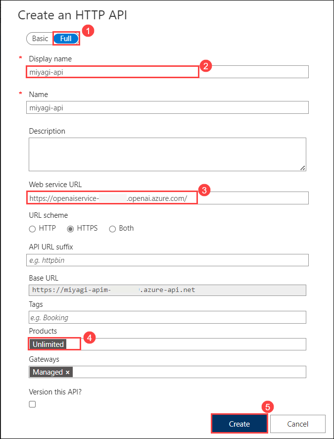
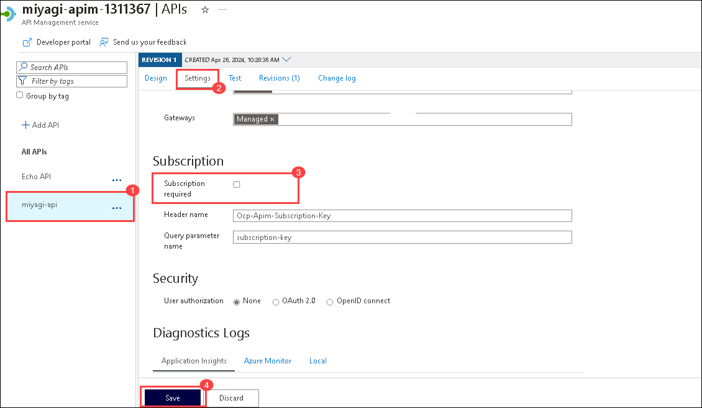
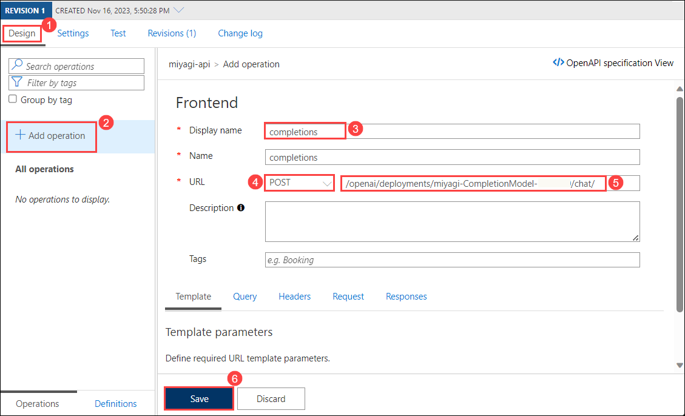
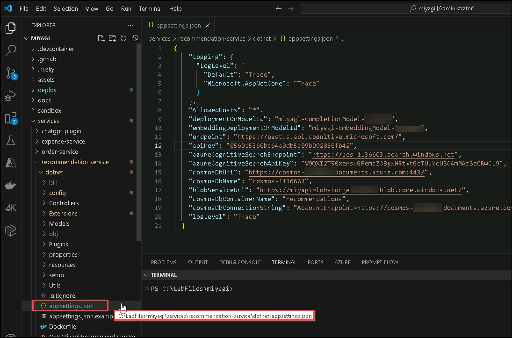
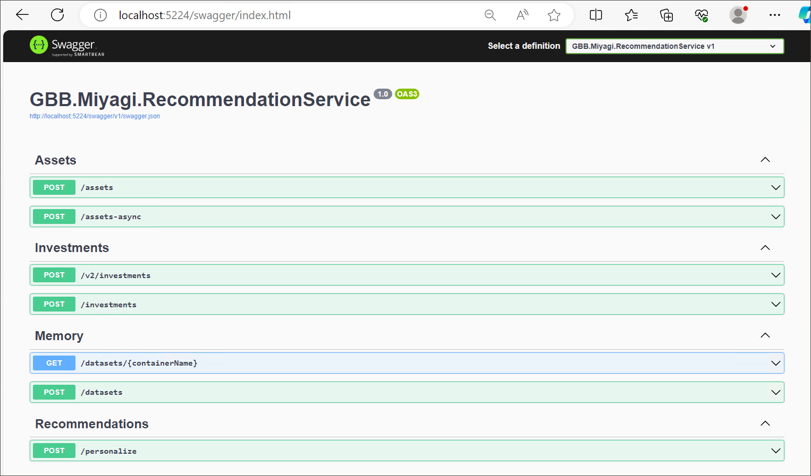
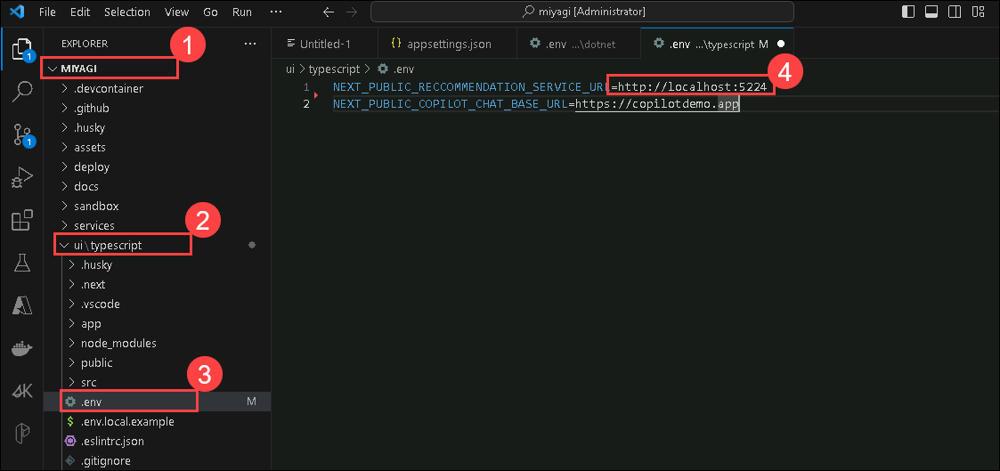
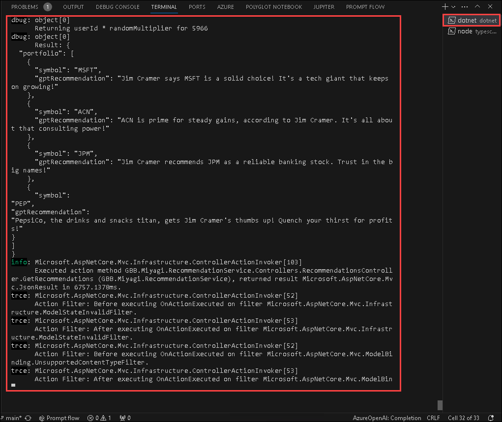

# Lab 2: Expose OpenAI through API Management Service

## Estimated Duration: 60 minutes

## Lab scenario

In this lab, you'll be verifying and creating APIs in the deployed API Management service to update the Docker image for the Recommendation service. The revision of the Recommendation service from the Container App encapsulates the meticulous approach to maintaining and optimizing containerized applications within the project's scope.

## Lab objectives 
In this lab, you will complete the following tasks:

- Task 1: Verify the API Management Service and create an API with Operations
- Task 2: Update the Recommendation Service configuration to access Azure Open AI through APIM
- Task 3: Verify that the Recommendation service accesses Azure Open AI through APIM

### Task 1: Verify the API Management Service and create an API with Operations

In this task, you will verify the API Management Service and create an API with operations by defining endpoints, setting policies, and testing the functionality to ensure proper integration and management of your APIs.

1. Navigate to Azure portal, open the Resource Group named **miyagi-rg-<inject key="DeploymentID" enableCopy="false"/>**  and select **miyagi-apim-<inject key="DeploymentID" enableCopy="false"/>** API Management service from the resources list.

   

1. In the **miyagi-apim-<inject key="DeploymentID" enableCopy="false"/>** API Management service, click on **APIs** **(1)** under APIs from the left menu and select **HTTP** **(2)** under Define a new API to create an HTTP API.

   

1. Enter the following values in the Create an HTTP API pane:
   
   | **Parameter**        | **Values**           | 
   | -------------------- | -------------------- | 
   | API Type **(1)**     | **Full**            | 
   | Display name **(2)** | **miyagi-api**       |
   | Web service URL **(3)** | **<inject key="OpenAIEndpoint" enableCopy="true"/>**   |
   | Products **(4)** | **Unlimited** |
   | Click on  **(5)** | **Create** |

   

1. Once the **HTTP API pane** is created, select **miyagi-api** **(1)** API from the list, select **Settings** **(2)**, scroll down to Subscription part **Uncheck** **(3)** the Subscription required and click on **Save** **(4)**.

   

1. In the **miyagi-api**, select **Design** **(1)**, and click on **+  Add operation** **(2)** fill the following details in **Frontend** and click on **Save** **(6)**.

   | **Parameter**           | **Values**                                            | 
   | ------------------------| ------------------------------------------------------| 
   | Display name **(3)**    | **completions**                                       | 
   | URL **(4)**             | from the drop-down select **Post**                    |
   | URL **(5)**             | in text box enter **/openai/deployments/<inject key="CompletionModel" enableCopy="false"/>/chat/completions**  |

   

1. Once the **completions** operation created successfully, click on **+  Add operation** **(1)** fill the following details in **Frontend** and click on **Save** **(5)**.

   | **Parameter**           | **Values**                                            | 
   | ------------------------| ------------------------------------------------------| 
   | Display name **(2)**    | **embeddings**                                       | 
   | URL **(3)**             | from the drop-down select **Post**                    |
   | URL **(4)**             | in text box enter **/openai/deployments/<inject key="EmbeddingModel" enableCopy="false"/>/embeddings**  |

   

1. Once the **embeddings** operation created successfully, click on **Overview** page, and copy the **Gateway URL** paste the Gateway URL into a notepad you need this in upcoming task.

   

>**Congratulations** on completing the Task! Now, it's time to validate it. Here are the steps:

  > - Hit the Validate button for the corresponding task. If you receive a success message, you have successfully validated the lab. 
  > - If not, carefully read the error message and retry the step, following the instructions in the lab guide.
  > - If you need any assistance, please contact us at CloudCloudlabs-support@spektrasystems.com.

  <validation step="d54f179b-7f83-4002-a3f5-d52f7c632b72" />
   
### Task 2: Update the Recommendation Service configuration to access Azure Open AI through APIM

In this task, you will update the Recommendation Service configuration to access Azure OpenAI through API Management by modifying settings and implementing necessary authentication to enable seamless communication.

1. Navigate to Visual Studio Code, open the `appsettings.json` file from the path `C:\LabFiles\miyagi\services\recommendation-service\dotnet\appsettings.json`.

      

1. In the `appsettings.json` file, you have to replace the **endpoint** value from **OpenAI resource endpoint** to **API Gateway URL** which you have copied in Task-1 Step-7 and press Ctrl + S to save the file.

      

1. Open a new terminal: by navigating **miyagi/services/recommendation-service/dotnet** and right-click on in cascading menu select **Open in intergate Terminal**.

      

1. Run the following command to run the recommendation service locally

    ```
    dotnet build
    dotnet run
    ```

   **Note**: Let the command run, meanwhile you can proceed with the next step.

1. Open another tab in Edge, in the browser window paste the following link

   ```
   http://localhost:5224/swagger/index.html 
   ```

   **Note**: Refresh the page continuously until you get the swagger page for the recommendation service as depicted in the image below.

   

   > **Congratulations** on completing the task! Now, it's time to validate it. Here are the steps:
   > - Hit the Validate button for the corresponding task. If you receive a success message, you can proceed to the next task. 
   > - If not, carefully read the error message and retry the step, following the instructions in the lab guide.
   > - If you need any assistance, please contact us at labs-support@spektrasystems.com. We are available 24/7 to help you out.

   <validation step="d1631c75-22e6-4fcc-a09d-c037ab0c0eb5" />

### Task 3: Verify that the Recommendation service accesses Azure Open AI through APIM

In this task, you will verify that the Recommendation Service successfully accesses Azure OpenAI through API Management by testing the API calls and ensuring that responses are correctly received and processed.

1. Navigate to **Miyagi** **(1)** folder, open **ui/typescript** **(2)** folder and then open `.env` file. Replace the existing code for **NEXT_PUBLIC_RECCOMMENDATION_SERVICE_URL** with the below provided URL and then save the file.

   ```
   http://localhost:5224
   ```

   

1. Open a new terminal: by navigating  **Miyagi** and right-click on **ui/typescript** , in cascading menu select **Open in Integrated Terminal**.

   

1. Run the following command to install the dependencies
   
    ```
    npm install --global yarn
    yarn install
    yarn dev
    ```

   **Note**: Let the command run, meanwhile you can proceed with the next step.

1. Open another tab in Edge, and  browse the following

   ```
   http://localhost:4001
   ```

   **Note**: Refresh the page continuously until you get miyagi app running locally as depicted in the image below.
                       
   

1. In the **personalize** page, select your **financial advisor** from the drop-down, and click on **Personalize**.

     

1. You should see the recommendations from the recommendation service in the Top Stocks widget.

    

1. Navigate to the **Visual Studio Code**, and click on **dotnet** from the terminal, you can go through the logs.

   

1. From the Terminal select Node terminal, press Ctrl + C to stop the recommendation service ui page. Now, click on Next from the lower right corner to move to the next page.

 ## Summary
 
 In this lab, you have accomplished the following:

- Verified the API Management Service and created an API successfully.
- Updated the Recommendation Service configuration for Azure OpenAI access.
- Verified that the Recommendation service successfully accesses Azure OpenAI.
