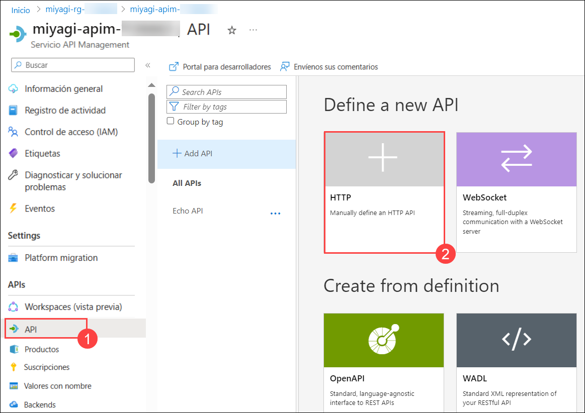
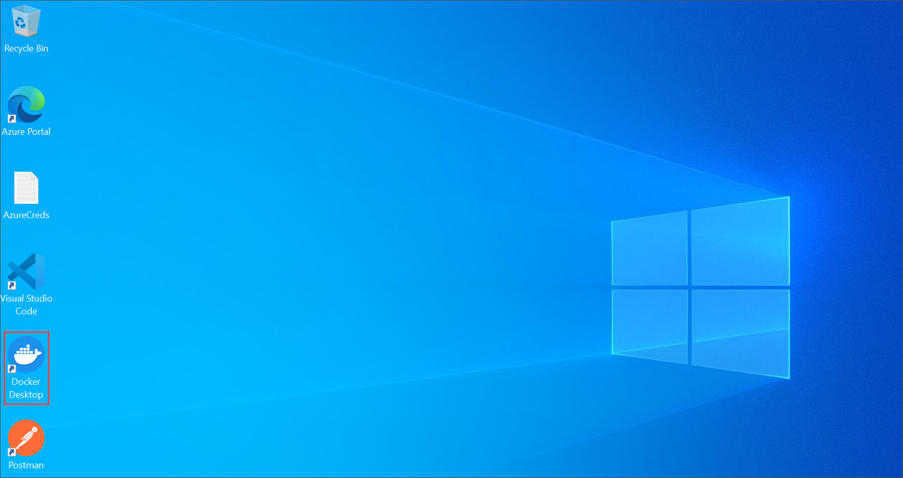
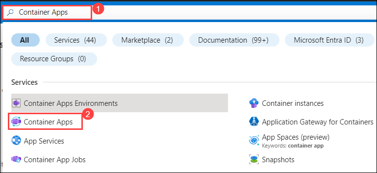
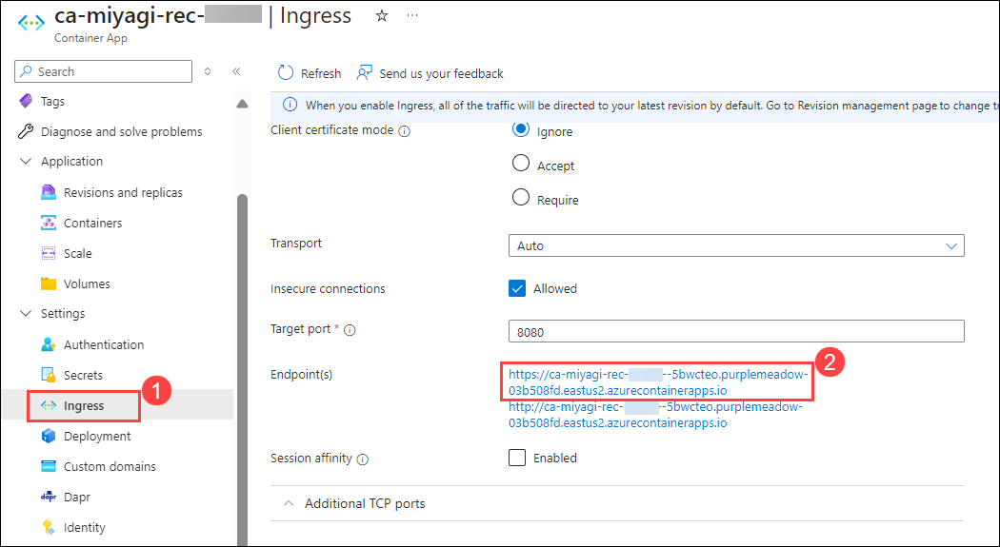
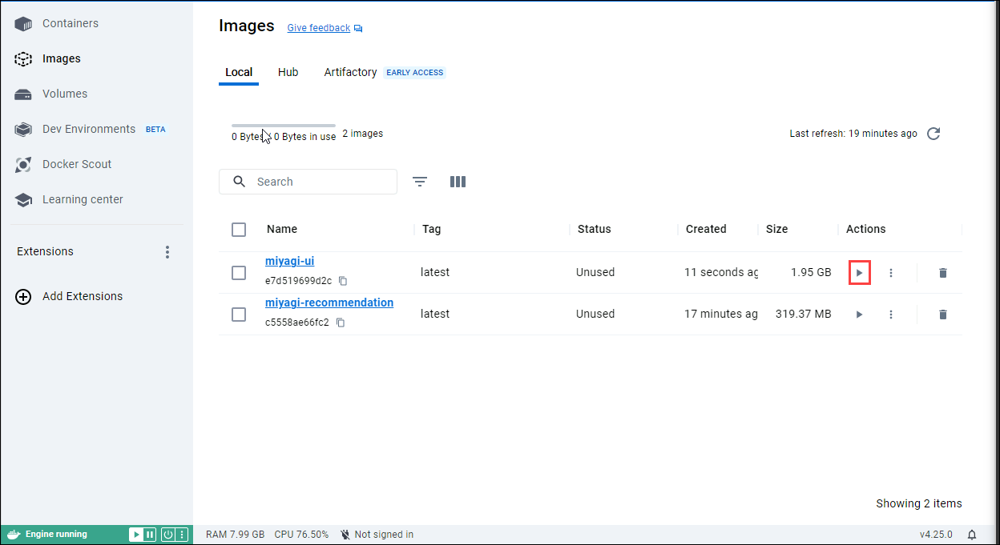

# Lab 2: Containerizing Miyagi UI and Recommendation Service to Azure Container Apps through API management service.

In this lab, you'll be building the docker images and publishing them to Azure Container Apps.

### Task 1: Verify the deployed API Management service and create an API

1. Navigate to Azure portal, open the Resource Group named **miyagi-rg-<inject key="DeploymentID" enableCopy="false"/>**  and select **miyagi-apim-<inject key="DeploymentID" enableCopy="false"/>** API Management service from the resources list.

   

1. From the left-menu, click on **APIs** **(1)** and select **HTTP** **(2)** under Define a new API to create an HTTP API.

   

1. Enter the following values in the Create an HTTP API pane:
   
   | **Parameter**        | **Values**           | 
   | -------------------- | -------------------- | 
   | API Type **(1)**     | **Basic**            | 
   | Display name **(2)** | **miyagi-api**       |
   | Name **(3)**         | **miyagi-api**       |
   | Web service URL **(4)** | **<inject key="OpenAIEndpoint" enableCopy="true"/>**  |
   | API URL suffix **(5)** | **miyagi** |
   | Click on  **(6)** | **Create** |

   

1. Once API is created, click on **Overview** **(1)** from the left-menu and copy the **Gateway URL** **(2)** of API Management service. Paste it into Notepad for later use.

   

### Task 2: Update the API Gateway URL in Recommendation service 

1. Navigate to Visual Studio Code, and open the `appsettings.json` file from the path `C:\LabFiles\miyagi\services\recommendation-service\dotnet\appsettings.json`.

   

1. In the `appsettings.json` file, you have to replace the **endpoint** value from **OpenAI resource endpoint** with **API Gateway URL** which you have copied in Task-1 Step-4.

   

### Task 3: Build Docker Images for the Recommendation service

1. Open the **Docker** Application from the Lab VM desktop by double-clicking on it.

   
   
1. In the **Docker Subscription Service Agreement** window, click **Accept**.

   

1. In the **Welcome to Docker Desktop** window, click on **Continue without signing in**.

   

1. In the **Tell us about the work you do** window, click on **Skip**.

1. Navigate back to **Visual studio code** window and navigate to **miyagi/services/recommendation-service/dotnet** right - click on dotnet in cascading menu, select **Open in integrate Terminal**.

1. Run the following command to build a **Docker image**.

   ```
   docker build --no-cache -t miyagi-recommendation .   
   ```

   

   > **Note**: Please wait as this command may require some time to complete.

1. Run the following command to get the newly created image.

   ```
   docker images
   ```
   
   

1. Navigate back to **Docker desktop**, from the left pane select **Images**.

   

1. In the **Images** blade, notice **miyagi-recommendation(1)** image is created, select **run(2)** icon .

   

1. In the **Run a new container** window select the dropdown arrow.

   .png)

1. In the **Run a new containe**, under **Ports** for **Host Port** enter **5224** and click on **Run**.

    

1. Click on **5224:80** URL link

   
   
1. You should be able to see the application running locally
   
   

### Task 4: Push the Docker Image of the Recommendation service to the Container registry

In this task, you'll Push miyagi-recommendation images to acr. 

1. Navigate back to the **Visual studio code** window and navigate to **miyagi/services/recommendation-service/dotnet** right - click on dotnet in cascading menu, select **Open in integrate Terminal**

1. Run the following command to log in to the **Azure portal**.

    ```
    az login
    ```

1. This will redirect to **Microsoft login page**, select your Azure account **<inject key="AzureAdUserEmail"></inject>**, and navigate back to the **Visual studio code**.

   

1. Run the following command to log in to an **Azure Container Registry (ACR)** using the Azure CLI.

   > **Note**: Please replace **[ACRname]** and **[uname]** with **<inject key="AcrUsername" enableCopy="true"/>**, and **[password]** with **<inject key="AcrPassword" enableCopy="true"/>**.
   
   ```
   az acr login -n [ACRname] -u [uname] -p [password]
   ```

   
    
1. Run the following command to add the tag.

   > **Note**: Please replace **[ACRname]** with **<inject key="AcrLoginServer" enableCopy="true"/>**.

   ```
   docker tag miyagi-recommendation:latest [ACRname]/miyagi-recommendation:latest
   ```

1. Run the following command to push the image to the container registry.

   > **Note**: Please replace **[ACRname]** with **<inject key="AcrLoginServer" enableCopy="true"/>**.

   ```
   docker push [ACRname]/miyagi-recommendation:latest
   ```

   

### Task 5: Create a container app for miyagi-recommendation

In this task, you'll will be creating a container app for the recommendation.

1. Run the following command to create **Container App environment**.

   > **Note**: Please replace **[DID]** with **<inject key="DeploymentID" enableCopy="true"/>** and **[Region]** with **<inject key="Region" enableCopy="true"/>**.

   ```
   az containerapp env create --name env-miyagi-[DID] --resource-group miyagi-rg-[DID] --location [Region]
   ```

1. Run the following command to create **Container App**.

   > **Note**: Please replace **[DID]** with **<inject key="DeploymentID" enableCopy="true"/>**, **[ACRname]** with **<inject key="AcrLoginServer" enableCopy="true"/>**, **[uname]** with **<inject key="AcrUsername" enableCopy="true"/>**, and **[password]** with **<inject key="AcrPassword" enableCopy="true"/>**.

   ```
   az containerapp create --name ca-miyagi-rec-[DID] --resource-group miyagi-rg-[DID] --image [ACRname]/miyagi-recommendation:latest --environment env-miyagi-[DID] --registry-server [ACRname] --registry-username [uname] --registry-password [password]
   ```

1. Run the following command to enable **Container App ingress**.

   > **Note**: Please replace **[DID]** with **<inject key="DeploymentID" enableCopy="true"/>**
   
   ```
   az containerapp ingress enable -n ca-miyagi-rec-[DID] -g miyagi-rg-[DID] --type external --allow-insecure --target-port 80
   ```
 
### Task 6: Update Container App Recommendation service URL for Miyagi UI

1. In the Azure Portal page, in the Search resources, services, and docs (G+/) box at the top of the portal, enter **Container Apps (1)**, and then select **Container Apps (2)** under services.

   

1. In the **Container Apps** blade, select **ca-miyagi-rec-<inject key="DeploymentID" enableCopy="false"/>**.

   

1. In the **ca-miyagi-rec-<inject key="DeploymentID" enableCopy="false"/>** page, from left navigation pane select **Ingress** **(1)** under setting session and copy **Endpoints** **(2)** URL link.

   

1. Navigate back to **Visual Studio Code**, navigate to **miyagi>ui>typescript>.env.** and replace existing code for **NEXT_PUBLIC_RECCOMMENDATION_SERVICE_URL** with copied for **Endpoints** and save the file 

   

### Task 7: Build Docker Image for the Miyagi UI. 
  
1. Navigate back to **Visual studio code** window and navigate to **miyagi/ui/typescript** right - click on dotnet in cascading menu, select **Open in integrate Terminal**.

   ```
   docker build --no-cache -t miyagi-ui .  
   ```

   > **Note**: Please wait as this command may require some time to complete.

1. Run the following command to get the newly created image.

   ```
   docker images
   ```
   
1. Navigate back to **Docker desktop**, from the left pane select **Images**.

   

1. In the **Images** blade, notice **miyagi-ui(1)** image is created, select **run(2)** icon .

   

1. In the **Run a new container** window select the dropdown arrow.

   .png)

1. In the **Run a new containe**, under **Ports** for **Host Port** enter **3000** and click on **Run**.

    

1. Click on **3000:3000** URL link

   
   
1. You should be able to see the application running locally
   
   

### Task 8: Push the Docker Image of Miyagi UI service to Container registry 

1. Right-click on **ui/typescript** in cascading menu, select **Open in intergate Terminal**.

1. Run the following command to log in.

   > **Note**: Please replace **[ACRname]** and **[uname]** with **<inject key="AcrUsername" enableCopy="true"/>**, and **[password]** with **<inject key="AcrPassword" enableCopy="true"/>**.

    ```
    az acr login -n [ACRname] -u [uname] -p [password]
    ```
   
1. Run the following command to add the tag.

   > **Note**: Please replace **[ACRname]** with **<inject key="AcrLoginServer" enableCopy="true"/>**.

   ```
   docker tag miyagi-ui:latest [ACRname]/miyagi-ui:latest
   ```

1. Run the following command to push the image to the container registry

   > **Note**: Please replace **[ACRname]** with **<inject key="AcrLoginServer" enableCopy="true"/>**.

   ```
   docker push [ACRname]/miyagi-ui:latest
   ```

### Task 9: Create a Container app for Miyagi UI

In this task, you'll will be creating a container app for the UI.

1. Right-click on **ui/typescript** in cascading menu, select **Open in intergate Terminal**.

1. Run the following command to log in.

   > **Note**: Please replace **[ACRname]** with **<inject key="AcrLoginServer" enableCopy="true"/>**, **[uname]** with **<inject key="AcrUsername" enableCopy="true"/>**, and **[password]** with **<inject key="AcrPassword" enableCopy="true"/>**.

    ```
    az acr login -n [ACRname] -u [uname] -p [password]
    ```

1. Run the following command to create **Container App**.

   > **Note**: Please replace **[DID]** with **<inject key="DeploymentID" enableCopy="true"/>**, **[ACRname]** with **<inject key="AcrLoginServer" enableCopy="true"/>**, **[uname]** with **<inject key="AcrUsername" enableCopy="true"/>**, and **[password]** with **<inject key="AcrPassword" enableCopy="true"/>**.

   ```
   az containerapp create --name ca-miyagi-ui-[DID] --resource-group miyagi-rg-[DID] --image [ACRname]/miyagi-ui:latest --environment env-miyagi-[DID] --registry-server [ACRname] --registry-username [uname] --registry-password [password]
   ```

1. Run the following command to enable **Container App ingress**.

   > **Note**: Please replace **[DID]** with **<inject key="DeploymentID" enableCopy="true"/>**
   
   ```
   az containerapp ingress enable -n ca-miyagi-ui-[DID] -g miyagi-rg-[DID] --type external --allow-insecure --target-port 80
   ```

1. Now, click on **Next** from the lower right corner to move to the next page.
