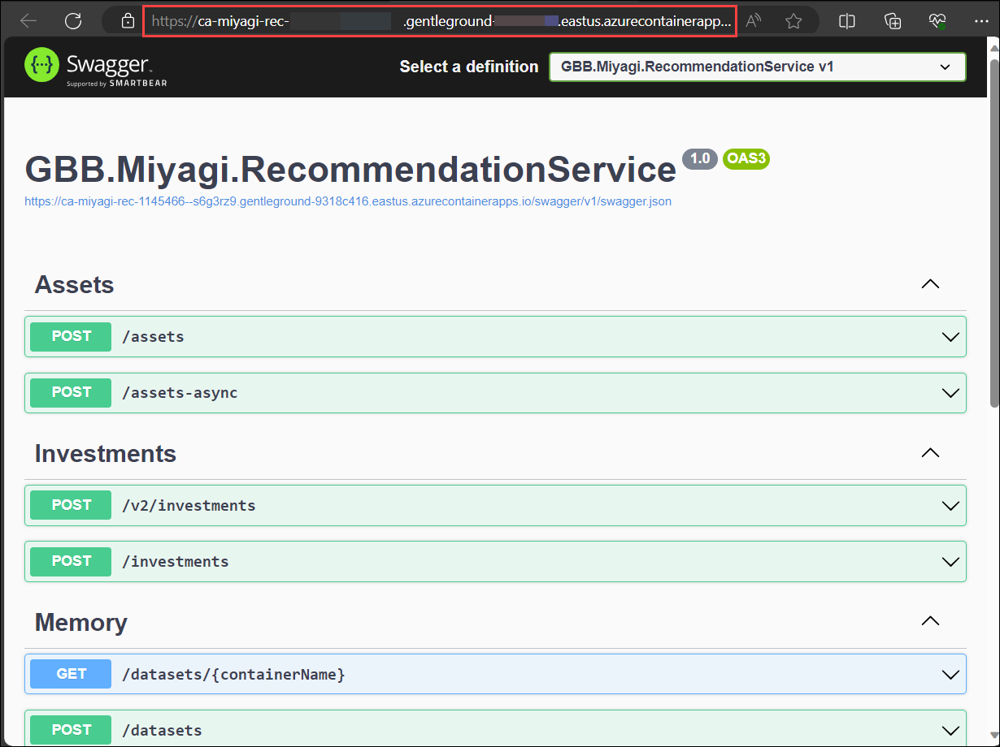
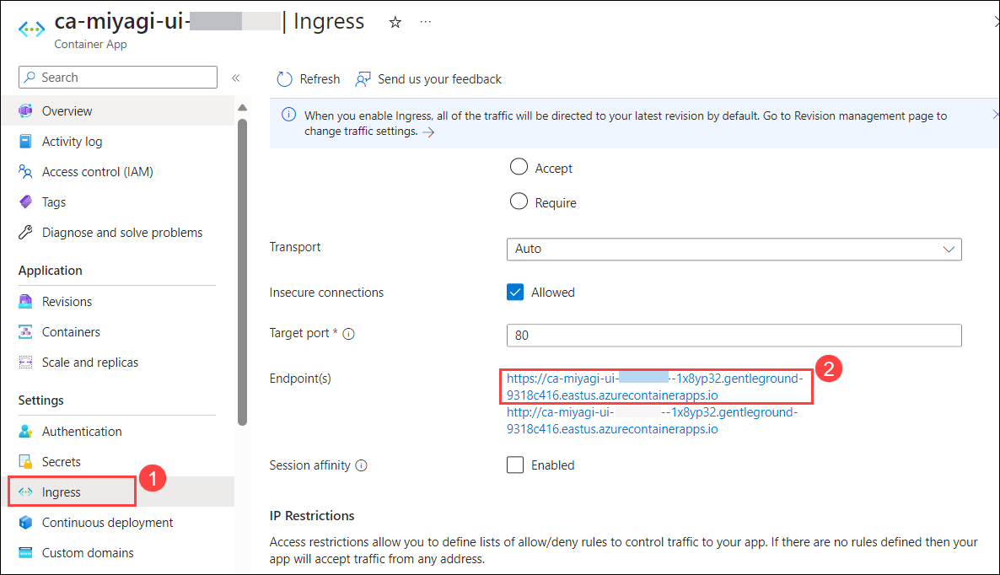
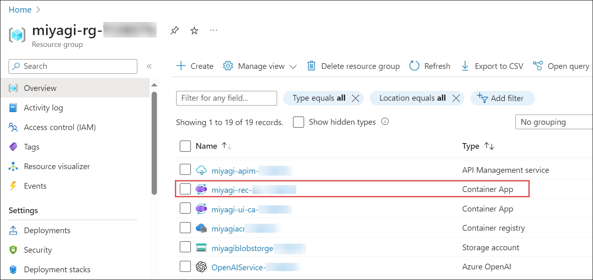
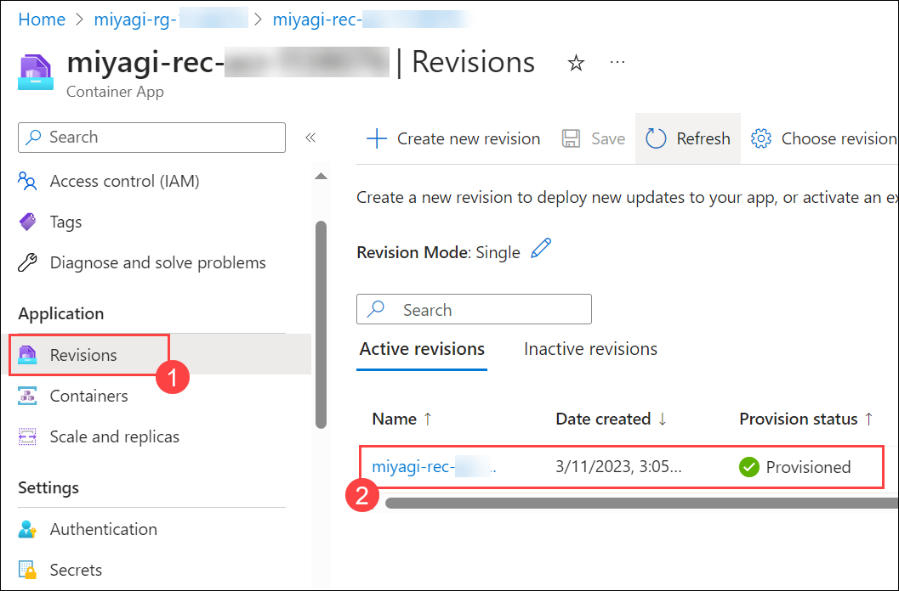

# Lab 3 - Explore and Verify the Containerized Miyagi UI and Recommendation service in Azure Container Apps

In this lab, you'll be verifying and creating APIs in the deployed API Management service to updating the Docker image for the Recommendation service. The revision of the Recommendation service from the Container App encapsulates the meticulous approach to maintaining and optimizing containerized applications within the project's scope.

### Task 1: Explore Recommendation service in Azure Container Apps using Ingress Endpoint

1. In the Azure Portal page, in the Search resources, services, and docs (G+/) box at the top of the portal, enter **Container Apps (1)**, and then select **Container Apps (2)** under services.

   

1. In the **Container Apps** blade, select **ca-miyagi-rec-<inject key="DeploymentID" enableCopy="false"/>**.

   

1. In the **ca-miyagi-rec-<inject key="DeploymentID" enableCopy="false"/>** page, from left navigation pane select **Ingress** **(1)** under setting session and click on **Endpoints** **(2)** URL link.

   

1. You can view the **miyagi Recommendation service** website running through the Container Apps.

       

### Task 2: Explore Miyagi App in Azure Container Apps using Ingress Endpoint

1. Return to **Azure Portal** in Search resources, services box at the top of the portal, enter **Container Apps**, and then select **Container Apps** under services.

1. In the **Container Apps** blade, select **ca-miyagi-ui-<inject key="DeploymentID" enableCopy="false"/>**.

   

1. In the **ca-miyagi-ui-<inject key="DeploymentID" enableCopy="false"/>**, from left navigation pane select **Ingress** under setting and click on **Endpoints** URL link.

   

1. You can view the **miyagi app** running through the Container Apps.

      

### Task 3: Revision of Recommendation service from Container App

1. Navigate to Azure portal, open the Resource Group named **miyagi-rg-<inject key="DeploymentID" enableCopy="false"/>**  and select **miyagi-rec-ca-<inject key="DeploymentID" enableCopy="false"/>** Container App from the resources list.

   

1. In the **ca-miyagi-rec-<inject key="DeploymentID" enableCopy="false"/>** Container App pane, select **Revisions** **(1)** under Applications from left-menu and then open the **Active Revision** named **ca-miyagi-rec-<inject key="DeploymentID" enableCopy="false"/>** **(2)**.

   

1. You will see the **Revision details** pop-up in the right-side, click on **Restart**. You will see a pop-up to restart the revision, click on **Continue** to confirm.

   

   

1. You will see the notification once the Revision is restarted successfully.

   

1. Select **Ingress** **(1)** under Settings from the left menu and then scroll down to Endpoints of Container App i.e, **ca-miyagi-rec-<inject key="DeploymentID" enableCopy="false"/>-SUFFIX** **(2)**. Click on the secured link to open it.

   

1. You can see the swagger page for the recommendation service as shown in the below image:

   
