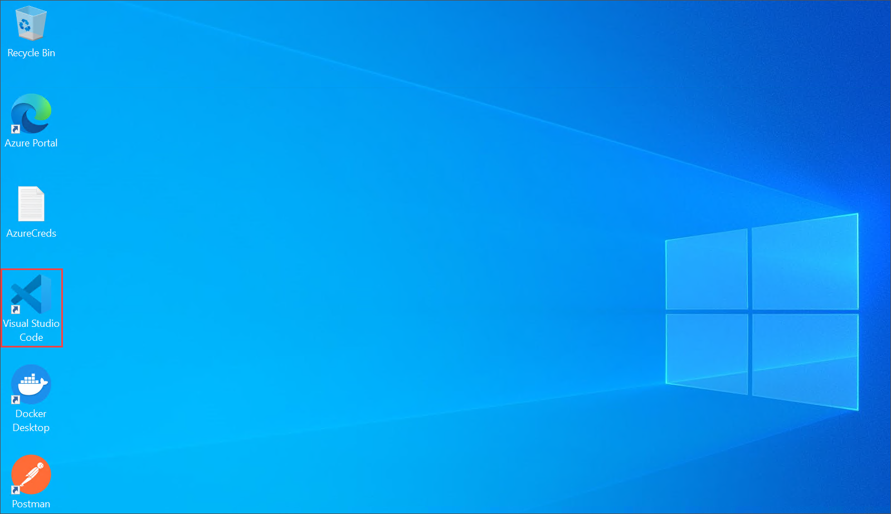
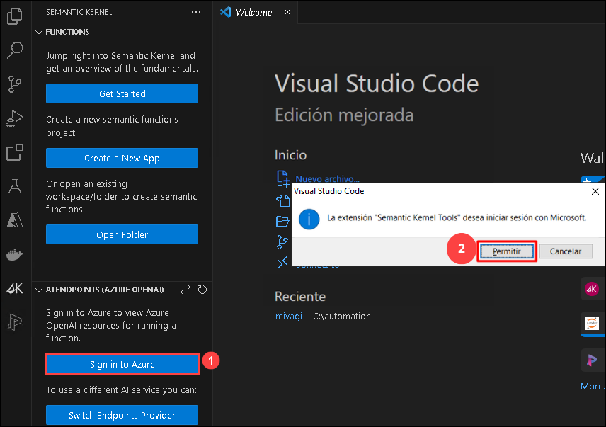
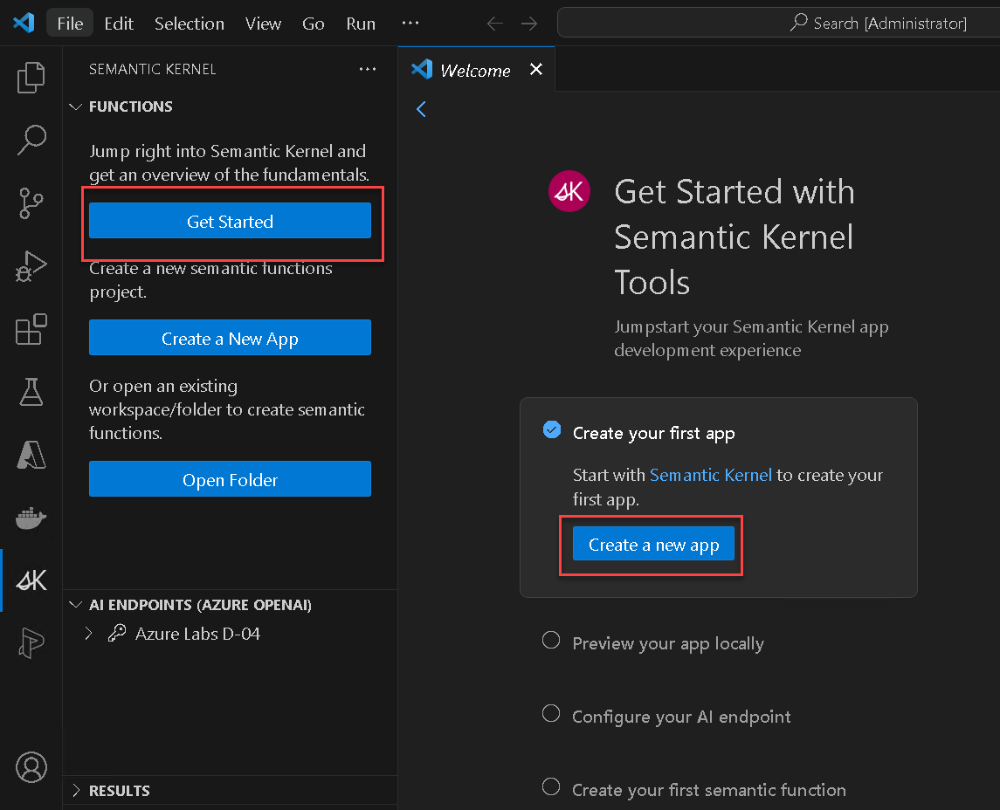
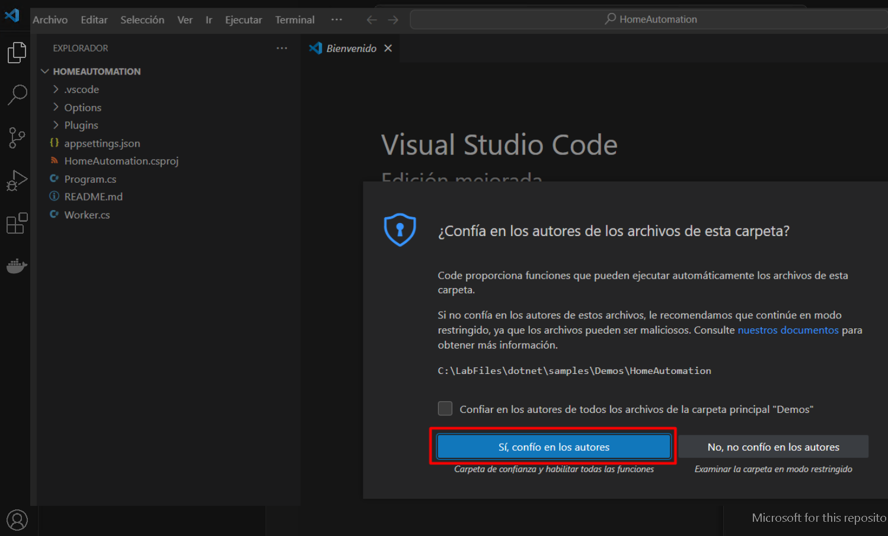
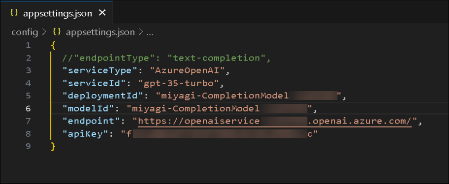
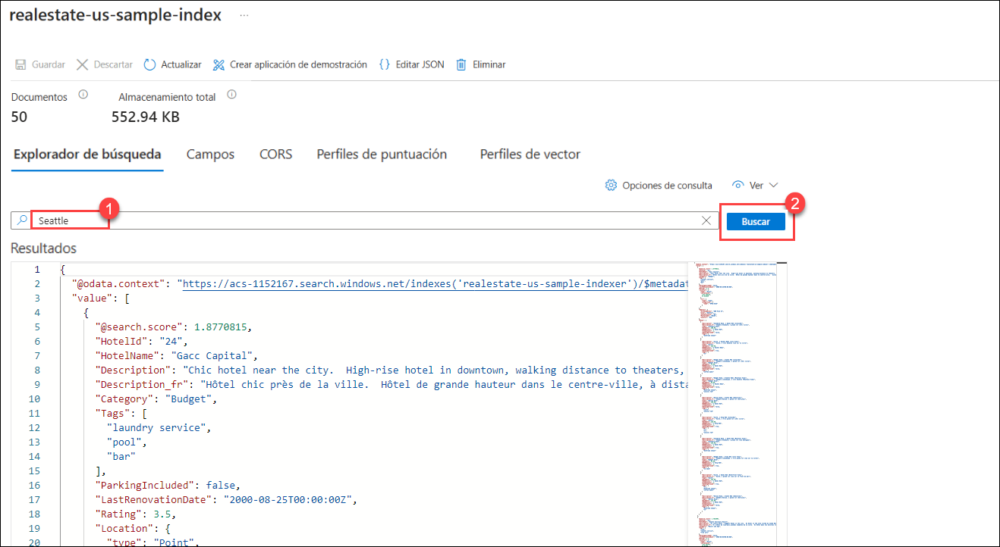

# Getting Started with Your Own Copilot

### Duration: 30 minutes

Semantic Kernel is an SDK that integrates Large Language Models (LLMs) like OpenAI, Azure OpenAI, and Hugging Face with conventional programming languages like C#, Python, and Java. Semantic Kernel achieves this by allowing you to define plugins that can be chained together in just a few lines of code.

What makes Semantic Kernel _special_, however, is its ability to _automatically_ orchestrate plugins with AI. With Semantic Kernel
[planners](https://learn.microsoft.com/en-us/semantic-kernel/ai-orchestration/planner), you can ask an LLM to generate a plan that achieves a user's unique goal. Afterwards, Semantic Kernel will execute the plan for the user.

### Task 1: Configure and Run the Semantic Kernel Sample

1. Open **Visual Studio Code** from the Lab VM desktop by double-clicking on it.

   

1. In the **Visual Studio Code** from the left panel select **Semantic Kernel** **(1)** plugin, expand  by click on **AIENDPONTS(OPEN AI)** **(2)**, click on **Switch EndPoint Provider** **(3)**, and select **AzureOpenAI** **(4)**.

   

1. Under **AI ENDPONTS(AZURE OPENAI)**, click on **sign in to Azure** **(1)**, in the pop-up  **The extension 'Semantic Kernel Tools' wants to sign in using Microsoft** click on **Allow** **(2)**.

   

1. This will redirect to **Microsoft login page**, select your Azure account **<inject key="AzureAdUserEmail"></inject>**, and navigate back to the **Visual studio code**.

   

1. Navigate back to the **Visual Studio Code** From the **Functions panel**, click on the **Get started icon** and follow the wizard to **create your app** with the semantic function and save it

    

1. Choose **C# Hello World**

    

1. Browse the location **C:\LabFiles** and **select location for new app**

    .png)

1. Click on **Yes, I trust authors**.

    

1. In ASP.NET Core, `appsettings.json` is a configuration file used to store various application settings, such as service endpoints, and other application-specific settings. Expand **Config** folder, rename **appsettings.json.azure-example** to **appsettings.json** and then replace the values given below.

   >**Note**: In the `appsettings.json` file, you will find a environment variable named `deploymentormodelId`. Please update this `deploymentormodelId` environment variable into two separate enviroment variables as `deploymentId` and `modelId`.

   | **Variables**                | **Values**                                                    |
   | ---------------------------- |---------------------------------------------------------------|
   | serviceId                    |  **gpt-35-turbo**                                           |
   | deploymentId                 | **<inject key="CompletionModel" enableCopy="true"/>**         |
   | modelId                      | **<inject key="CompletionModel" enableCopy="true"/>**
   | endpoint                     | **<inject key="OpenAIEndpoint" enableCopy="true"/>**          |
   | apiKey                       | **<inject key="OpenAIKey" enableCopy="true"/>**               |

1. Comment the line 2 by adding **//** and save the file. Make sure that your `appsettings.json` file looks as shown in the below screenshot.

    

1. Configure an Azure OpenAI endpoint by Opening a New **Terminal** click on **(...) (1)** next to **View** menu and select **Terminal(2)** > **New Terminal(3)**.

    

1. You can use the secret manager tool without knowing these implementation details. Here, you'll be defining multiple app secrets consisting of a key and its value. The secret is associated with the project's UserSecretsId value. Run the below dotnet commands to set user-secrets. Make sure to replace the below values before running it.
  
   | **Variables**                | **Values**                                                    |
   | ---------------------------- |---------------------------------------------------------------|
   | deploymentId                 | **<inject key="CompletionModel" enableCopy="true"/>**         |
   | modelID                      | **<inject key="CompletionModel" enableCopy="true"/>**
   | endpoint                     | **<inject key="OpenAIEndpoint" enableCopy="true"/>**          |
   | apiKey                       | **<inject key="OpenAIKey" enableCopy="true"/>**               |
    

   ```powershell
   dotnet user-secrets set "serviceType" "AzureOpenAI"
   dotnet user-secrets set "serviceId" "gpt-35-turbo"
   dotnet user-secrets set "deploymentId" "your deploymentId"
   dotnet user-secrets set "ModelId" "your ModelId"
   dotnet user-secrets set "endpoint" "https:// ... your endpoint ... .openai.azure.com/"
   dotnet user-secrets set "apiKey" "... your Azure OpenAI key ..."
   ```
     
1. To build and run the console application from the terminal use the following commands:

   ```powershell
   dotnet build
   dotnet run
   ```

   >**Note**: Getting a 400 (BadRequest) and error "Azure.RequestFailedException: logprobs, best_of and echo parameters are not available on gpt-35-turbo model. Please remove the parameter and try again."
   
   > A chat completion model (gpt-35-turbo) was set in serviceId/deploymentOrModelId while the kernel was configured to use a text completion model. The type of model used by the kernel can be configured with the endpointType secret. To fix, you can either:
   
   > Change the endpointType to chat-completion by running the given command `dotnet user-secrets set "endpointType" "chat-completion"` and Re-run step 13 commands.

1. After running `dotnet run`, you can ask few questions and review the response. For example: `what is Copilot?`

   

1. Example 2: `How Semantic Kernel used in C# Hello World Sample App`

   

1. This app don't support real-time information questions. For example: `What's the latest update on Azure OpenAI`

   

### Task 2: Configure Azure Cognitive Search

1. Navigate back to the **Azure portal** tab, search and select **AI Search**.

        

1. In **Azure AI services | AI Search** tab, select **acs-<inject key="DeploymentID" enableCopy="false"/>**.

   > **Note**: Please click on the refresh button still you view the **Document Count**.

1. In the overiew tab of search service, click on the **Import data**.

        
   
1. From the drop-down select **Data Source** as **Sample**, select the **CosmosDB hotels-sample**, and click on **Next : Add cognitive skills(optional)**.

   
   
1. In **cognitive skills** leave as default and click on **Customize target index**.

1. In the **Customize target index**, Enter the index name as **realestate-us-sample-index** and click on **Next:Create an indexer**.

   

1. In the **create an indexer**, change the indexer name as **realestate-us-sample-indexer** and click on **submit**.

   
    
1. Click on **realestate-us-sample-index** in the search bar enter **Seattle** and click on **Search**.

   


